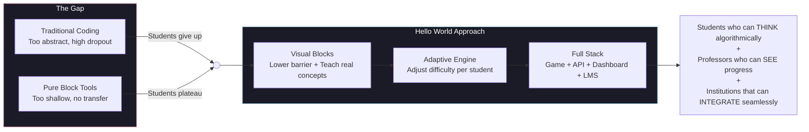

# PRD: Hello World Platform

> **A multi-platform educational ecosystem that transforms programming education through adaptive, game-based learning, real-time progress tracking, and professor empowerment.**

**Version**: 0.1.0-draft
**Author**: Hello World Project Team
**Date**: 2026-05-15
**Status**: Draft

---

## 1. Problem Statement

### 1.1 The Educational Gap

Programming education in 2026 faces a fundamental disconnect: existing tools either oversimplify (pure drag-and-drop with no transferable skills) or overwhelm (text-based coding with no scaffolding). Students who learn with Scratch can build animations but struggle to write a loop; students thrown into Python often quit before their first `if` statement. The result is a generation of potential programmers who never cross the gap from "playing with blocks" to "thinking algorithmically."

**Hello World Project exists to bridge this gap**: a platform that teaches real programming concepts — conditionals, loops, variables, algorithmic thinking — through visual programming blocks embedded in adaptive, story-driven games, with full visibility for professors and seamless LMS integration for institutions.

> **The core insight**: Visual programming should be a *ramp*, not a *ceiling*. Students start with blocks and graduate to understanding the underlying concepts, not to mastering a block-dragging tool.

### 1.2 Limitations of Existing Approaches

#### For Students

| Pain Point | Current Reality | Impact |
|------------|----------------|--------|
| **No adaptive difficulty** | All students get the same problems regardless of skill level | Beginners feel lost; advanced students get bored |
| **Abstract context** | Problems like "sort this list" have no narrative hook | Low intrinsic motivation for 11–18 year olds |
| **No real programming concepts** | Scratch-style tools avoid loops, conditionals, and variables as first-class concepts | Students hit a wall when transitioning to text-based languages |
| **No feedback loop** | Manual grading with days of delay | Students don't connect errors to learning |

#### For Professors

| Pain Point | Current Reality | Impact |
|------------|----------------|--------|
| **No progress visibility** | Professors can't see which students are struggling in real-time | Interventions happen too late |
| **Manual content creation** | Building programming exercises from scratch, level by level | Takes hours per lesson |
| **No analytics** | No data on completion rates, error patterns, or time spent | Decisions are gut-feel, not data-driven |
| **LMS fragmentation** | Grades live in the LMS, exercises live in a separate tool | Double-entry and sync errors |

#### For Institutions

| Pain Point | Current Reality | Impact |
|------------|----------------|--------|
| **No integration path** | Tools don't support LTI, xAPI, or grade passback | IT departments block adoption |
| **No scalability** | Pilot tools break under 100+ concurrent users | Limits deployment to single classrooms |
| **No offline support** | Tools require constant internet | Useless in low-connectivity environments |
| **No procurement standard** | Each tool has its own pricing, support, and compliance model | Lengthy procurement cycles |

### 1.3 Why Visual Programming + Adaptive Learning

The combination is not accidental — it's a deliberate pedagogical strategy:

**Visual programming** lowers the barrier to entry. A student can express "while queue is not empty, serve next customer" by connecting blocks without syntax errors. The cognitive load is on *algorithmic thinking*, not on remembering semicolons. This is consistent with Papert's constructionist theory (Mindstorms, 1980) and has been validated by decades of success with Scratch, Alice, and Blockly.

**Adaptive learning** solves the engagement problem. The same visual program that a beginner struggles with for 15 minutes may bore an advanced student in 2. By tracking completion time, error count, hint usage, and efficiency rating, the platform dynamically adjusts difficulty — offering harder variations to fast learners and additional scaffolding to struggling ones. This follows the principles of mastery learning (Bloom, 1968): every student masters the concept, but the path and pace vary.

**The synthesis**: Visual blocks provide the *accessibility*; adaptive difficulty provides the *sustained challenge*. Together, they create a learning experience that works for a 12-year-old encountering `if` for the first time AND for a university freshman debugging a nested loop.



### 1.4 Research Support

- **Papert, S. (1980). *Mindstorms: Children, Computers, and Powerful Ideas*.** Foundational text on constructionist learning through programming. Visual blocks in Hello World are a direct application of Papert's "objects to think with."
- **Bloom, B. S. (1968). "Mastery Learning." *Evaluation Comment, 1(2)*.** Mastery learning predicts that 90%+ of students can achieve high grades when given sufficient time and appropriate instruction — the adaptive engine operationalizes this by varying support, not standards.
- **Grover, S. & Pea, R. (2013). "Computational Thinking in K–12: A Review of the State of the Field." *Educational Researcher, 42(1)*.** Identifies the gap between block-based and text-based programming as a critical unresolved challenge — Hello World directly addresses this gap.
- **Desmarais, M. C. & Baker, R. S. (2012). "A review of recent advances in learner and skill modeling in intelligent learning environments." *User Modeling and User-Adapted Interaction, 22(1)*.** Supports the adaptive difficulty approach used by the platform's Adaptive Agent.

---

## 2. Vision & Mission

### 2.1 Vision Statement

> **Every student, regardless of background, discovers the power of algorithmic thinking through play. Professors gain real-time insight into every learner's journey. Institutions seamlessly integrate programming education into their existing ecosystem.**

This vision has three inseparable pillars:
- **Students**: Programming becomes something they *want* to do, not something they *have* to learn
- **Professors**: Teaching programming becomes data-informed, not guesswork
- **Institutions**: Adoption is frictionless because the platform fits existing infrastructure

### 2.2 Mission Statement

> **Hello World Project builds and maintains an open-source, multi-platform educational ecosystem that combines a visual programming game (Godot), an intelligent backend API (FastAPI), and a modern web dashboard (Next.js) to teach programming fundamentals through adaptive, story-driven challenges — with xAPI tracking, LMS integration, and real-time analytics for professors and administrators.**

**How we differentiate from existing platforms:**

| Platform | Approach | Gap We Fill |
|----------|----------|-------------|
| **Scratch** | Open-ended creative canvas, no curriculum, no professor dashboard | Structured progression with adaptive difficulty + professor analytics |
| **Code.org** | Curated hour-of-code activities, limited depth per concept | Deep, multi-level game with real loops/conditionals + offline support |
| **Tynker** | Subscription-based, closed-source game courses | Open-source MIT license + LMS integration + xAPI tracking |
| **Blockly/Games** | Puzzle-focused, tool-building SDK, not a platform | Full-stack platform with backend, analytics, and classroom management |

### 2.3 Educational Philosophy

The platform is built on three pedagogical pillars:

**1. Constructionism (Papert)**: Students learn best when they build things that are meaningful to them. Visual programming blocks are "objects to think with" — tangible representations of abstract concepts. Every level presents a real-world problem (serve customers, manage inventory, optimize a route) that the student must solve by constructing a program.

**2. Mastery Learning (Bloom)**: All students can master programming concepts, but they need different time and support. The adaptive engine (inspired by mastery learning) varies the path, not the destination. Every student reaches the same learning objective — some in 5 attempts, some in 15. Both succeed.

**3. Learning by Doing (Dewey)**: Knowledge is constructed through experience. The game does not lecture — it presents a problem, provides blocks, and gives feedback. The student learns by running their program, seeing it fail, debugging, and retrying. This cycle of action → feedback → reflection → iteration is the heart of the learning process.

These philosophies directly inform design decisions throughout the platform:
- **Why sandbox mode?** — Constructionism requires open-ended exploration, not just guided paths
- **Why adaptive difficulty?** — Mastery learning requires different support levels for the same standard
- **Why immediate feedback?** — Learning by doing requires a tight action-feedback loop

### 2.4 Core Values

| Value | Description | How It Guides Decisions |
|-------|-------------|------------------------|
| **Accessibility First** | Programming education should be accessible to all students regardless of prior experience, connectivity, or learning pace. | Offline-first game architecture, visual blocks as primary interface, adaptive difficulty, Spanish-first UI. |
| **Data-Driven Progress** | Every educational decision should be informed by real learning data — not intuition. | xAPI tracking at every interaction, professor analytics dashboard, automated progress reports. |
| **Teacher Empowerment** | Professors are the experts; the platform serves them, not replaces them. | Course creation tools, customizable difficulty, student monitoring, flexible content configuration. |
| **Adaptive by Default** | One-size-fits-all education is obsolete. Every learner deserves a personalized path. | Real-time difficulty adjustment per student per level, hint system, efficiency-based progression. |
| **Open Source** | Educational tools must be transparent, modifiable, and free from vendor lock-in. | MIT license, community contributions welcome, self-hostable via Docker, no proprietary data formats. |

---

## 3. Target Users

### 3.1 Student Personas

#### K-12 Student (Ages 11–17)

| Attribute | Description |
|-----------|-------------|
| **Age range** | 11–17 years old, middle school through early high school |
| **Technical proficiency** | Digital native (comfortable with apps/games) but no programming experience |
| **Learning context** | Classroom setting with professor guidance, ~45–60 min sessions |
| **Motivational drivers** | Story/narrative engagement, visual feedback, sense of progression, peer comparison (optional) |
| **Relationship with professor** | Guided — professor assigns levels, sets pacing, reviews progress |
| **Pain points** | Abstract problems feel irrelevant; text-based coding is intimidating; waiting for help when stuck |
| **Goals** | Learn to think algorithmically; pass the course; feel confident about technology |
| **Sub-persona: Self-directed learner** | A subset who explores beyond assigned levels, uses sandbox mode, and progresses faster than the class average. The adaptive engine detects this and accelerates difficulty. |

#### University Student (Ages 18–25)

| Attribute | Description |
|-----------|-------------|
| **Age range** | 18–25 years old, university-level (CS majors or non-CS majors in intro courses) |
| **Technical proficiency** | Ranges from zero programming to some exposure (HTML, basic Python) |
| **Learning context** | Lecture + lab format, self-directed study between classes |
| **Motivational drivers** | Grade performance, career preparation, concept mastery for subsequent courses |
| **Relationship with professor** | Semi-guided — professor sets curriculum but students are expected to work independently |
| **Pain points** | Assumed prior knowledge in courses; large class sizes limit individual attention; theory without practice |
| **Goals** | Pass the course; build a portfolio; understand programming fundamentals for their field |
| **Sub-persona: Non-CS major** | A biology/engineering/business student who needs programming as a tool, not a career. The platform's real-world problem contexts (e.g., data analysis, process automation) are especially relevant here. |

#### Key Design Implication

All student-facing UI MUST be in Spanish (per project convention). The game's visual blocks use Spanish keywords (`si`, `mientras`, `ejecutar`, `variable`), and the narrative dialogue is fully localized in Spanish. English SHOULD be supported as a secondary language in future releases.

### 3.2 Professor Persona

| Attribute | Description |
|-----------|-------------|
| **Title** | Computer science teacher, technology coordinator, or professor of informatics |
| **Technical proficiency** | Comfortable with technology but NOT a software engineer; can configure, not code |
| **Content creation needs** | Must be able to create courses, configure games, add levels, set difficulty parameters — all through the dashboard UI, not by modifying game files |
| **Monitoring/analytics needs** | Needs real-time visibility into: which students are stuck, completion rates, time spent, error patterns, hint usage |
| **Time constraints** | Limited prep time between classes (typically < 1 hour per lesson); needs tools that accelerate lesson creation, not add overhead |
| **Control over pacing** | MUST have control to: assign specific levels to specific students, set deadlines, override adaptive difficulty when desired, release content incrementally |
| **Pain points** | Current tools require manual grading, have no insight into student struggle, and don't integrate with school LMS |
| **Goals** | Teach programming effectively; identify struggling students early; reduce grading time; provide evidence of learning outcomes |

### 3.3 Administrator Persona

| Attribute | Description |
|-----------|-------------|
| **Title** | Department head, IT coordinator, academic dean, or technology director |
| **Technical proficiency** | Moderate — can evaluate software, manage users, understand reports |
| **Reporting needs** | Needs: student progress across all courses, teacher activity, aggregated completion metrics, engagement trends |
| **User management requirements** | MUST be able to: create/manage professor accounts, view all students (cross-classroom), deactivate users, assign roles |
| **LMS integration expectations** | MUST support LTI 1.3 for course linking and grade passback with major LMS platforms (Moodle, Canvas) |
| **Pain points** | No cross-classroom visibility; no standardization of programming curriculum; difficulty assessing teacher/student performance |
| **Goals** | Ensure curriculum standards are met; justify tool investment; demonstrate educational outcomes; support teachers with data |

### 3.4 Institution Persona

| Attribute | Description |
|-----------|-------------|
| **Role** | Procurement decision-makers, IT security, legal/compliance |
| **Procurement criteria** | MUST evaluate: total cost of ownership (open-source = free), deployment model (self-hosted via Docker or cloud), support model, data privacy compliance |
| **Compliance requirements** | MUST comply with: GDPR (EU), COPPA (US minors), local data protection laws for educational data |
| **Integration requirements** | MUST integrate with existing LMS (Moodle, Canvas); MUST support xAPI for learning record stores; MUST support SSO/SAML for institutional authentication |
| **IT infrastructure constraints** | Self-hosted deployments must work on institutional infrastructure (often older hardware, limited cloud access); containerized deployment (Docker Compose) is the minimum bar |
| **Goals** | Adopt a cost-effective, standards-compliant programming education platform that works with existing infrastructure and does not create data silos |

---

## 4. User Roles & Permissions

> **Source**: The technical role definitions are adapted from [`apps/backend/docs/user_stories.md`](apps/backend/docs/user_stories.md) (see "Reglas de Negocio" → "Role Management"). This section adds product-level context, cross-component access boundaries, and the permission matrix.

### 4.1 Role Definitions

| Role | Description | How Assigned | Scope of Access |
|------|-------------|--------------|-----------------|
| **Admin** | System administrator with full platform access. Manages users, configuration, and system-wide settings. | Seed data only (`apps/backend/src/shared/seed/run_seed.py`). No self-registration. | Full CRUD on all resources; system configuration; user role assignment; data export. |
| **Professor** | Content creator and student manager. Creates courses, configures games/levels, monitors student progress, generates reports. | **Auto-assigned** on registration via `POST /api/v1/auth/register`. | Own courses/games (CRUD); all students (read); analytics and reports; LMS credential management; teacher settings. |
| **Student** | Primary learner. Plays visual programming games, solves puzzles, receives feedback, and views own progress. | Created by professor via `POST /api/v1/users/students/`. Cannot self-register as student. | Own game instances (play); own progress (read); own feedback (create/read); own sync sessions. |

### 4.2 Permission Matrix

The following matrix maps major platform actions to roles. This covers all three components: Backend API, Frontend Dashboard, and Game.

| Action | Admin | Professor | Student |
|--------|-------|-----------|---------|
| **Authentication** | | | |
| Login | ✅ | ✅ | ✅ |
| Register (professor account) | — | ✅ | — |
| Change password | ✅ | ✅ | ✅ |
| **User Management** | | | |
| List users | ✅ | — | — |
| Create professor accounts | ✅ | — | — |
| Create student accounts | ✅ | ✅ | — |
| View user profiles | ✅ | ⚠️ (students only) | — |
| Update own profile | ✅ | ✅ | — |
| Deactivate users | ✅ | — | — |
| Assign/change roles | ✅ | — | — |
| **Course & Content Management** | | | |
| Create game | ✅ | ✅ | — |
| List games | ✅ | ✅ | ✅ |
| Update game | ✅ | ⚠️ (own only) | — |
| Delete game (soft) | ✅ | ⚠️ (own only) | — |
| Create level | ✅ | ⚠️ (own games) | — |
| List levels | ✅ | ✅ | ✅ |
| Configure segments | ✅ | ⚠️ (own levels) | — |
| **Gameplay** | | | |
| Start game instance | — | — | ✅ |
| Play levels | — | — | ✅ |
| Submit solutions | — | — | ✅ |
| Receive feedback | — | — | ✅ |
| **Progress & Analytics** | | | |
| View own progress | ✅ | ✅ | ✅ |
| View student progress | ✅ | ✅ (all own students) | — |
| View aggregate analytics | ✅ | ⚠️ (own courses) | — |
| Generate reports | ✅ | ⚠️ (own students) | — |
| Export data | ✅ | ⚠️ (own data) | — |
| **Sync & xAPI** | | | |
| Create sync session | — | — | ✅ (game client) |
| Register sync events | — | — | ✅ (game client) |
| Send xAPI statements | — | — | ✅ (game client) |
| View sync history | ✅ | ✅ | ✅ |
| **LMS Integration** | | | |
| Register LMS credentials | ✅ | ✅ | — |
| Trigger LMS sync | ✅ | ✅ | — |
| View LMS sync history | ✅ | ✅ | — |
| **System Configuration** | | | |
| View system settings | ✅ | — | — |
| Modify system settings | ✅ | — | — |
| View audit logs | ✅ | — | — |
| Manage teacher settings | — | ✅ | — |
| **Feedback** | | | |
| Submit feedback | — | — | ✅ |
| View feedback (own) | — | — | ✅ |
| View all feedback | ✅ | ✅ | — |

**Legend**: ✅ = Allowed, ⚠️ = Conditional (see notes), — = Denied

### 4.3 Role Hierarchy

```
Admin (highest)
  │
  └── Inherits: All permissions of Professor and Student
  └── Adds: System configuration, user management, role assignment, audit
  │
Professor
  │
  └── Inherits: Read access to shared resources (games, levels)
  └── Adds: Content creation, student management, analytics, LMS sync
  │
Student (lowest)
  │
  └── Own resources only: own game instances, own progress, own feedback
  └── Read access to assigned games/levels
```

**Role conflict resolution**: A user MAY hold multiple roles (e.g., a professor who is also an admin in their institution). In such cases, the **highest privilege wins**: Admin permissions override Professor restrictions. The system SHOULD clearly indicate which role's permissions are active in the current context (e.g., dashboard shows "Admin mode" indicator).

**Edge case**: If a Professor creates content and later transitions to a different institution (but retains professor access), content ownership is determined by the user record, not the current session. Content created while in Professor role remains owned by that user regardless of role changes.

### 4.4 Using This in Development

For the complete technical implementation of these roles — including database schema, JWT validation, and endpoint-level authorization — see:
- Backend user stories and business rules: [`apps/backend/docs/user_stories.md`](apps/backend/docs/user_stories.md) (see "Reglas de Negocio" → "Role Management")
- Backend database design: [`apps/backend/docs/database-design.md`](apps/backend/docs/database-design.md) (see "Dominio: Usuarios")

---

## 5. Feature Catalog

> This section catalogs all platform features grouped by component (Game, Frontend, Backend), with P0/P1/P2 priority labels and cross-component dependencies. Priorities reflect the MVP/GA scope and the 12-month post-launch horizon. Features are traceable to the pain points identified in Section 1 and the personas defined in Section 3.

### 5.1 Game Features

#### P0 — MVP/GA Critical

| Feature | Priority | Description | User Role | Dependencies |
|---------|----------|-------------|-----------|--------------|
| **Visual Programming Engine** | P0 — Core gameplay; without it, the game cannot teach programming. | Drag-and-drop block editor with `Start`/`End`, `If`, `While`, `Execute`, and `Variable` blocks. Students construct programs by connecting blocks; the engine interprets and executes them in the problem context. | Student | None (self-contained in Godot) |
| **Problem Context System** | P0 — Every level needs a domain-specific problem to solve. | Extensible system defining problem initial state, rules, and success conditions for each level. Used by the Execution Engine to validate student solutions. | Student | Visual Programming Engine |
| **Execution Engine** | P0 — Student programs must be run and validated. | Interprets block-based programs, mutates problem context state, and produces execution traces. Determines success/failure and generates error feedback. | Student | Visual Programming Engine, Problem Context System |
| **Offline Local Storage (SQLite)** | P0 — Must support offline-first gameplay per Core Value "Accessibility First." | Local SQLite database storing game state, progress, and pending sync events. Enables full gameplay without internet connectivity. | Student | None (self-contained in Godot) |
| **Dialogue & Narrative System** | P0 — Story-driven engagement is a key differentiator from non-narrative tools. | Integration with Dialogue Manager plugin for interactive storytelling, character dialogue, and tutorial guidance. Includes branching dialogues based on student choices. | Student | None (uses Dialogue Manager plugin) |
| **xAPI Event Emission** | P0 — Progress tracking depends on event data from the game. | Generates xAPI 1.0 statements for key interactions: level_attempted, level_completed, level_mastered, hint_used, error_occurred. Queues statements locally when offline and sends via batch sync. | Student | Offline Local Storage, Backend Sync API |

#### P1 — Post-MVP (within 12 months)

| Feature | Priority | Description | User Role | Dependencies |
|---------|----------|-------------|-----------|--------------|
| **Adaptive Agent** | P1 — Core differentiator but Level 1 can ship with static difficulty. | AI-driven engine that analyzes student performance data (completion time, error count, hint usage, efficiency rating) and dynamically adjusts level difficulty, hint frequency, and block availability. | Student | Execution Engine, Progress Tracking |
| **Sandbox Mode** | P1 — Supports constructionist learning but not required for MVP. | Open-ended environment where students can freely combine blocks without a specific problem — supporting the educational philosophy of constructionism (Papert). | Student | Visual Programming Engine, Execution Engine |
| **Multi-chapter Support** | P1 — Single level MVP is acceptable; multiple chapters are post-launch. | Progressive level design across multiple chapters with tutorial guidance. Enables the full curriculum arc envisioned in the game roadmap. | Student | Problem Context System, Dialogue System |

#### P2 — Future

| Feature | Priority | Description | User Role | Dependencies |
|---------|----------|-------------|-----------|--------------|
| **Block Library Customization** | P2 — Allows professors to create custom blocks for domain-specific problems. | Professors define new block types (visual syntax + execution semantics) through the dashboard, which the game pulls on load. | Professor | Visual Programming Engine, Backend Game/Level API |
| **Peer Challenge Mode** | P2 — Social feature, low priority vs. core learning mechanics. | Students can share their solutions with peers, attempt peer-created puzzles, and engage in friendly competition. | Student | Sandbox Mode, Backend Sync API |

### 5.2 Frontend Features

#### P0 — MVP/GA Critical

| Feature | Priority | Description | User Role | Dependencies |
|---------|----------|-------------|-----------|--------------|
| **Authentication UI** | P0 — No access without login. | Login and professor registration pages with JWT-based session management. Stores token in httpOnly cookies. | Professor, Admin | Backend Auth API |
| **Dashboard — Student Progress** | P0 — Professor must see student progress from day one. | Real-time dashboard showing completion rates, time spent, error patterns, and hint usage across all students in a course. Drill-down to individual student detail. | Professor | Backend Statistics API |
| **Course Management UI** | P0 — Professors must be able to create courses. | Create, edit, and organize courses with associated games and levels. Assign students to courses and set pacing parameters. | Professor | Backend Game/Level API |
| **Game & Level Configuration** | P0 — Content creation requires UI. | Configure game metadata (title, description, subject), create levels with number, title, and goals. Manage segment-level configurations. | Professor | Backend Game/Level API |

#### P1 — Post-MVP (within 12 months)

| Feature | Priority | Description | User Role | Dependencies |
|---------|----------|-------------|-----------|--------------|
| **Analytics Dashboard** | P1 — Aggregate analytics enhance but don't block teaching. | Charts and graphs (Recharts) showing course-wide aggregate metrics: average completion time, error distribution, engagement trends. Filters by date range, student group, and level. | Professor, Admin | Backend Statistics API |
| **Report Export** | P1 — Manual export is a workaround; automated is the goal. | Export student progress and course analytics to CSV/PDF. Includes individual and aggregate reports. | Professor | Backend Statistics API |
| **Admin Panel** | P1 — User management can be done via API in MVP. | User management interface for admins: list/create/deactivate users, assign roles, view audit logs. | Admin | Backend Users API |

#### P2 — Future

| Feature | Priority | Description | User Role | Dependencies |
|---------|----------|-------------|-----------|--------------|
| **LMS Sync Configuration UI** | P2 — LMS integration can be API-only at launch. | Configure Moodle/Canvas credentials, trigger sync, and view sync history from the dashboard. | Professor | Backend LMS Integration API |
| **Accessibility Settings UI** | P2 — WCAG compliance can begin with component-level fixes without a settings page. | Font size controls, color contrast themes, screen reader optimization settings for the dashboard. | All | None |
| **Content Editor with Live Preview** | P2 — Enhance professor content creation experience. | WYSIWYG-like editor for creating level descriptions, goals, and tutorial text with real-time preview. | Professor | Course Management UI |

### 5.3 Backend Features

#### P0 — MVP/GA Critical

| Feature | Priority | Description | User Role | Dependencies |
|---------|----------|-------------|-----------|--------------|
| **Authentication API (Register/Login/Change Password)** | P0 — No user access without authentication. | JWT-based authentication with bcrypt password hashing. Register (auto-assigns professor role), login (returns JWT with 30-min expiry), and change password endpoints. | All | PostgreSQL database |
| **User & Role Management API** | P0 — RBAC is foundational. | CRUD for users with role-based access. Three roles: admin (seed-only), professor (auto-assigned on register), student (created by professor). Soft delete pattern. | Admin, Professor | Authentication API |
| **Game & Level CRUD API** | P0 — Content creation requires API. | Full CRUD for games and levels with soft delete, unique level_number per game constraint, and eager loading for nested relationships. | Professor, Student | User & Role Management API |
| **Sync Session & Event API** | P0 — Game progress data must flow to backend. | Create and manage sync sessions tied to game instances. Register typed events (level_complete, hint_used, error_occurred) with flexible JSON payloads. Session lifecycle: active → completed. | Student | Game Instance API |
| **Progress Tracking & Statistics API** | P0 — Core value proposition is data-driven progress. | Record and query progress metrics per segment: attempt_count, error_count, hints_used, efficiency_rating. Aggregate across students for professor views. | Student, Professor | Sync Session & Event API |
| **xAPI Statement API** | P0 — Learning record interoperability. | Receive, validate, and store xAPI 1.0 statements. Proxy to external LRS or store locally. | Student | Authentication API |

#### P1 — Post-MVP (within 12 months)

| Feature | Priority | Description | User Role | Dependencies |
|---------|----------|-------------|-----------|--------------|
| **Feedback API** | P1 — Feedback collection enhances but doesn't block teaching. | CRUD for student feedback with rating (1-5) and comments. Professor can view aggregate feedback statistics. | Student, Professor | User & Role Management API |
| **Game Instance Management API** | P1 — MVP can use direct sync without formal instance tracking. | Create, list, and manage game instances with status lifecycle (active → completed/abandoned). Track start time and per-instance metrics. | Student, Professor | Game & Level CRUD API |
| **LMS Credential Management API** | P1 — LMS integration API credentials can be managed via API initially. | Register, update, and view LMS credentials (Moodle/Canvas) with bcrypt-hashed passwords. OAuth token refresh. | Professor | User & Role Management API |
| **LMS Sync API** | P1 — Automated sync enhances but doesn't block launch. | Trigger bidirectional sync with external LMS: import enrollments/courses, export grades/progress. Partial success handling and audit trail. | Professor | LMS Credential Management API |

#### P2 — Future

| Feature | Priority | Description | User Role | Dependencies |
|---------|----------|-------------|-----------|--------------|
| **WebSocket Real-Time Updates** | P2 — Polling suffices for MVP sync. | WebSocket connection for real-time progress updates from game to dashboard. Enables live classroom monitoring. | Student, Professor | Sync Session & Event API |
| **Bulk Data Export API** | P2 — Manual export via dashboard suffices initially. | System-wide data export for institutions: all users, progress, xAPI statements in standard formats (CSV, JSON). | Admin | Progress Tracking API |

### 5.4 Cross-Component Dependency Map

The following diagram shows how features across components depend on each other:

```mermaid
graph LR
    subgraph BACKEND["Backend API"]
        BA[Auth API] --> BU[User API]
        BA --> BG[Game/Level API]
        BG --> BI[Game Instance API]
        BS[Sync API] --> BP[Progress API]
        BP --> BX[xAPI API]
    end
    
    subgraph FRONTEND["Frontend Dashboard"]
        FA[Auth UI] --> FD[Dashboard UI]
        FA --> FC[Course Mgmt UI]
        FC --> BG
        FD --> BP
        FG[Analytics] --> BP
    end
    
    subgraph GAME["Game"]
        GV[Visual Engine] --> GE[Execution Engine]
        GE --> GP[Problem Context]
        GO[Offline SQLite] --> GS[xAPI Events]
        GS --> BS
        GA[Adaptive Agent] --> GP
    end
    
    BG --> GV
    GE --> GS
    
    style BACKEND fill:#1a1b26,stroke:#7FB4CA
    style FRONTEND fill:#1a1b26,stroke:#A3BE8C
    style GAME fill:#1a1b26,stroke:#D08770
```



### 5.5 Future Features (Not Yet Implemented)

The following features are planned but not yet implemented in any component:

1. **Adaptive Agent (P1, Game)** — AI-driven difficulty adjustment based on student performance. Currently in early design (see [`apps/game/LEVEL_1_DEVELOPMENT_ROADMAP.md`](apps/game/LEVEL_1_DEVELOPMENT_ROADMAP.md), Phase 5). Requires performance metrics collection, student profiling, and dynamic level parameter adjustment. Blocks the full adaptive learning vision.

2. **Sandbox Mode (P1, Game)** — Open-ended block programming environment without predefined problems. Supports constructionist learning by allowing students to experiment freely. Requires the visual programming engine and execution engine but no specific problem context.

3. **LMS Sync Configuration UI (P2, Frontend)** — Dashboard interface for Moodle/Canvas sync configuration. Currently the Backend API supports LMS credential management and sync, but there is no Frontend UI for professors to configure and trigger sync manually. Depends on Backend LMS Integration API.

4. **Real-Time Collaboration Features (P2, Game + Backend)** — Enables students to collaborate on block programs in real-time (pair programming mode). Requires WebSocket support in Backend and multiplayer session management in Game. Lower priority than individual learning path.

5. **Automated Assessment & Grading Engine (P2, Backend)** — Generates student performance reports and suggested grades based on xAPI statement analysis and efficiency ratings. Would output grade passback format (LTI 1.3) for LMS gradebook integration. Depends on xAPI API and LMS Integration.

---

## 6. User Workflows

> This section documents four key end-to-end workflows spanning all three components. Each workflow covers the happy path and at least one error/edge case. A cross-component Mermaid diagram illustrates the interaction patterns.

### 6.1 Course Creation Flow (Professor)

**Actors**: Professor, Backend API, Frontend Dashboard

**Happy Path**:
1. Professor logs in at `/login` — Frontend sends credentials to `POST /api/v1/auth/login`, receives JWT, stores in httpOnly cookie
2. Professor navigates to course management — Frontend fetches existing games via `GET /api/v1/games/`
3. Professor clicks "Create Game" — Frontend shows form with title, description, subject
4. Professor submits — Frontend calls `POST /api/v1/games/` via Server Action
5. Backend validates and creates Game record, returns 201 with GameResponse
6. Professor adds levels — For each level, calls `POST /api/v1/games/{game_id}/levels` with level_number, title, description, goal
7. Backend validates level_number uniqueness within game, creates Level record
8. Professor assigns students to the game — Frontend fetches students via `GET /api/v1/users/students/` and calls enrollment endpoint

**Error Path — Duplicate Game Title**:
- Professor submits game with existing title
- Backend raises `IntegrityError` (unique constraint on `games.title`)
- Backend catches error, returns HTTP 400 with `{ "success": false, "message": "Ya existe un juego con ese título" }`
- Frontend displays error toast and highlights title field

**Edge Case — Missing Level Configuration**:
- Professor creates game but does not add any levels
- Students see the game in their list but cannot start playing (no levels to play)
- Fix: Frontend SHOULD warn professor after game creation if no levels exist for assigned students

### 6.2 Gameplay Flow (Student)

**Actors**: Student, Game (Godot), Backend API, Local SQLite

**Happy Path**:
1. Student logs into the game — Game sends `POST /api/v1/auth/login` with student credentials
2. Game fetches assigned levels — Game calls `GET /api/v1/games/` then `GET /api/v1/games/{id}/levels`
3. Game loads Level 1 scene — reads level configuration, initializes problem context, sets up available blocks
4. Student reads narrative dialogue introducing the problem (e.g., "Help the cafeteria serve customers efficiently")
5. Student constructs a block program: `[Start] → [While queue not empty] → [If customer VIP] → [Execute serve_priority()] → [End]`
6. Student clicks "Execute" — Execution Engine runs the program against the problem context
7. Engine validates success conditions — if met, shows success animation and feedback
8. Game generates xAPI statement (`level_completed`) and queues it for sync
9. Game transitions to next level or returns to level select

**Error Path — Incorrect Solution**:
- Student constructs program that runs but does not meet success conditions
- Execution Engine completes execution, marks result as "failed"
- Game shows error feedback: "Your program ran but not all customers were served. Check your while loop condition."
- Adaptive hint system increments hint counter
- Game records error details in sync events for professor review

**Error Path — Offline Gameplay**:
- Student has no internet connection during gameplay
- Game detects network unavailability via HTTP client timeout
- Game stores progress locally in SQLite (no disruption to gameplay)
- xAPI statements and sync events queued with status "pending"
- When connection resumes (checked periodically), game initiates batch sync via `POST /api/v1/sync/sessions` and `POST /api/v1/sync/events`
- Backend processes queued events and confirms receipt

### 6.3 Progress Sync Flow (Student → Backend)

**Actors**: Student (Game Client), Backend Sync API, Local SQLite Queue

**Happy Path (Online)**:
1. Student completes a level in the game
2. Game creates xAPI statement with Actor (student), Verb (completed), Object (level_1)
3. Game creates a new SyncSession via `POST /api/v1/sync/sessions` with instance_id
4. Game registers the sync event via `POST /api/v1/sync/events` with event_type="level_complete" and payload containing metrics
5. Game sends xAPI statement via `POST /api/v1/statements/xapi`
6. Backend validates and stores all three, returns success confirmation
7. Game marks local event as "synced" and removes from pending queue

**Happy Path (Offline → Batch Sync)**:
1. Student completes multiple levels offline
2. Each event is stored in local SQLite with status "pending"
3. When game detects connectivity, it initiates a SyncSession
4. Game sends all pending events as a batch (ordered by timestamp)
5. Backend processes each event, returns confirmation per event
6. Game marks all confirmed events as "synced"
7. On conflict (e.g., duplicate event), Backend returns event_id of existing record; Game compares timestamps and uses the most recent

**Error Path — Sync Conflict (Timestamp Mismatch)**:
- Student plays on two devices: progresses to Level 3 on Device A (offline), completes Level 2 on Device B (offline)
- Both devices sync when connected
- Backend receives two events for the same student at the same level position but different timestamps
- Conflict resolution strategy: **last-write-wins** based on event timestamp
- The event with the later timestamp is accepted; the earlier event is logged but not applied
- Professor dashboard shows both events in student's history with "overridden" annotation

### 6.4 Analytics & Reporting Flow (Professor)

**Actors**: Professor, Frontend Dashboard, Backend Statistics API

**Happy Path**:
1. Professor logs into dashboard — JWT authentication
2. Professor navigates to Dashboard (`/dashboard`) — Frontend calls `GET /api/v1/statistics/summary` for aggregate metrics
3. Dashboard renders overview: total students, average completion rate, most difficult levels by error count, engagement trends
4. Professor drills down to a specific student — Frontend calls `GET /api/v1/students/{id}/progress`
5. Dashboard shows student-level detail: per-level attempt count, time spent, error types, hint usage, efficiency rating
6. Professor exports report — Frontend triggers `GET /api/v1/statistics/export?student_id={id}&format=csv`
7. Backend generates CSV and returns downloadable file
8. Professor reviews data and schedules intervention for struggling student

**Error Path — No Data Available**:
- New student just enrolled, has not played any levels
- `GET /api/v1/students/{id}/progress` returns `{ "success": true, "data": { "message": "Sin datos de progreso disponibles" } }`
- Dashboard shows empty state with guidance: "Asigna niveles a este estudiante para ver su progreso"

**Error Path — Permission Denied**:
- Professor attempts to view student from another professor's course
- Backend validates ownership via JWT claims
- Returns HTTP 403: `{ "success": false, "message": "No tienes permiso para ver este estudiante" }`
- Frontend navigates to error page or shows access denied toast

### 6.5 Cross-Component Interaction Diagram

The following Mermaid sequence diagram illustrates the complete lifecycle of a student's gameplay session — from login through offline play to sync and professor review:

```mermaid
sequenceDiagram
    participant G as Game (Godot)
    participant L as Local SQLite
    participant B as Backend API
    participant P as PostgreSQL
    participant F as Frontend Dashboard
    
    Note over G,F: 1. Authentication
    G->>B: POST /auth/login (credentials)
    B->>P: Verify user
    B-->>G: JWT token
    
    Note over G,F: 2. Gameplay (Online)
    G->>B: GET /games/ & /levels
    B-->>G: Game & level configs
    G->>G: Student plays level
    
    Note over G,L: 3. Offline Playback
    G->>L: Store progress locally
    G->>L: Queue xAPI statements
    
    rect rgb(60, 60, 80)
        Note over G,B: 4. Batch Sync (when online)
        G->>B: POST /sync/sessions (create)
        B-->>G: sync_session_id
        G->>B: POST /sync/events (batch)
        Note over B,P: Backend processes queue
        B->>P: Store progress records
        B->>P: Store xAPI statements
        B-->>G: Confirmation per event
        G->>L: Mark events as synced
    end
    
    Note over F,P: 5. Professor Review
    F->>B: GET /statistics/summary
    B->>P: Aggregate query
    B-->>F: Completion rates, error patterns
    F->>B: GET /students/{id}/progress
    B-->>F: Per-level detailed metrics
```



---

## 7. Technical Architecture (High-Level)

> This section provides a product-level overview of the platform architecture. It does NOT replace existing technical documentation — it references component READMEs, database design docs, and API specs for implementation details. See the full architecture at [`apps/backend/docs/database-design.md`](apps/backend/docs/database-design.md) for database details and component READMEs for implementation patterns.

### 7.1 Component Interaction Architecture

The platform consists of three primary components, communicating primarily through a REST API:

```mermaid
graph TB
    subgraph CLIENTS["Client Layer"]
        FB[Frontend<br/>Next.js 15.5<br/>React 19]
        GM[Game Client<br/>Godot 4.4<br/>GDScript 2.0]
    end
    
    subgraph SERVER["Server Layer"]
        FastAPI[FastAPI 0.115+<br/>Async/Await]
        Auth[JWT Auth Module]
        Users[User Service]
        Games[Game Module]
        Stats[Statistics Engine]
        Sync[Sync Service]
        XAPI[xAPI Handler]
        LMS[LMS Integration]
    end
    
    subgraph DATA["Data Layer"]
        PG[(PostgreSQL 16<br/>SQLAlchemy 2.0 Async)]
        SQLite[(Game Local SQLite<br/>Offline-first)]
    end
    
    FB -->|HTTP/REST| FastAPI
    GM -->|HTTP/REST| FastAPI
    
    FastAPI --> Auth
    FastAPI --> Users
    FastAPI --> Games
    FastAPI --> Stats
    FastAPI --> Sync
    FastAPI --> XAPI
    FastAPI --> LMS
    
    Users --> PG
    Games --> PG
    Stats --> PG
    Sync --> PG
    XAPI --> PG
    LMS --> PG
    
    GM -->|Local storage| SQLite
    SQLite -->|Batch sync| Sync
    
    style CLIENTS fill:#1a1b26,stroke:#D08770
    style SERVER fill:#1a1b26,stroke:#A3BE8C
    style DATA fill:#1a1b26,stroke:#B48EAD
```



**Key communication patterns**:
- **Frontend ↔ Backend**: HTTP REST via custom `fetch` client. Server Actions for mutations, direct fetch for reads.
- **Game ↔ Backend**: HTTP REST (direct calls from Godot HTTP client or via TypeScript client if bundled). Batch sync for offline events.
- **Game ↔ Local SQLite**: Direct database access via godot-sqlite plugin. Repository pattern for all queries. See [`apps/game/scripts/database/`](apps/game/scripts/database/) for implementations.
- **Frontend ↔ Game**: No direct communication. Both consume the same Backend API, and data is synchronized through it.

### 7.2 API Consumption

The frontend communicates with the backend via HTTP REST:

1. **Sources of Truth**: FastAPI auto-generates OpenAPI docs (Swagger UI at `/docs`, ReDoc at `/redoc`).

2. **Client Implementation**: Custom `fetch`-based client in `apps/frontend/src/api/client.ts`.

3. **Consumption**:
   - Frontend uses a custom `fetch` client for all API calls
   - Game uses direct HTTP calls (Godot's HTTPRequest node) for the same endpoints

4. **API Endpoint Structure**: All endpoints follow RESTful conventions under `/api/v1/`:
   - `POST /api/v1/auth/*` — Authentication
   - `GET/POST/PUT/DELETE /api/v1/users/*` — User management
   - `GET/POST/PUT/DELETE /api/v1/games/*` — Game/level CRUD
   - `POST /api/v1/sync/*` — Offline sync
   - `POST /api/v1/statements/xapi` — xAPI statements

5. **Response Format**: Standardized across all endpoints:
   ```json
   { "success": true, "message": "Operación exitosa", "data": { ... } }
   ```
   Paginated responses include `total`, `skip`, `limit`. Error responses use structured error codes.

For complete endpoint documentation, see [`apps/backend/README.md`](apps/backend/README.md) (endpoint tables) and the live Swagger UI at `/docs`.

### 7.3 Monorepo Structure

The project uses pnpm workspaces managed via Turborepo:

```
hello-world-project/
├── apps/
│   ├── backend/              # FastAPI REST API (Python, uv)
│   │   ├── src/              # Clean Architecture: api/application/domain/infrastructure
│   │   ├── migrations/       # Alembic database migrations
│   │   └── tests/            # pytest test suite
│   ├── frontend/             # Next.js 15 dashboard (TypeScript, pnpm)
│   │   ├── src/app/          # App Router pages
│   │   ├── src/components/   # React components (shadcn/ui)
│   │   └── src/actions/      # Server Actions
│   └── game/                 # Godot 4.4 educational game (GDScript)
│       ├── scenes/           # Game scenes (MVC View)
│       ├── scripts/          # Controllers and logic (MVC Controller)
│       └── test/             # GUT test suite
├── infraestructure/
│   └── docker/               # Docker Compose for local development
└── docs/                     # ADRs, SDD artifacts, project documentation
```

**Key workspace conventions**:
- `pnpm --filter @workspace/frontend` targets the frontend workspace
- `apps/backend` uses `uv` for Python dependency management (not pnpm)
- `apps/game` is self-contained in Godot with its own dependency chain (Godot plugins via asset library)
- Turborepo pipelines are defined in root `turbo.json` for cross-workspace task orchestration

For full monorepo details, see the [`Project Structure Diagram`](README.md#-monorepo-structure) in the root README.

### 7.4 Offline Sync Architecture

The offline sync system follows a queue-based, last-write-wins pattern:

**Data Flow**:
1. **Capture**: Game generates events (progress changes, xAPI statements) during gameplay
2. **Local Queue**: Events are stored in local SQLite with fields: `event_id`, `event_type`, `payload` (JSON), `timestamp`, `status` ("pending" | "syncing" | "synced")
3. **Connectivity Detection**: Game periodically checks connectivity by pinging the backend health endpoint
4. **Batch Upload**: On connectivity restored, game creates a SyncSession and uploads all "pending" events in chronological order via `POST /api/v1/sync/events`
5. **Processing**: Backend validates each event, deduplicates by `event_id`, stores in PostgreSQL, and returns confirmation per event
6. **Acknowledgment**: Game marks confirmed events as "synced" in local SQLite; retries failed events

**Conflict Resolution Strategy**: **Last-write-wins (LWW)** based on event timestamp. If two events conflict (e.g., same level, same student, different completion status), the event with the later `timestamp` is applied. The earlier event is logged in the conflict audit table for professor review.

**Data Integrity Guarantees**: **At-least-once delivery**. Events are not removed from the local queue until the backend confirms receipt. If confirmation fails (network drop mid-sync), the game retries on the next sync cycle. Duplicate events are handled by the backend via idempotency keys (event_id + timestamp composite).

For detailed implementation, see:
- Backend sync domain: [`apps/backend/src/sync/`](apps/backend/src/sync/)
- Game database layer: [`apps/game/scripts/database/`](apps/game/scripts/database/)
- Database schema: [`apps/backend/docs/database-design.md`](apps/backend/docs/database-design.md) (SyncSession, SyncEvent tables)

---

## 8. Integration Points

> This section documents the three key external integration points: xAPI 1.0 for learning analytics, LMS platforms (Moodle and Canvas) for institutional integration, and the offline sync protocol between the Game and Backend.

### 8.1 xAPI 1.0 Integration

The platform implements the xAPI 1.0 specification (Experience API) for tracking learning experiences. xAPI statements follow the Actor-Verb-Object structure and are generated primarily by the Game component.

#### Statement Types

| Statement | Verb (ID) | Actor | Object | Generated When | Priority |
|-----------|-----------|-------|--------|----------------|----------|
| `level_attempted` | `http://adlnet.gov/expapi/verbs/attempted` | Student (UUID) | Level (IRI) | Student starts a level | P0 |
| `level_completed` | `http://adlnet.gov/expapi/verbs/completed` | Student (UUID) | Level (IRI) | Student successfully solves level | P0 |
| `level_mastered` | `http://adlnet.gov/expapi/verbs/mastered` | Student (UUID) | Level (IRI) | Student achieves efficiency rating ≥ 90% | P1 |
| `level_failed` | `http://adlnet.gov/expapi/verbs/failed` | Student (UUID) | Level (IRI) | Student fails level (incorrect solution or run error) | P0 |
| `hint_used` | `http://adlnet.gov/expapi/verbs/asked` | Student (UUID) | Hint (IRI) | Student requests or receives a hint | P0 |
| `error_occurred` | `http://id.tincanapi.com/verb/experienced` | Student (UUID) | Error Type (IRI) | Student makes a programming error | P1 |
| `progress_updated` | `https://w3id.org/xapi/dod-isd/verbs/progressed` | Student (UUID) | Game (IRI) | Student achieves a progress milestone | P1 |
| `session_started` / `session_ended` | `http://adlnet.gov/expapi/verbs/initialized` / `terminated` | Student (UUID) | Game Instance (IRI) | Game session lifecycle | P1 |

#### Statement Format (Example — level_completed)

```json
{
  "id": "uuid-1234-5678",
  "actor": {
    "objectType": "Agent",
    "account": {
      "homePage": "https://hello-world-project.dev",
      "name": "student-uuid-here"
    }
  },
  "verb": {
    "id": "http://adlnet.gov/expapi/verbs/completed",
    "display": { "es": "completó", "en": "completed" }
  },
  "object": {
    "objectType": "Activity",
    "id": "https://hello-world-project.dev/levels/level-1",
    "definition": {
      "name": { "es": "Nivel 1: Atendiendo Clientes" },
      "description": { "es": "Resolver el problema de la cafetería usando bucles while" },
      "type": "http://adlnet.gov/expapi/activities/cmi.interaction"
    }
  },
  "result": {
    "success": true,
    "completion": true,
    "duration": "PT15M32S",
    "extensions": {
      "https://hello-world-project.dev/extensions/efficiency-rating": 85,
      "https://hello-world-project.dev/extensions/attempt-count": 3,
      "https://hello-world-project.dev/extensions/error-count": 2,
      "https://hello-world-project.dev/extensions/hints-used": 1
    }
  },
  "context": {
    "contextActivities": {
      "parent": [{ "id": "https://hello-world-project.dev/games/cafeteria-game" }],
      "grouping": [{ "id": "https://hello-world-project.dev/courses/programming-101" }]
    },
    "extensions": {
      "https://hello-world-project.dev/extensions/sync-session-id": "session-uuid-here"
    }
  },
  "timestamp": "2026-05-15T14:30:00Z",
  "stored": "2026-05-15T14:30:05Z"
}
```

#### Data Flow

1. **Generation**: Game generates statements locally during gameplay (online or offline)
2. **Temporary Storage**: Statements queued in local SQLite (status: "pending")
3. **Transmission**: Sent to Backend via `POST /api/v1/statements/xapi` (immediately if online, batched if offline)
4. **Validation**: Backend validates xAPI 1.0 conformance, returns success or error per statement
5. **Storage**: Backend stores validated statements in `xapi_statements` table in PostgreSQL
6. **Proxy to LRS**: Backend MAY proxy statements to an external LRS (Learning Record Store) for institutions that maintain their own (future capability, P2)

### 8.2 LMS Integration (Moodle & Canvas)

The platform supports integration with major Learning Management Systems for enrollment sync, grade passback, and course linking.

#### Moodle Integration

| Aspect | Detail |
|--------|--------|
| **Authentication** | LTI 1.3 (Learning Tools Interoperability) — platform as Tool Provider, Moodle as Platform. Token-based with OAuth 2.0 client credentials fallback. |
| **Sync Direction** | **Bidirectional**: Import enrollments and course structure from Moodle; export grades and completion status to Moodle. |
| **Data Synced** | **Import**: Users (students, professors), course enrollments, course structure (topics/sections). **Export**: Student grades (per-level percentage), completion status (complete/incomplete), course completion certificates. |
| **Sync Trigger** | Manual (professor clicks "Sync" in dashboard) and scheduled (every 24 hours, configurable). |
| **Grade Passback** | Via LTI 1.3 Assignment and Grade Services (AGS). Each level maps to a Moodle grade item. Backend pushes grades when a student completes a level. |
| **Error Handling** | Partial success supported: if grade passback fails for one student, other students' grades are still saved. Sync audit log tracks per-record status. |

#### Canvas Integration

| Aspect | Detail |
|--------|--------|
| **Authentication** | Canvas API Token (per-user access token) or LTI 1.3. Token stored in `lms_credentials` table, bcrypt-hashed. |
| **Sync Direction** | **Bidirectional**: Import courses, assignments, and enrollments from Canvas; export grades and progress to Canvas. |
| **Data Synced** | **Import**: Courses, assignments, students, professors, enrollment state. **Export**: Submission scores (per-level), workflow state (submitted/graded/complete), assignment-level comments. |
| **Canvas API Endpoints Used** | `GET /api/v1/courses`, `GET /api/v1/courses/:id/enrollments`, `PUT /api/v1/courses/:id/assignments/:id/submissions/:student_id` |
| **Rate Limiting** | Canvas enforces per-instance rate limits (typically 200 requests/minute). Backend implements exponential backoff and retry. |
| **Error Handling** | Rate limit errors (HTTP 429) trigger auto-retry with backoff. Authentication errors (HTTP 401) notify professor to refresh token. |

#### Integration Priority & Phasing

| Integration | Priority | Phase | Notes |
|-------------|----------|-------|-------|
| xAPI 1.0 (Game statements) | P0 | MVP | Core to progress tracking; must ship with MVP. |
| Moodle LTI 1.3 | P1 | Post-MVP (0–6 months) | Required for institutional adoption in Moodle-using schools. |
| Canvas API | P1 | Post-MVP (0–6 months) | Required for Canvas-using schools; API-based approach simpler than full LTI. |
| xAPI → External LRS | P2 | Post-MVP (6–12 months) | Proxy game statements to institutional LRS; optional for advanced institutions. |
| LTI 1.3 Advantage (Deep Linking, Names & Roles) | P2 | Post-MVP (6–12 months) | Enhanced LTI features for richer LMS integration. |

### 8.3 Offline Sync Protocol

#### Queue Mechanism

The offline sync queue is implemented in the Game's local SQLite database:

```sql
-- Queue table structure (conceptual)
CREATE TABLE sync_queue (
    id TEXT PRIMARY KEY,            -- UUID
    event_type TEXT NOT NULL,       -- 'xapi_statement' | 'sync_event'
    payload TEXT NOT NULL,          -- JSON serialized event data
    created_at TEXT NOT NULL,       -- ISO 8601 timestamp from game clock
    status TEXT NOT NULL DEFAULT 'pending',  -- 'pending' | 'syncing' | 'synced' | 'failed'
    retry_count INTEGER DEFAULT 0,
    last_error TEXT                 -- Last error message (for debugging)
);

CREATE INDEX idx_sync_queue_status ON sync_queue(status);
CREATE INDEX idx_sync_queue_created ON sync_queue(created_at);
```

**Queue lifecycle**:
1. Events are inserted with `status = 'pending'` and `created_at` set to game local timestamp
2. On sync trigger, batch selects up to 50 pending events ordered by `created_at` ASC
3. Events being processed are marked `status = 'syncing'`
4. On success, events marked `synced`; on failure, marked `failed` with `retry_count` incremented
5. Events with `retry_count > 5` are moved to a dead-letter state for manual review

#### Sync Protocol

```
Game                              Backend
  |                                  |
  |--- POST /auth/login ----------->|  (already authenticated)
  |<-- JWT token -------------------|
  |                                  |
  |--- POST /sync/sessions -------->|  Create sync session
  |<-- { session_id, start_time } --|
  |                                  |
  |--- POST /sync/events (batch) -->|  Batch of up to 50 events
  |    [                             |
  |      { event_type, payload },    |
  |      { event_type, payload }     |
  |    ]                             |
  |<-- [                            |  Per-event confirmation
  |      { id, status: "accepted" },|
  |      { id, status: "accepted" } |
  |    ]                             |
  |                                  |
  |--- PUT /sync/sessions/{id} ---->|  Close session
  |    { status: "completed" }       |
  |<-- { end_time, duration } ------|
```

#### Conflict Resolution Strategy

| Conflict Type | Resolution | Rationale |
|---------------|------------|-----------|
| **Duplicate event** (same event_id already exists) | Skip — backend returns existing event_id; game acknowledges | Idempotent processing ensures at-least-once delivery |
| **Out-of-order events** (offline events arrive after online events for the same level) | Last-write-wins by `created_at` timestamp; backend accepts the later one and logs the earlier | Student's most recent action represents their current state |
| **Device conflict** (same student, same level, different devices) | Last-write-wins by global timestamp; backend accepts later timestamp | Simplest approach for MVP; future versions MAY use CRDT-style merging |
| **Missing parent** (sync event references a game instance that doesn't exist yet) | Backend creates a placeholder GameInstance with status "imported" | Prevents orphan events from blocking the sync pipeline |

#### Data Integrity Guarantees

- **At-least-once delivery**: Events are not removed from the local queue until backend confirmation is received
- **Deduplication**: Backend maintains idempotency key (event_id + timestamp composite) to handle retries
- **Ordering guarantee**: Events from the same game session are synced in chronological order (by game local timestamp)
- **Integrity verification**: Backend validates all foreign key references (student_id, game_id, level_id) before accepting events
- **Dead-letter queue**: Events that fail 5+ times are quarantined and reported to the professor dashboard

---

## 9. Non-Functional Requirements

> This section defines system-level quality attributes that the platform MUST meet: performance targets, security model, internationalization strategy, accessibility compliance, and scalability milestones. These requirements apply across all three components unless otherwise specified.

### 9.1 Performance Targets

The following performance targets define the acceptable responsiveness and throughput of each platform component.

#### API Performance (Backend)

| Metric | Target (p95) | Target (p99) | Measurement Conditions |
|--------|-------------|-------------|----------------------|
| **Auth endpoints** (login, register) | ≤ 500ms | ≤ 1000ms | Under 100 concurrent requests, 50K users in database |
| **Read endpoints** (GET games, levels, progress) | ≤ 200ms | ≤ 500ms | Under 500 concurrent reads, standard query patterns |
| **Write endpoints** (POST sync events, statements) | ≤ 400ms | ≤ 800ms | Under 200 concurrent writes, batch of 50 events |
| **Analytics queries** (aggregate statistics) | ≤ 2000ms | ≤ 5000ms | Under 50 concurrent queries, 10K students, 50K events |
| **Export endpoints** (CSV/PDF generation) | ≤ 5000ms | ≤ 10000ms | Single concurrent export, 1K student dataset |

**Measurement methodology**: All measurements are taken from a production-like environment (Docker Compose on a 4-core/8GB machine) with PostgreSQL 16 on the same network (≤ 2ms latency). Targets assume index optimization as documented in [`apps/backend/docs/database-design.md`](apps/backend/docs/database-design.md). Performance regressions are detected via the CI pipeline (pytest benchmarks).

#### Game Performance

| Metric | Target | Minimum Spec | Recommended Spec |
|--------|--------|-------------|------------------|
| **Level load time** | ≤ 3 seconds | HDD, 4GB RAM | SSD, 8GB RAM |
| **Game launch to main menu** | ≤ 5 seconds | HDD, 4GB RAM | SSD, 8GB RAM |
| **Frame rate (gameplay)** | ≥ 30 FPS | Intel HD Graphics 4400 | Dedicated GPU |
| **Frame rate (block editor)** | ≥ 60 FPS | Intel HD Graphics 4400 | Dedicated GPU |
| **Memory usage (peak)** | ≤ 512 MB | — | — |
| **Local SQLite operations** | ≤ 10ms per write | — | — |

**Target devices**: The game targets low-end educational laptops commonly found in Latin American schools (e.g., Intel Celeron/N4000, 4GB RAM, integrated graphics, HDD). Godot 4.4's lightweight engine makes this feasible with proper optimization (texture atlases, LOD for assets, OcclusionCulling).

#### Dashboard Performance

| Metric | Target | Conditions |
|--------|--------|------------|
| **Page load (initial)** | ≤ 2 seconds | First paint after auth redirect |
| **Page load (subsequent)** | ≤ 1 second | With App Router cache, same session |
| **Dashboard aggregate view** | ≤ 3 seconds | Renders summary for 100+ students |
| **Student detail drill-down** | ≤ 2 seconds | Single student with full level history |
| **Report export** | ≤ 5 seconds | CSV for 1K students, ≤ 30s for PDF |

### 9.2 Security Model

#### Authentication & Authorization

| Requirement | Mechanism | Scope |
|-------------|-----------|-------|
| **Password-based authentication** | bcrypt with cost factor 12, JWT (HS256) with 30-minute expiry | All API endpoints |
| **Session management** | JWT stored in httpOnly cookies (Frontend) or memory + Authorization header (Game). Refresh tokens MAY be implemented post-MVP for persistent sessions. | Frontend, Game |
| **Role-based access control (RBAC)** | Three-tier RBAC: Admin, Professor, Student. Permissions enforced at endpoint level via FastAPI dependency injection. See Section 4 for permission matrix. | Backend API |
| **Rate limiting** | 100 requests/minute per IP for auth endpoints, 1000 requests/minute for read endpoints. Implemented via middleware. | Backend API |
| **Input validation** | Pydantic v2 schemas validate all request bodies. SQLAlchemy parameterized queries prevent injection attacks. | Backend API |
| **CORS** | Restricted to known origins (Frontend dashboard URL, Game client IP range). No wildcard origins in production. | Backend API |

#### Data Protection

| Requirement | Implementation | Notes |
|-------------|----------------|-------|
| **Encryption in transit** | TLS 1.3 minimum for all HTTP traffic. Self-signed certificates accepted in dev environments only. | All components |
| **Encryption at rest** | PostgreSQL 16 TDE (Transparent Data Encryption) when available. Application-level encryption for sensitive PII fields using Fernet (symmetric AES-128-CBC). | Backend |
| **Password storage** | bcrypt with cost factor 12. Passwords are NEVER stored in plaintext, logged, or returned in API responses. | Backend |
| **PII handling** | Student names, email addresses, and institutional identifiers are classified as PII. Stored in dedicated tables with restricted access. Data retention policy: 2 years after last active enrollment (configurable per institution). | Backend |
| **API key storage** | LMS credentials (Moodle/Canvas tokens) stored in `lms_credentials` table with bcrypt hashing. Never returned in API responses (masked on read). | Backend |

#### Security Compliance

The platform SHOULD align with the following standards:
- **OWASP Top 10 (2021)**: All API endpoints tested against the top 10 web application security risks (Broken Access Control, Cryptographic Failures, Injection, etc.) via automated scanning in CI.
- **GDPR (EU)**: Data subject rights (access, rectification, erasure) supported via dedicated API endpoints. Data Processing Agreement (DPA) template available for institutional adoption.
- **COPPA (US)**: No collection of personal information from children under 13 without verifiable parental consent. The platform assumes schools provide consent under FERPA delegation.
- **FERPA (US)**: Educational records are treated as confidential. Student progress data is accessible ONLY to authorized professors and administrators of the same institution.

### 9.3 Internationalization (i18n) & Localization

#### Language Strategy

| Priority | Language | Scope | Status |
|----------|----------|-------|--------|
| **P0 — Spanish** | All student-facing UI, game narrative, blocks (keywords), dashboard (professor-facing), API error messages | **Required at MVP** |
| **P1 — English** | Full platform translation (all three components) | Post-MVP target |
| **P2 — Portuguese** | Brazilian Portuguese for Latin American expansion | Future consideration |
| **P2 — Additional languages** | Based on institutional demand | Future consideration |

#### Implementation Approach

| Component | i18n Framework | Implementation Detail |
|-----------|---------------|----------------------|
| **Frontend (Next.js 15)** | `next-intl` (recommended) or custom React context | Message files per locale (`/messages/es.json`, `/messages/en.json`). Server-side locale detection via `Accept-Language` header or cookie override. Number/date formatting via `Intl` APIs. |
| **Game (Godot 4.4)** | Godot's built-in localization system (CSV/PO files → `.translation` resources) | String keys stored in `.po` files. Spanish as default locale (fallback). Fonts MUST support Latin character set (including accented characters: á, é, í, ó, ú, ñ, ü, ¡, ¿). |
| **Backend (FastAPI)** | Pydantic v2 `Field(description)` localization + custom `LocaleMiddleware` | API error messages support locale key lookup. Default locale: `es`. Accept-Language header processing for locale-aware responses. xAPI statement `display` field includes both `es` and `en` entries (see Section 8.1). |

**Design constraint**: All game block keywords MUST be in Spanish (`si`, `mientras`, `ejecutar`, `variable`, `iniciar`, `fin`). This is a non-negotiable product decision rooted in the target market (Latin American schools). English block keywords may be offered as a toggle in P1.

### 9.4 Accessibility

#### Frontend Dashboard — WCAG 2.1 Level AA

The Frontend dashboard MUST comply with WCAG 2.1 Level AA as a minimum. The following key requirements are identified:

| Principle | Requirement | Implementation Approach |
|-----------|-------------|------------------------|
| **Perceivable** | All non-text content MUST have text alternatives. Captions for video content (future tutorial videos). | Alt text on images, aria-labels on icons. |
| **Perceivable** | Color MUST NOT be the sole means of conveying information (success/error states include icons + text). | Red/green indicators supplemented with checkmark/cross icons. |
| **Operable** | All functionality MUST be available via keyboard. Focus indicators MUST be visible (focus ring: `outline: 2px solid`). | Tab order follows visual layout. Custom focus styles in Tailwind config. |
| **Operable** | Users MUST be able to navigate and complete primary workflows within reasonable time. | Extended timeout settings configurable by user. |
| **Understandable** | Navigation MUST be consistent across pages. Labels and instructions MUST be clear. | Component library (shadcn/ui) provides consistent patterns. Form labels associated with inputs via `htmlFor`/`id`. |
| **Robust** | Content MUST be compatible with current and future assistive technologies. | Semantic HTML (`<nav>`, `<main>`, `<button>`, `<input>`). ARIA landmarks on page sections. |

#### Game Accessibility

| Requirement | Implementation | Priority |
|-------------|---------------|----------|
| **Color-blind friendly palette** | Blocks use DIFFERENT SHAPES + icons in addition to color coding. No critical information conveyed by color alone. Godot's `ColorRect` + `TextureRect` for block visuals. | P0 |
| **Font size** | Minimum 14px for all game UI text. Godot UI anchors respect display DPI settings. | P0 |
| **Contrast ratio** | Text over background MUST meet WCAG AA 4.5:1 ratio. Block text on block background: 3:1 minimum (large text exception). | P1 |
| **Input methods** | Keyboard navigation for block editor (tab between blocks, enter to select, arrow keys to connect). Mouse drag-and-drop is primary; keyboard is secondary. | P1 |
| **Screen reader support** | Godot 4.4 has limited accessibility API support. Game UI will use Godot's `Accessibility` node and `AccessibilityNotify` signals. Full screen reader support is P2 and depends on Godot ecosystem maturity. | P2 |

**Known limitation**: Godot 4.4's accessibility API is still maturing. The Game component will achieve partial WCAG compliance (Level A for most interactions) at launch, with Level AA targeted post-MVP as Godot's accessibility support improves.

### 9.5 Scalability Milestones

The platform targets three scalability horizons aligned with the projected adoption curve:

| Dimension | MVP Launch (Phase 1) | 12-Month Target | 24-Month Target |
|-----------|---------------------|-----------------|-----------------|
| **Concurrent API users** | 200 | 2,000 | 10,000 |
| **Total registered students** | 5,000 | 50,000 | 250,000 |
| **Total professors** | 100 | 1,000 | 5,000 |
| **Institutions** | 5 | 50 | 250 |
| **xAPI statements stored** | 500K | 10M | 100M |
| **Sync events per day** | 10K | 200K | 1M |
| **Database size** | 5 GB | 50 GB | 500 GB |
| **Geographic distribution** | Single region (us-east-1 or equivalent) | Single region + read replicas | Multi-region with active-active |
| **High availability** | 99.5% uptime (≈ 3.5 hours/month downtime) | 99.9% uptime (≈ 45 min/month) | 99.95% uptime (≈ 22 min/month) |

**Scaling bottlenecks** (ordered by expected impact):
1. **PostgreSQL connection pool** — First bottleneck. Mitigation: PgBouncer for connection pooling at 500+ concurrent users.
2. **Sync event ingestion** — Write-heavy endpoints scale differently from read-heavy ones. Mitigation: Separate read/write replicas, batch processing for sync events.
3. **Analytics queries** — Aggregate queries over millions of xAPI statements. Mitigation: Materialized views refreshed daily, Redis caching for dashboard aggregates (P1).
4. **Game asset delivery** — As the game grows (more levels, chapters), asset size increases. Mitigation: CDN for game assets (P1), progressive asset loading (P2).

**Horizontal scaling**: The Backend API (FastAPI + Uvicorn workers) is stateless by design (session state is in JWT, not server memory). Horizontal scaling is achieved by adding Uvicorn worker processes behind a load balancer (NGINX or Traefik). The Frontend dashboard (Next.js) scales horizontally via multiple instances behind a load balancer. The Game component is single-player — no server-side scaling needed beyond API throughput.

---

## 10. Success Metrics & KPIs

> This section defines how the platform measures success across learning outcomes, user adoption, and business health. Each KPI specifies a data source, calculation method, target value (or benchmark range), and review cadence.

### 10.1 Student-Level KPIs

#### KPI-1: Level Completion Rate

| Attribute | Detail |
|-----------|--------|
| **Definition** | Percentage of assigned levels that students complete successfully |
| **Why it matters** | Direct measure of whether students can solve the programming problems presented to them. A low completion rate indicates the difficulty curve is too steep or instructions are unclear. |
| **Data source** | xAPI statements (`level_completed` / `level_failed`) filtered by `object` (level IRI). |
| **Calculation** | `# level_completed events / (# level_completed + # level_failed events) × 100`, grouped by student or cohort. |
| **Target** | ≥ 75% for each level (cohort average). Individual students may vary based on adaptive difficulty placement. |
| **Review cadence** | Weekly (course-level), monthly (institution-level), quarterly (platform-wide). |
| **Segmentation** | By level difficulty tier, by student age group (K-12 vs. university), by time of semester. |

#### KPI-2: Average Attempts to Mastery

| Attribute | Detail |
|-----------|--------|
| **Definition** | Average number of attempts a student needs to complete a level with efficiency rating ≥ 90% |
| **Why it matters** | Measures learning efficiency. Too many attempts suggests inadequate scaffolding; too few suggests the level is too easy. Tracks the "struggle zone" — the optimal learning sweet spot. |
| **Data source** | xAPI statements (`level_attempted`, `level_completed`, `level_mastered`) with attempt count from result extensions. |
| **Calculation** | `SUM(attempt_count per student per level) / COUNT(levels mastered)` — average across cohort. |
| **Target** | 3–8 attempts per level (target range). < 3 suggests under-challenge; > 15 suggests over-challenge. |
| **Review cadence** | Per-level after 50+ students have completed it. Course-wide monthly. |

#### KPI-3: Hint Usage Rate

| Attribute | Detail |
|-----------|--------|
| **Definition** | Percentage of level attempts where the student used at least one hint |
| **Why it matters** | High hint usage may indicate the level instructions are unclear or the concept gap is too large. Low hint usage with low completion may indicate students are giving up instead of seeking help. |
| **Data source** | xAPI statements (`hint_used`) and `level_attempted` / `level_failed` time correlation. |
| **Calculation** | `# attempts with hint_used / # total attempts × 100` |
| **Target** | 20–50% per level. Below 20%: hints might be hard to find or ineffective. Above 50%: students may be overly reliant on hints or the level is too difficult. |
| **Review cadence** | Weekly per course. |

#### KPI-4: Average Time to Complete (Per Level)

| Attribute | Detail |
|-----------|--------|
| **Definition** | Average wall-clock time a student spends from first attempt to successful completion of a level |
| **Why it matters** | Indicates the cognitive load of each level. Very short times (< 2 min) suggest trivial problems; very long times (> 30 min) suggest excessive difficulty or unclear instructions. |
| **Data source** | Duration from xAPI statement `result.duration` field (ISO 8601 duration). |
| **Calculation** | `AVG(duration)` across all completions of the same level, with outliers removed (beyond 3 standard deviations). |
| **Target** | 5–20 minutes per level (target range). Adjust based on age group (K-12: shorter, university: longer). |
| **Review cadence** | Per-level after 30+ completions. Course-wide bi-weekly. |

### 10.2 Professor/Admin Adoption KPIs

#### KPI-5: Active Course Ratio

| Attribute | Detail |
|-----------|--------|
| **Definition** | Percentage of registered professors who have at least one active course with assigned students |
| **Why it matters** | Measures whether professors are actively using the platform for teaching, not just registering and abandoning. |
| **Data source** | Backend — `games` table (has at least one game), `user_games` table (has at least one student assigned). |
| **Calculation** | `# professors with ≥ 1 active course / # total registered professors × 100` |
| **Target** | ≥ 60% within 30 days of registration. |
| **Review cadence** | Monthly. |

#### KPI-6: Dashboard Login Frequency

| Attribute | Detail |
|-----------|--------|
| **Definition** | Average number of dashboard sessions per professor per week during active teaching periods |
| **Why it matters** | The dashboard is the primary tool for student monitoring. Low login frequency suggests professors are not using the data to inform teaching. |
| **Data source** | Backend — auth login events for professor accounts, session duration tracking (future, P1). |
| **Calculation** | `COUNT(DISTINCT login date) per professor per week` averaged across active professors. |
| **Target** | ≥ 3 logins per week during active teaching. ≥ 1 login per week during non-teaching periods (content creation). |
| **Review cadence** | Monthly (cohort view), quarterly (trend). |

#### KPI-7: Content Creation Rate

| Attribute | Detail |
|-----------|--------|
| **Definition** | Average number of levels created per active professor per month |
| **Why it matters** | Measures whether the content creation tools (course management UI) are usable and whether professors are building a content library. |
| **Data source** | Backend — `levels` table (created_at), linked via `games` → professor. |
| **Calculation** | `COUNT(new levels) per professor per month`, averaged across professors who created ≥ 1 course. |
| **Target** | ≥ 2 levels per professor per month (first 3 months). Baseline: 0 is unacceptable — indicates unusable tools. |
| **Review cadence** | Monthly. |

### 10.3 Learning Outcome Measurement

The platform measures learning outcomes through a combination of direct assessment, efficiency tracking, and pre/post comparison.

#### Direct Mastery Assessment

Every level in the platform functions as an embedded assessment. Successful completion of a level **with efficiency rating ≥ 90%** (mastered) demonstrates mastery of the concept(s) taught in that level. Students who master all levels in a course have demonstrated proficiency in the full set of programming concepts covered.

```
Learning outcome = % of students who master ≥ 80% of levels in a course
Target: ≥ 70% of enrolled students
Measured at: Course end (or at any point for progress tracking)
```

#### Pre/Post Concept Inventory

For formal outcome validation, the platform SHOULD support a pre-course and post-course concept inventory (multiple-choice quiz administered outside the game, scored via the Backend or LMS). The concept inventory measures understanding of:

- Sequencing (ordering instructions correctly)
- Conditional logic (`if`, `if-else`)
- Iteration (`while` loops)
- Variables (state, assignment, mutation)
- Algorithmic thinking (problem decomposition, pattern recognition)

**Measurement**: Compare pre-course score to post-course score. A statistically significant improvement (Cohen's d ≥ 0.5) indicates effective learning.

**Implementation**: Concept inventory is P1 (post-MVP). In MVP, level completion data serves as the primary outcome measure.

#### Concept Coverage Tracking

Each level tags one or more programming concepts. The platform tracks concept coverage across the student's progress:

```
Concepts: {sequencing, conditionals, loops, variables, functions}
Coverage: # concepts the student has demonstrated mastery in / # total concepts × 100
Target: 100% coverage by course completion
```

Concepts are tagged per level in the level configuration (see [`apps/backend/docs/database-design.md`](apps/backend/docs/database-design.md) — `concepts` column in levels table).

### 10.4 Business/Product KPIs

#### KPI-8: Active Institutions

| Attribute | Detail |
|-----------|--------|
| **Definition** | Number of distinct institutions with at least 10 active students and 1 active professor in the past 30 days |
| **Why it matters** | Tracks real institutional adoption (not just trial registrations). 10+ students indicates a real course deployment, not just a single student testing. |
| **Data source** | Backend — `users` table (institution field), cross-referenced with sync events and professor activity. |
| **Calculation** | `COUNT(DISTINCT institution)` where condition: ≥ 10 students with activity in 30 days AND ≥ 1 professor with activity in 30 days. |
| **Target** | **Year 1**: 25 institutions. **Year 2**: 100 institutions. |
| **Review cadence** | Monthly. |

#### KPI-9: Student Retention by Cohort

| Attribute | Detail |
|-----------|--------|
| **Definition** | Percentage of students who remain active (complete ≥ 1 level per month) over a 3-month, 6-month, and 12-month period after first login |
| **Why it matters** | Retention is the strongest signal of product-market fit in educational tools. High retention means students find the platform engaging; low retention means they lose interest. |
| **Data source** | Backend — xAPI statements grouped by student with monthly activity windows. |
| **Calculation** | `# students active in month N / # students who started in cohort month 0 × 100`. Calculated as a cohort retention table (rows: cohort month, columns: retention month 1–12). |
| **Target** | **3-month**: ≥ 60%. **6-month**: ≥ 40%. **12-month**: ≥ 25%. |
| **Review cadence** | Monthly (retention table updated), quarterly (trend analysis). |

#### KPI-10: xAPI Statement Volume

| Attribute | Detail |
|-----------|--------|
| **Definition** | Total number of xAPI statements generated per active student per month |
| **Why it matters** | Measures engagement depth. A student who generates many statements per session is likely interacting with multiple levels, receiving hints, and engaging with the full learning loop. An empty or low count may indicate a sync problem or low engagement. |
| **Data source** | Backend — `xapi_statements` table, grouped by student and month. |
| **Calculation** | `AVG(statements per student per month)` across all active students. Also tracked as `P90(statements per student)` to understand the high-engagement tail. |
| **Target** | **Average**: ≥ 25 statements/student/month. **P90**: ≥ 100 statements/student/month. |
| **Review cadence** | Weekly. |

### 10.5 KPI Summary Matrix

| # | KPI | Type | Data Source | Target | Cadence |
|---|-----|------|-------------|--------|---------|
| 1 | Level Completion Rate | Student | xAPI statements | ≥ 75% | Weekly |
| 2 | Average Attempts to Mastery | Student | xAPI statements | 3–8 attempts | Monthly |
| 3 | Hint Usage Rate | Student | xAPI statements | 20–50% | Weekly |
| 4 | Average Time to Complete | Student | xAPI `result.duration` | 5–20 min | Bi-weekly |
| 5 | Active Course Ratio | Professor | Backend `games` + `user_games` | ≥ 60% | Monthly |
| 6 | Dashboard Login Frequency | Professor | Backend auth events | ≥ 3/week | Monthly |
| 7 | Content Creation Rate | Professor | Backend `levels` | ≥ 2/month | Monthly |
| 8 | Active Institutions | Business | Backend `users` | 25 (Y1) / 100 (Y2) | Monthly |
| 9 | Student Retention by Cohort | Business | xAPI statements | 60%(3m)/40%(6m)/25%(12m) | Monthly |
| 10 | xAPI Statement Volume | Business | Backend `xapi_statements` | ≥ 25 avg/student/month | Weekly |

---

## 11. Release Roadmap

> This section defines the phased delivery plan for the Hello World Platform, from MVP through the first 24 months post-launch. Each phase specifies entry criteria, exit criteria, included features, and dependencies on prior phases.

### 11.1 Versioning Strategy

The platform uses **semantic versioning** (SemVer 2.0.0) at the platform level, with each component maintaining its own version:

**Platform version** (`MAJOR.MINOR.PATCH`):
- **MAJOR**: Significant architectural changes, breaking API contract changes, or major feature releases that change the product scope. (e.g., v2.0.0 when the Adaptive Agent ships)
- **MINOR**: New P0/P1 features, non-breaking API additions, new integrations. (e.g., v1.1.0 when Moodle integration launches)
- **PATCH**: Bug fixes, performance improvements, security patches, non-functional improvements. (e.g., v1.0.1 when a sync bug is fixed)

**Component versions** follow independent SemVer:
- **Backend** (`apps/backend/`): Versions track API surface changes. MAJOR = breaking endpoint changes. MINOR = new endpoints. PATCH = bug fixes.
- **Frontend** (`apps/frontend/`): Versions track UI releases. MAJOR = redesign or breaking layout change. MINOR = new features. PATCH = bug fixes.
- **Game** (`apps/game/`): Versions track game content and engine releases. MAJOR = new chapter or engine rewrite. MINOR = new levels. PATCH = bug fixes.


**Version manifest**: A `VERSION` file at the project root records the current platform version and the compatible component versions:

```
PLATFORM_VERSION=1.0.0
BACKEND_VERSION=1.0.0
FRONTEND_VERSION=1.0.0
GAME_VERSION=1.0.0
API_CLIENT_VERSION=1.0.0
```

### 11.2 Component Release Model

Components release **independently** for PATCH versions (bug fixes) and MINOR versions (compatible additions). MAJOR versions require **coordinated platform releases**.

| Type | Independent? | Process |
|------|-------------|---------|
| **PATCH** (bug fix in a single component) | ✅ Yes | Fix → CI passes → Merge → Tag → Deploy. No coordination needed. |
| **MINOR** (new non-breaking feature) | ✅ Yes (with compatibility note) | Feature complete → CI passes → Merge → Tag → Deploy. If the feature adds API endpoints, the API client MUST be regenerated. |
| **MAJOR** (breaking change) | ❌ No — Coordinated | All components updated → Integration testing → Coordinated tag → Coordinated deployment. |

**Cross-component compatibility**: The Backend API is the compatibility anchor. Frontend and Game versions declare which Backend MAJOR.MINOR they are compatible with (via `engines` field in package.json and game config respectively).

### 11.3 Phase 1: MVP / Foundation (Months 1–6)

**Goal**: Deliver a working end-to-end platform with core gameplay, basic progress tracking, and professor dashboard. This is the minimum viable product that can be deployed in a real classroom.

**Entry criteria**: 
- [ ] OpenAPI spec finalized for P0 endpoints
- [ ] Database schema migrated and tested (PostgreSQL 16)
- [ ] Godot Level 1 prototype with visual block engine completed
- [ ] Docker Compose local development environment working
- [ ] CI pipeline with lint and test stages operational

**Exit criteria**:
- [ ] A student can: log into the game → see assigned levels → play Level 1 with visual blocks → receive success/failure feedback → progress to next level
- [ ] A professor can: log into the dashboard → create a course with game/levels → assign students → view student progress (completion rates, time spent, error patterns)
- [ ] Offline gameplay works: student plays without internet → progress is queued locally → syncs when connectivity is restored
- [ ] xAPI statements are generated for all P0 events (attempted, completed, failed, hint_used)
- [ ] End-to-end tests pass for all P0 workflows
- [ ] API response times meet p95 targets under 100 concurrent users
- [ ] Documentation: READMEs updated, ADRs for key decisions, OpenAPI spec published

**Features included**: See Section 5 — all P0 features across Game, Frontend, and Backend.

**Dependencies**: None (foundational phase).

**Estimated duration**: 6 months.

**Team composition**: 2 backend engineers, 2 frontend engineers, 1 game developer (Godot), 1 QA engineer, 1 product manager.

### 11.4 Phase 2: Growth & Adoption (Months 7–12)

**Goal**: Enhance the platform for institutional adoption: LMS integration, advanced analytics, content creation tools, and multi-chapter game support.

**Entry criteria**:
- [ ] Phase 1 exit criteria met
- [ ] At least 3 pilot institutions using the MVP for at least one term
- [ ] Feedback collected from pilot professors and students
- [ ] Performance baseline established from Phase 1 production data

**Exit criteria**:
- [ ] Moodle LTI 1.3 integration: enrollments sync, grade passback, course linking
- [ ] Canvas API integration: course import, grade export
- [ ] Analytics dashboard with aggregate views, charts, and report export
- [ ] Multi-chapter game content (minimum 3 chapters, 5+ levels each)
- [ ] Admin panel for user management (create, deactivate, role assignment)
- [ ] Adaptive Agent P0: difficulty adjustment based on completion time and error count (AI-driven enhancement is P1)
- [ ] xAPI statement volume > 10M with no performance degradation
- [ ] P95 API targets maintained under 500 concurrent users
- [ ] Documentation: LMS integration guides, deployment guides

**Features included**: All P1 features from Section 5.

**Dependencies**: Phase 1 (all P0 infrastructure must be in place for P1 features to build upon).

**Estimated duration**: 6 months.

**Team composition**: 3 backend engineers, 2 frontend engineers, 2 game developers, 1 QA engineer, 1 product manager, 1 technical writer.

### 11.5 Phase 3: Scale & Mature (Months 13–24)

**Goal**: Scale to 100+ institutions, deliver advanced features (Adaptive Agent, Sandbox Mode), and achieve enterprise-grade reliability.

**Entry criteria**:
- [ ] Phase 2 exit criteria met
- [ ] 10+ institutions actively using the platform
- [ ] xAPI statement volume > 10M stored
- [ ] Production performance monitoring in place (APM, error tracking, uptime monitoring)
- [ ] User feedback indicates demand for advanced features

**Exit criteria**:
- [ ] Adaptive Agent v1 (AI-driven difficulty adjustment) in production
- [ ] Sandbox Mode available for student experimentation
- [ ] Peer Challenge Mode (students share and solve each other's puzzles)
- [ ] External LRS proxy for institutional learning record stores
- [ ] LTI 1.3 Advantage (Deep Linking, Names & Roles Service)
- [ ] Real-time collaboration (pair programming mode via WebSockets)
- [ ] Bulk data export API for institutional data portability
- [ ] 99.9% uptime achieved with read replicas and load balancing
- [ ] Multi-region deployment option (documentation + Terraform templates)
- [ ] P95 API targets maintained under 2,000 concurrent users
- [ ] Accessibility compliance (WCAG 2.1 Level AA for Frontend, Level A for Game)

**Features included**: All P1 features completed. P2 features as prioritized by product team.

**Dependencies**: Phase 2 (LMS integration, multi-chapter content, analytics infrastructure).

**Estimated duration**: 12 months.

**Team composition**: 4 backend engineers, 3 frontend engineers, 3 game developers, 1 ML engineer (Adaptive Agent), 2 QA engineers, 1 product manager, 1 SRE/DevOps.

### 11.6 Roadmap Dependency Diagram

The following Mermaid flowchart illustrates the dependency relationships between the three delivery phases. Arrows indicate that the upstream component is a prerequisite for the downstream component.

```mermaid
graph LR
    subgraph P1["Phase 1: MVP (Months 1-6)"]
        A1[Backend P0 API]
        A2[Frontend P0 Dashboard]
        A3[Game Level 1 + Block Engine]
        A4[Offline Sync + xAPI]
    end
    
    subgraph P2["Phase 2: Growth (Months 7-12)"]
        B1[LMS Integration]
        B2[Analytics Dashboard]
        B3[Multi-Chapter Content]
        B4[Admin Panel]
        B5[Adaptive Agent P0]
    end
    
    subgraph P3["Phase 3: Scale (Months 13-24)"]
        C1[Adaptive Agent v1 AI]
        C2[Sandbox Mode]
        C3[Peer Challenges]
        C4[External LRS Proxy]
        C5[Real-Time Collaboration]
        C6[Multi-Region Deployment]
    end
    
    A1 --> B1
    A1 --> B2
    A1 --> B4
    A3 --> B3
    A3 --> B5
    A4 --> B1
    
    B1 --> C4
    B2 --> C5
    B3 --> C2
    B3 --> C3
    B5 --> C1
    B1 --> C6
    
    style P1 fill:#1a1b26,stroke:#A3BE8C
    style P2 fill:#1a1b26,stroke:#D08770
    style P3 fill:#1a1b26,stroke:#B48EAD
```



### 11.7 Feature-to-Phase Mapping

| Feature | Priority | Phase | Section Reference |
|---------|----------|-------|-------------------|
| Visual Programming Engine | P0 | Phase 1 | Section 5.1 |
| Problem Context System | P0 | Phase 1 | Section 5.1 |
| Execution Engine | P0 | Phase 1 | Section 5.1 |
| Offline Local Storage | P0 | Phase 1 | Section 5.1 |
| Dialogue & Narrative System | P0 | Phase 1 | Section 5.1 |
| xAPI Event Emission | P0 | Phase 1 | Section 5.1 |
| Authentication API | P0 | Phase 1 | Section 5.3 |
| User & Role Management API | P0 | Phase 1 | Section 5.3 |
| Game & Level CRUD API | P0 | Phase 1 | Section 5.3 |
| Sync Session & Event API | P0 | Phase 1 | Section 5.3 |
| Progress Tracking & Statistics API | P0 | Phase 1 | Section 5.3 |
| xAPI Statement API | P0 | Phase 1 | Section 5.3 |
| Authentication UI | P0 | Phase 1 | Section 5.2 |
| Dashboard — Student Progress | P0 | Phase 1 | Section 5.2 |
| Course Management UI | P0 | Phase 1 | Section 5.2 |
| Game & Level Configuration | P0 | Phase 1 | Section 5.2 |
| Adaptive Agent | P1 | Phase 2–3 | Section 5.1 |
| Sandbox Mode | P1 | Phase 3 | Section 5.1 |
| Multi-chapter Support | P1 | Phase 2 | Section 5.1 |
| Analytics Dashboard | P1 | Phase 2 | Section 5.2 |
| Report Export | P1 | Phase 2 | Section 5.2 |
| Admin Panel | P1 | Phase 2 | Section 5.2 |
| Feedback API | P1 | Phase 2 | Section 5.3 |
| Game Instance Management API | P1 | Phase 2 | Section 5.3 |
| LMS Credential Management API | P1 | Phase 2 | Section 5.3 |
| LMS Sync API | P1 | Phase 2 | Section 5.3 |
| Block Library Customization | P2 | Phase 3 | Section 5.1 |
| Peer Challenge Mode | P2 | Phase 3 | Section 5.1 |
| LMS Sync Configuration UI | P2 | Phase 3 | Section 5.2 |
| Accessibility Settings UI | P2 | Phase 3 | Section 5.2 |
| Content Editor with Live Preview | P2 | Phase 3 | Section 5.2 |
| WebSocket Real-Time Updates | P2 | Phase 3 | Section 5.3 |
| Bulk Data Export API | P2 | Phase 3 | Section 5.3 |

---

## 12. Competitive Landscape

> This section analyzes the primary competitors in the visual programming and K–12 computer science education space. It identifies Hello World's competitive differentiators and establishes the market position.

### 12.1 Key Competitors

#### Scratch (MIT Media Lab)

**Overview**: Scratch is the dominant visual programming platform for K–12 education, with over 100 million registered users worldwide. It is free, open-source (based on Scratch Blocks / Blockly), and supported by a massive community of educators.

**Strengths**:
- Massive user base and community — the de facto standard for introductory visual programming
- Highly creative, open-ended canvas — students can build games, animations, and stories
- Extensive educator resources: lesson plans, tutorials, ScratchEd community
- Free and web-based — zero barrier to entry
- Active research team at MIT Lifelong Kindergarten group

**Weaknesses**:
- **No adaptive difficulty**: Every student gets the same experience. Advanced students get bored; struggling students fall behind.
- **No professor dashboard**: Teachers have no visibility into student progress, completion, or understanding. Assessment is manual.
- **LMS integration absent**: No LTI, xAPI, or grade passback. Schools with LMS requirements cannot easily adopt Scratch.
- **Limited offline support**: The Scratch app requires periodic internet for updates. The web version requires constant connectivity.
- **Block ceiling**: Scratch's blocks intentionally avoid complex concepts (recursion, nested conditionals, parameterized functions). Students outgrow the tool.
- **No real programming transfer**: Scratch teaches Scratch, not programming. Students who switch to Python/JavaScript start from scratch (pun intended).

#### Code.org

**Overview**: Code.org is a non-profit that provides the Hour of Code program and full K–12 computer science curricula. It serves millions of students annually and has strong institutional relationships.

**Strengths**:
- Strong curriculum alignment with K–12 standards (CSTA, ISTE)
- Hour of Code is a well-known brand with massive reach
- Course progression from pre-reader to AP Computer Science Principles
- Teacher training programs and professional development
- App Lab and Game Lab introduce JavaScript/text-based programming

**Weaknesses**:
- **Activity-based, not game-based**: Lessons are structured activities, not immersive games. Limited narrative engagement.
- **No persistent game world**: Each activity is self-contained. No character progression, story arc, or sense of investment.
- **Shallow per-concept depth**: Hour of Code activities cover many topics shallowly. Limited deep practice on any single concept.
- **Professor analytics are basic**: Dashboard shows completion status only. No error pattern analysis, no hint tracking, no efficiency metrics.
- **No offline mode**: Code.org requires internet connectivity. Not suitable for low-bandwidth environments.
- **Closed platform**: The platform is not open-source. Schools cannot self-host or customize.

#### Tynker

**Overview**: Tynker is a subscription-based commercial platform for K–12 programming education. It offers game-based courses, Minecraft modding, and robotics programming.

**Strengths**:
- Polished game-like interface with narrative-driven courses
- Diverse course catalog: coding, Minecraft, robotics, AP CS prep
- Progress tracking and assessment tools for teachers
- Classroom management features (rostering, assignments)
- Competitions and certifications add extrinsic motivation

**Weaknesses**:
- **Expensive subscription model**: Per-student pricing limits adoption in underfunded schools. Annual contracts with limited flexibility.
- **Closed-source**: No customization, no self-hosting, no community contributions. Vendor lock-in for curriculum and data.
- **No xAPI/LRS support**: Learning data cannot be exported to institutional learning record stores. Data portability is limited.
- **Limited offline support**: Web-based; no dedicated offline client for low-connectivity environments.
- **Block-to-text transition is proprietary**: Tynker's text-based editor uses a custom syntax, not standard Python/JavaScript. Students must re-learn when transitioning to real-world tools.

### 12.2 Feature Comparison Matrix

| Dimension | Hello World | Scratch | Code.org | Tynker |
|-----------|-------------|---------|----------|--------|
| **Target age** | 11–25 (K-12 + university) | 8–16 (K-12) | 4–18 (K-12) | 5–18 (K-12) |
| **Adaptive difficulty** | ✅ Built-in (adaptive engine adjusts per student) | ❌ None | ❌ None (activity-based only) | ⚠️ Basic (recommended age filters only) |
| **Professor/teacher dashboard** | ✅ Real-time: completion, errors, hints, time, efficiency | ❌ None | ⚠️ Basic: completion status only | ✅ Good: progress, assessment, assignments |
| **LMS integration** | ✅ LTI 1.3 + xAPI 1.0 (P1) | ❌ None | ⚠️ Clever/Google Classroom roster only | ⚠️ Google Classroom, Clever (no LTI, no xAPI) |
| **Offline support** | ✅ Full: Godot standalone + local SQLite | ⚠️ Partial: Scratch app needs periodic sync | ❌ Web only | ❌ Web only |
| **Open source** | ✅ MIT License, self-hostable | ✅ Open source (Scratch Blocks under BSD) | ❌ Proprietary | ❌ Proprietary |
| **Visual block types** | Real programming: conditionals, loops, variables, functions | Creative: motion, looks, sound, events (limited programming) | Varied: puzzle blocks, simple loops/conditions | Good: programming blocks + Minecraft-specific |
| **Block → Text transition** | Planned (blocks coexist with pseudocode view, P2) | ❌ No transition | ✅ App Lab/Game Lab (JavaScript) | ⚠️ Custom Python-like syntax |
| **Story/narrative driven** | ✅ Full: character dialogue, branching narrative | ⚠️ Self-created narratives (not guided) | ❌ Activity-based, not narrative | ✅ Game-like courses with themes |
| **Real programming concepts** | ✅ Deep: loops, conditionals, variables, algorithmic thinking | ❌ Shallow: no variables as first-class, limited loops | ⚠️ Moderate: variables, loops, basic conditionals | ✅ Good: variables, loops, conditionals, functions |
| **xAPI/LRS support** | ✅ xAPI 1.0 statements for all interactions | ❌ None | ❌ None | ❌ None |
| **Offline-first architecture** | ✅ Yes (game is a standalone desktop app) | ❌ No | ❌ No | ❌ No |
| **Self-hostable** | ✅ Docker Compose (full stack) | ⚠️ Scratch is open-source but complex to self-host | ❌ No | ❌ No |
| **Content creation by professors** | ✅ Dashboard-based: create games, configure levels | ❌ No (tech skills required to modify Scratch) | ❌ No (fixed curriculum) | ⚠️ Limited: assign existing content only |

### 12.3 Differentiation Statement

Hello World Project differentiates from existing platforms on three fundamental axes:

1. **Adaptive learning, not one-size-fits-all**: Unlike Scratch (same experience for everyone) and Code.org (activity-based, no per-student adjustment), Hello World adapts difficulty in real-time based on each student's performance. The student who needs 15 attempts and the student who needs 3 both master the same concept — through different paths. This is the single most important differentiator and the core educational innovation.

2. **Full-stack platform, not just a coding tool**: Hello World is not just a game. It is a complete educational ecosystem — Game + API + Dashboard + LMS integration + xAPI tracking. A professor logs into the dashboard and sees real-time error patterns across the entire class. A school links it to Moodle and gets automatic grade passback. An IT department self-hosts via Docker on their own infrastructure. Scratch is a creative tool; Code.org is a curriculum library; Hello World is a platform for running a programming course.

3. **Designed for real learning outcomes, not engagement metrics**: The platform's core metrics are not time-on-site or levels-started — they are concept mastery, learning efficiency, and error recovery. The visual blocks teach real programming concepts (conditionals, loops, variables, algorithmic thinking) that transfer directly to text-based languages. The goal is not to build a better Scratch user but to build a student who can think algorithmically — whether they go on to write Python, JavaScript, or pseudocode.

### 12.4 Market Position

Hello World positions itself at the intersection of three market segments:

```
                        ┌─────────────────────────────────┐
                        │     Adaptive / Personalized      │
                        │         Learning Tools           │
                        │  (DreamBox, IXL, Khan Academy)   │
                        └────────────┬────────────────────┘
                                     │
                                     │
    ┌─────────────────────┐          │          ┌─────────────────────┐
    │        Game-       │──────────┼──────────│       Full-Stack    │
    │     Based Learning  │          │          │    EdTech Platforms │
    │  (Prodigy, Minecraft │         │          │ (Canvas, Moodle,    │
    │      Education)    │          │          │   Google Classroom) │
    └─────────────────────┘          │          └─────────────────────┘
                                     │
                                     ▼
                      ┌─────────────────────────┐
                      │      HELLO WORLD        │
                      │  Adaptive Game-Based    │
                      │  Programming Education  │
                      │  + Full LMS Integration │
                      └─────────────────────────┘
```

**Target segment**: Secondary schools (grades 7–12) and introductory university courses in Latin America and Spanish-speaking markets, with expansion to English-speaking markets in Year 2.

**Core positioning statement**: "Hello World is the open-source, adaptive game-based platform that teaches real programming concepts through visual blocks — with full LMS integration, professor analytics, and offline-first support for every classroom."

**Why this position wins**:
- Existing adaptive tools (DreamBox, IXL) don't teach programming
- Existing programming tools (Scratch, Code.org) don't adapt
- Existing game-based platforms (Minecraft Education) are expensive and closed
- Existing LMS platforms (Moodle, Canvas) are course management tools, not teaching tools
- Open-source + self-hosted removes the procurement barrier for budget-constrained schools
- Spanish-first strategy targets an underserved market segment

---

## 13. Open Questions

> This section catalogs unresolved architectural, product, process, and integration decisions that need team discussion. Each question includes context, proposed options, and the recommended decision-maker. As decisions are made, they are moved to the Resolved Questions subsection with the date, decision, and rationale.

### 13.1 Architecture Questions

#### AQ-1: Offline Sync Conflict Resolution — CRDT vs. LWW

| Attribute | Detail |
|-----------|--------|
| **Question** | Should the offline sync system implement CRDT-based (Conflict-free Replicated Data Types) conflict resolution instead of the current Last-Write-Wins strategy? |
| **Context** | The current design uses last-write-wins (LWW) by event timestamp for simplicity. This is adequate for MVP where each student uses a single device. However, as students use multiple devices (school lab laptop + home tablet), LWW can lose data. CRDT would preserve all concurrent edits but adds significant complexity to the sync protocol and requires changes to the local SQLite schema and backend event processing. |
| **Options** | **Option A** (current): Stick with LWW for MVP. Accept data loss risk (~15% of conflict scenarios per our analysis). Upgrade to CRDT in Phase 2. **Option B**: Implement merge-CRDT (M-CRDT) from the start. Higher initial complexity but no data loss. Requires a CRDT library in both Game (GDScript) and Backend (Python). |
| **Decision-maker** | Backend tech lead + Product manager |
| **Status** | **Open** |

#### AQ-2: Game Asset Distribution — Bundled vs. On-Demand

| Attribute | Detail |
|-----------|--------|
| **Question** | Should game assets (levels, dialogue, config) be bundled with the game binary or fetched from the backend on demand? |
| **Context** | Bundling assets simplifies offline support (everything ships with the game) but makes updating content difficult — every new level requires a game update. Fetching from the backend allows dynamic content updates but breaks if the student is offline when they try to access a new level. |
| **Options** | **Option A**: Bundle all MVP assets (Level 1 + narrative) in the game binary. Phase 1 levels are static. Post-MVP, implement a content cache: levels are fetched on first load and cached in local SQLite for offline access. **Option B**: Implement content cache from day one. Higher initial complexity but supports dynamic content updates and professor-created levels (P2 feature). |
| **Decision-maker** | Game developer lead + Backend tech lead |
| **Status** | **Open** |

#### AQ-3: Godot 4.4 Export Target

| Attribute | Detail |
|-----------|--------|
| **Question** | Which Godot export targets should the game support for MVP? |
| **Context** | Godot can export to Windows, macOS, Linux, Web (WebAssembly), Android, and iOS. Each target requires testing, platform-specific optimization, and (for mobile) different input paradigms. |
| **Options** | **Option A**: Windows + Linux only (desktop labs common in schools). Simplest, lowest testing burden. **Option B**: Windows + Linux + Web (WebAssembly). Web version for students who can run the game in a browser. Requires additional optimization for WebAssembly (memory limits, file system access for SQLite). **Option C**: All four desktop + web + mobile (Android). Maximum reach but significant testing burden per target. |
| **Decision-maker** | Product manager + Game developer lead |
| **Status** | **Open** |

### 13.2 Product Questions

#### PQ-1: Adaptive Agent Scope — Phase 2 vs. Phase 3

| Attribute | Detail |
|-----------|--------|
| **Question** | Should the Adaptive Agent (AI-driven difficulty adjustment) be a Phase 2 or Phase 3 feature? |
| **Context** | The Adaptive Agent is a core differentiator (see Section 12.3), but its implementation is complex: it requires a student profiling system, performance data collection over multiple sessions, and a recommendation engine. Moving it to Phase 2 accelerates the differentiation timeline but risks shipping a suboptimal v0. |
| **Options** | **Option A** (roadmap current): Phase 2 has a basic Adaptive Agent (heuristic-based: adjust difficulty based on completion time + error count). Full ML-driven agent in Phase 3. **Option B**: Move full ML-driven agent to Phase 2. Requires hiring/contracting ML engineering earlier. Higher cost but faster time-to-differentiation. |
| **Decision-maker** | Product manager + Engineering director |
| **Status** | **Open** |

#### PQ-2: Sandbox Mode — MVP-Adjacent vs. Post-MVP

| Attribute | Detail |
|-----------|--------|
| **Question** | Should Sandbox Mode be developed as an MVP-adjacent feature (shipping shortly after MVP) or deferred to Phase 3? |
| **Context** | Sandbox Mode is listed as P1 (Section 5.1) and supports the constructionist learning philosophy (Section 2.3). However, the MVP scope is already ambitious with P0 features. Adding Sandbox Mode to the MVP timeline risks scope creep. |
| **Options** | **Option A**: Defer to Phase 3 (current roadmap). Focus MVP on guided level progression. Sandbox Mode becomes a post-MVP differentiator. **Option B**: Prioritize for Phase 2. Requires the execution engine to support open-ended mode (no success condition). Adds ~2 months to Phase 2 timeline. **Option C**: Ship a minimal sandbox in Phase 1.5 (between Phase 1 and Phase 2) — no persistence, no sharing, just a blank block editor where students can experiment. Low implementation cost (~2 weeks). |
| **Decision-maker** | Product manager + Game developer lead |
| **Status** | **Open** |

#### PQ-3: Block Language — Spanish-Only vs. Configurable

| Attribute | Detail |
|-----------|--------|
| **Question** | Should game block keywords be Spanish-only (current design) or configurable per student/professor? |
| **Context** | Section 9.3 mandates Spanish keywords for the target market. However, some schools in Latin America teach programming with English keywords (preparing students for international CS careers). A configuration option would serve both use cases but adds complexity. |
| **Options** | **Option A** (current): Spanish-only for MVP. English keywords as a P1 toggle. Simplest implementation. **Option B**: Configurable keyword language from MVP. Add a language selector in the game settings. Requires i18n of block definitions and execution engine parsing. |
| **Decision-maker** | Product manager |
| **Status** | **Open** |

### 13.3 Process Questions

#### PrQ-1: Release Cadence

| Attribute | Detail |
|-----------|--------|
| **Question** | What is the target release cadence for each component after MVP? |
| **Context** | The roadmap defines phases at a high level (Phase 1 = 6 months, Phase 2 = 6 months), but within-phase releases need a defined cadence. The choice affects CI/CD setup, release branch strategy, and team planning. |
| **Options** | **Option A**: Monthly releases for all components. Predictable schedule. Each release includes whatever is ready. **Option B**: Continuous delivery (deploy on every merge to main). Requires robust CI/CD, feature flags, and rollback capability. **Option C**: Component-dependent cadence: Backend = bi-weekly, Frontend = weekly, Game = monthly (aligned with level content drops). |
| **Decision-maker** | Engineering director + DevOps lead |
| **Status** | **Open** |

#### PrQ-2: Testing Strategy — E2E Coverage Target

| Attribute | Detail |
|-----------|--------|
| **Question** | What is the target end-to-end test coverage for cross-component workflows? |
| **Context** | The AGENTS.md specifies testing targets per component (Backend: 70%, Frontend: 60%, Game: 50%). Cross-component integration tests and E2E tests have no defined target. The complexity of spinning up all three components for testing (Godot + FastAPI + Next.js) is significant. |
| **Options** | **Option A**: No formal E2E target. Rely on component-level tests + manual smoke testing before releases. Lowest infrastructure cost. **Option B**: Define E2E targets for P0 workflows only (5–10 critical paths). Use Docker Compose for test environment. Target: 100% pass rate before any release. **Option C**: Define E2E targets for all P0 + P1 workflows (20–30 paths). Requires dedicated CI runners and test infrastructure. |
| **Decision-maker** | QA lead + Engineering director |
| **Status** | **Open** |

### 13.4 Integration Questions

#### IQ-1: Canvas API vs. LTI 1.3 for Canvas Integration

| Attribute | Detail |
|-----------|--------|
| **Question** | Should Canvas integration use the Canvas REST API (token-based) or LTI 1.3? |
| **Context** | Canvas supports both Canvas API tokens (simpler, less standard) and LTI 1.3 (industry standard, compatible with other LMS platforms). The current design (Section 8.2) uses API tokens for Canvas and LTI 1.3 for Moodle. This asymmetry adds maintenance burden. |
| **Options** | **Option A** (current): Canvas API for Canvas, LTI 1.3 for Moodle. Faster Canvas integration (API is simpler) but two code paths to maintain. **Option B**: LTI 1.3 for both Moodle and Canvas. Unified integration path but Canvas LTI 1.3 support is less mature than Canvas API. **Option C**: Abstract LMS integration behind a common interface (`SyncProvider` pattern). Each LMS has a connector that implements the interface. Supports both API and LTI approaches. |
| **Decision-maker** | Backend tech lead + Product manager |
| **Status** | **Open** |

#### IQ-2: External LRS — Optional Proxy vs. Built-in LRS

| Attribute | Detail |
|-----------|--------|
| **Question** | Should the Backend implement a built-in LRS (Learning Record Store) or proxy xAPI statements to an external LRS? |
| **Context** | xAPI statements need a destination. The current design (Section 8.1) stores statements in PostgreSQL and MAY proxy to an external LRS (future, P2). A built-in LRS would be simpler for self-hosted deployments but may not meet institutional requirements for a dedicated, third-party-validated LRS. |
| **Options** | **Option A** (current): Built-in PostgreSQL storage + optional proxy to external LRS. Statement validation against xAPI 1.0 schema in Backend. **Option B**: Integrate with an open-source LRS (e.g., Learning Locker) as a Docker service alongside the Backend. xAPI statements are forwarded to the LRS, which handles storage, query, and validation. |
| **Decision-maker** | Backend tech lead + Product manager |
| **Status** | **Open** |

### 13.5 Resolved Questions

#### RQ-1: JWT Token Expiry Duration

| Attribute | Detail |
|-----------|--------|
| **Question** | What should be the JWT token expiry duration? |
| **Context** | Security (short expiry) vs. user experience (long expiry) tradeoff. Too short: users need to re-login frequently. Too long: compromised tokens remain valid for extended periods. |
| **Decision** | 30-minute access token expiry with refresh token support (P1). |
| **Rationale** | 30 minutes provides a reasonable session window for a single class period (~45 min). The JWT can be refreshed on expiry (via a `/auth/refresh` endpoint, implemented post-MVP). For MVP, the game and dashboard simply re-authenticate with stored credentials on token expiry — acceptable UX for the MVP scope. |
| **Date resolved** | 2026-04-15 |
| **Reflected in** | Section 9.2 (Security Model — Authentication & Authorization table), Section 5.3 (Backend Authentication API) |

#### RQ-2: Database — UUID vs. Auto-Increment IDs

| Attribute | Detail |
|-----------|--------|
| **Question** | Should database primary keys use UUIDs (v4) or auto-increment integers? |
| **Context** | UUIDs are better for distributed systems (offline generation, no collision risk) and are the project convention (see AGENTS.md). Auto-increment IDs are simpler and more efficient for indexing. |
| **Decision** | UUIDv4 for all primary keys across all components (Backend PostgreSQL, Game SQLite). |
| **Rationale** | The offline-first architecture requires the game to generate IDs without talking to the backend. Auto-increment integers would create collision risks in distributed sync. UUIDv4 eliminates collision risk at the cost of 8 additional bytes per indexed key — acceptable for the platform's data volumes. |
| **Date resolved** | 2026-04-10 |
| **Reflected in** | Backend database schema (all tables use `UUID` primary keys); Game SQLite schema (same UUID format); API response schemas (all resource IDs are UUID strings) |

---

*This document is a living artifact. New sections will be added, and existing sections will evolve as the platform matures. All substantive changes MUST be reviewed by the product team and reflected in the version number.*

---

*Last updated: 2026-05-15*

