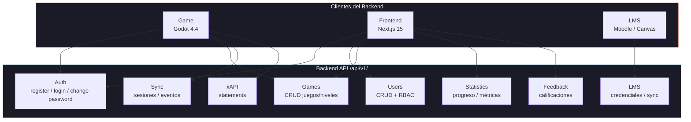
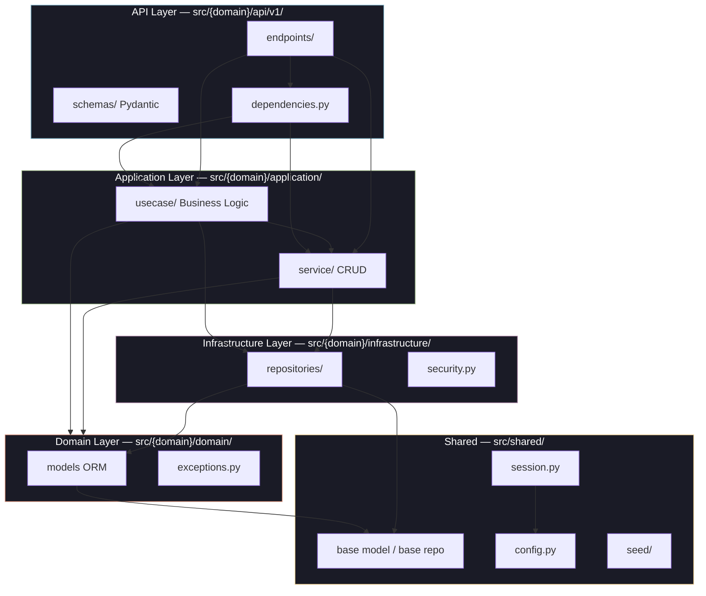
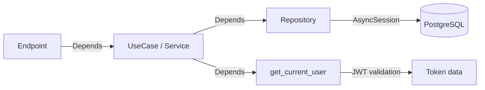
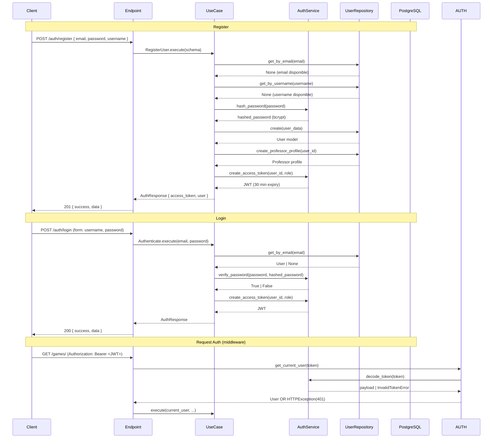

# PRD: Hello World Backend — API REST

> **El backbone inteligente de la plataforma Hello World. Garantiza integridad de datos, escalabilidad horizontal y cumplimiento de estándares educativos (xAPI 1.0, LTI 1.3) para tres tipos de clientes: el motor de juego (Godot), el panel del profesor (Next.js) y los sistemas LMS institucionales (Moodle, Canvas).**

**Versión**: 0.1.0-draft
**Derivado de**: PRD principal (`/PRD.md` v0.1.0-draft)
**Componente**: `apps/backend/`
**Fecha**: 2026-05-19
**Estado**: Draft

---

## Índice

1. [Visión y Misión del Backend](#1-visión-y-misión-del-backend)
2. [Catálogo de Funcionalidades](#2-catálogo-de-funcionalidades)
3. [Arquitectura del Backend](#3-arquitectura-del-backend)
4. [Diseño de API](#4-diseño-de-api)
5. [Modelo de Datos](#5-modelo-de-datos)
6. [Restricciones Técnicas y No-Objetivos](#6-restricciones-técnicas-y-no-objetivos)
7. [Métricas de Éxito](#7-métricas-de-éxito)

---

## 1. Visión y Misión del Backend

### 1.1 Visión

> **Ser la capa de integración invisible pero indispensable que garantiza que cada interacción de aprendizaje —desde que un estudiante conecta un bloque visual hasta que un profesor exporta un informe— sea almacenada con integridad, procesada con eficiencia y accesible bajo estándares abiertos.**

El backend no es un producto visible para el usuario final, sino la **columna vertebral** que hace posible que los otros componentes funcionen como un sistema coherente.

### 1.2 Misión

Proveer una **API REST robusta, segura y standards-compliant** que:

- **Sirva al Game (Godot)**: Autenticación de estudiantes, entrega de configuraciones de niveles, recepción de eventos de sincronización offline, almacenamiento de statements xAPI.
- **Sirva al Frontend (Next.js)**: CRUD de cursos/juegos/niveles, agregación de progreso estudiantil, exportación de reportes, gestión de usuarios.
- **Sirva a LMS Externos**: Sincronización bidireccional con Moodle y Canvas, grade passback, importación de matriculaciones.

### 1.3 Principios Rectores

| Principio | Implicación Técnica |
|-----------|---------------------|
| **Integridad de Datos** | Transacciones ACID, soft delete, validación Pydantic en todas las entradas, eventos idempotentes |
| **Escalabilidad Horizontal** | Stateless (JWT sin sesión en servidor), Uvicorn workers detrás de load balancer, pool de conexiones PostgreSQL |
| **Cumplimiento de Estándares** | xAPI 1.0 para tracking de aprendizaje, LTI 1.3 para integración LMS, OpenAPI 3.1 para contrato de API |
| **Tolerancia a Fallos** | Sync offline con al-menos-una entrega, dead-letter queue, partial success en operaciones batch |
| **Seguridad por Diseño** | JWT con expiración corta, bcrypt en passwords/tokens, CORS restringido, rate limiting |

### 1.4 Clientes y sus Contratos



---

## 2. Catálogo de Funcionalidades

### 2.1 Convenciones de Prioridad

| Prioridad | Horizonte | Definición |
|-----------|-----------|------------|
| **P0 — MVP/GA Critical** | Fase 1 (Meses 1–6) | Sin esto, la plataforma no puede operar. Bloqueante para el lanzamiento. |
| **P1 — Post-MVP** | Fase 2 (Meses 7–12) | Mejora significativa pero existe workaround. No bloquea el GA. |
| **P2 — Futuro** | Fase 3 (Meses 13–24) | Valor añadido. Se implementa según demanda. |

### 2.2 P0 — MVP/GA Critical

---

#### F-AUTH: Authentication API

| Atributo | Detalle |
|----------|---------|
| **Endpoint** | `POST /api/v1/auth/register`, `POST /api/v1/auth/login`, `POST /api/v1/auth/change-password` |
| **Descripción** | Sistema de autenticación JWT con bcrypt. Registro asigna rol `professor` automáticamente. Login devuelve JWT con expiración de 30 minutos. Cambio de contraseña requiere contraseña actual. |
| **Usuario objetivo** | Professors (register), Todos (login, change-password) |
| **Prioridad** | **P0** — Sin autenticación no hay acceso al sistema |
| **Dependencias** | PostgreSQL, tabla `users` |

**Validaciones**:
- `email`: formato email válido, único en base de datos
- `password`: mínimo 8 caracteres, al menos 1 mayúscula, 1 minúscula, 1 número, 1 carácter especial
- `username`: único, alfanumérico, 3–50 caracteres
- `current_password` en change-password: debe coincidir con el hash almacenado

**Escenarios de error**:

| Código HTTP | Condición | Mensaje |
|-------------|-----------|---------|
| 409 | Email duplicado | `"El correo electrónico ya está registrado"` |
| 409 | Username duplicado | `"El nombre de usuario ya está en uso"` |
| 401 | Credenciales inválidas | `"Credenciales inválidas"` |
| 401 | Token expirado | `"Token expirado"` |
| 400 | Contraseña actual incorrecta | `"La contraseña actual no es correcta"` |
| 422 | Validación Pydantic falla | Detalle del campo inválido |

---

#### F-USERS: User & Role Management API

| Atributo | Detalle |
|----------|---------|
| **Endpoint** | `GET /api/v1/users/`, `GET /api/v1/users/{id}`, `PUT /api/v1/users/{id}`, `DELETE /api/v1/users/{id}`, `GET /api/v1/users/students/` |
| **Descripción** | CRUD completo de usuarios con RBAC. Sólo admin puede listar/crear profesores. Professor puede crear estudiantes. Soft delete (marca `is_deleted=true`, no borra físicamente). |
| **Usuario objetivo** | Admin, Professor |
| **Prioridad** | **P0** — El RBAC es fundamental para la seguridad del sistema |
| **Dependencias** | F-AUTH (autenticación), seed de roles (admin creado vía seed) |

**Reglas de negocio**:
- `admin`: solo creado via seed (`src/shared/seed/run_seed.py`)
- `professor`: auto-asignado en `POST /auth/register`
- `student`: creado por professor via `POST /api/v1/users/students/`
- Soft delete: `is_deleted = true`, `deleted_at = now()`. Las consultas excluyen registros eliminados por defecto.

**Escenarios de error**:

| Código HTTP | Condición | Mensaje |
|-------------|-----------|---------|
| 403 | Professor intenta crear otro professor | `"No tienes permiso para crear usuarios con este rol"` |
| 404 | Usuario no encontrado | `"Usuario no encontrado"` |
| 409 | Email duplicado en actualización | `"El correo ya está en uso por otro usuario"` |

---

#### F-GAMES: Game & Level CRUD API

| Atributo | Detalle |
|----------|---------|
| **Endpoint** | `POST /api/v1/games/`, `GET /api/v1/games/`, `GET /api/v1/games/{id}`, `PUT /api/v1/games/{id}`, `DELETE /api/v1/games/{id}`, `POST /api/v1/games/{id}/levels`, `GET /api/v1/games/{id}/levels`, `PUT /api/v1/levels/{id}`, `DELETE /api/v1/levels/{id}` |
| **Descripción** | CRUD completo de juegos y niveles con soft delete. Un juego contiene múltiples niveles. Cada nivel tiene un `level_number` único dentro del mismo juego. Los niveles pueden tener segmentos con configuración JSON. Eager loading de relaciones (levels → segmentos). |
| **Usuario objetivo** | Professor (CRUD), Student (lectura), Admin (CRUD global) |
| **Prioridad** | **P0** — Sin contenido no hay plataforma |
| **Dependencias** | F-USERS (autorización basada en roles) |

**Validaciones**:
- `level_number`: único por `game_id`, entero positivo
- `title`: obligatorio, 1–255 caracteres
- Soft delete en cascada: eliminar un juego marca sus niveles como eliminados

**Escenarios de error**:

| Código HTTP | Condición | Mensaje |
|-------------|-----------|---------|
| 404 | Juego no encontrado | `"Juego no encontrado"` |
| 409 | level_number duplicado en el mismo juego | `"El nivel {n} ya existe en este juego"` |
| 403 | Professor intenta modificar juego de otro | `"No tienes permiso para modificar este juego"` |

---

#### F-SYNC: Sync Session & Event API

| Atributo | Detalle |
|----------|---------|
| **Endpoint** | `POST /api/v1/sync/sessions`, `POST /api/v1/sync/events`, `GET /api/v1/sync/sessions/{id}/events`, `PUT /api/v1/sync/sessions/{id}` |
| **Descripción** | Pipeline de sincronización offline/online. El game crea una sesión de sincronización asociada a una instancia de juego. Luego registra eventos tipados (`level_complete`, `hint_used`, `error_occurred`) con payloads JSON flexibles. Ciclo de vida de sesión: `active` → `completed`. Batch de hasta 50 eventos por request. |
| **Usuario objetivo** | Student (game client) |
| **Prioridad** | **P0** — El progreso offline debe persistir en el servidor |
| **Dependencias** | F-GAMES (game instances), F-USERS (student authentication) |

**Pipeline de procesamiento**:
1. Game autenticado crea `SyncSession` vía `POST /sync/sessions`
2. Game envía eventos batch vía `POST /sync/events` (array JSON)
3. Backend valida cada evento: `event_type` conocido, payload JSON válido, referencias FK válidas
4. Backend aplica deduplicación por `event_id + timestamp` (idempotencia)
5. Backend retorna confirmación por evento: `{ id, status: "accepted" | "duplicate" | "error" }`
6. Game cierra sesión vía `PUT /sync/sessions/{id}` con status `completed`

**Escenarios de error**:

| Código HTTP | Condición | Mensaje |
|-------------|-----------|---------|
| 400 | Payload inválido | `"El payload del evento no es JSON válido"` |
| 409 | event_type desconocido | `"Tipo de evento no reconocido: {type}"` |
| 422 | FK inválida (student/instance no existe) | `"La instancia de juego no existe"` |

---

#### F-STATS: Progress Tracking & Statistics API

| Atributo | Detalle |
|----------|---------|
| **Endpoint** | `GET /api/v1/statistics/summary`, `GET /api/v1/students/{id}/progress`, `GET /api/v1/statistics/export` |
| **Descripción** | Métricas por segmento: `attempt_count`, `error_count`, `hints_used_count`, `efficiency_rating`. Agregación por estudiante, nivel, juego y curso. Los profesores ven el progreso de todos sus estudiantes. Exportación a CSV. |
| **Usuario objetivo** | Professor (dashboard), Student (progreso propio) |
| **Prioridad** | **P0** — La propuesta de valor central es "datos para la toma de decisiones" |
| **Dependencias** | F-SYNC (los eventos de sincronización alimentan las métricas) |

**Cálculos de agregación**:

| Métrica | Fórmula | Nivel |
|---------|---------|-------|
| Tasa de finalización | `levels_completed / levels_asignados × 100` | Estudiante, Curso |
| Intentos promedio | `AVG(attempt_count)` por nivel completado | Estudiante |
| Rating de eficiencia | `AVG(efficiency_rating)` por instancia de juego | Estudiante |
| Uso de pistas | `SUM(hints_used_count) / COUNT(levels)` | Curso |
| Errores más comunes | `TOP 5 error_details` agrupado por tipo | Curso |

**Escenarios de error**:

| Código HTTP | Condición | Mensaje |
|-------------|-----------|---------|
| 403 | Professor ve estudiante de otro curso | `"No tienes permiso para ver este estudiante"` |
| 404 | Estudiante no encontrado | `"Estudiante no encontrado"` |
| 200 | Estudiante sin datos | `{ "success": true, "data": { "message": "Sin datos de progreso disponibles" } }` |

---

#### F-XAPI: xAPI Statement API

| Atributo | Detalle |
|----------|---------|
| **Endpoint** | `POST /api/v1/statements/xapi` |
| **Descripción** | Recibe, valida y almacena statements xAPI 1.0 del game. Validación de conformidad con el formato Actor-Verb-Object. Almacena el statement original completo en un campo JSON y extrae campos clave (actor, verb, object, result, context) en columnas indexadas para consultas eficientes. Proxy futuro a LRS externo. |
| **Usuario objetivo** | Student (game client) |
| **Prioridad** | **P0** — La interoperabilidad de datos de aprendizaje es un diferenciador clave |
| **Dependencias** | F-AUTH (autenticación), PostgreSQL (tipo JSONB para statement original) |

**Verbos xAPI soportados (P0)**:

| Statement | Verb ID | Actor | Object |
|-----------|---------|-------|--------|
| `level_attempted` | `http://adlnet.gov/expapi/verbs/attempted` | Student (UUID) | Level (IRI) |
| `level_completed` | `http://adlnet.gov/expapi/verbs/completed` | Student (UUID) | Level (IRI) |
| `level_failed` | `http://adlnet.gov/expapi/verbs/failed` | Student (UUID) | Level (IRI) |
| `hint_used` | `http://adlnet.gov/expapi/verbs/asked` | Student (UUID) | Hint (IRI) |

**Validaciones**:
- `actor` DEBE tener `account.name` + `account.homePage` o `mbox`
- `verb.id` DEBE ser una URI válida y conocido en el catálogo
- `object.id` DEBE ser una URI válida
- `timestamp` DEBE ser ISO 8601
- `result.extensions` DEBE contener campos conocidos (efficiency-rating, attempt-count, etc.) si se incluyen

**Escenarios de error**:

| Código HTTP | Condición | Mensaje |
|-------------|-----------|---------|
| 400 | Statement malformado | `"El statement xAPI no cumple con el formato requerido"` |
| 400 | Verb no soportado | `"El verbo xAPI no está soportado: {verb_id}"` |
| 422 | Campos requeridos faltantes | Detalle del campo faltante |

---

### 2.3 P1 — Post-MVP

---

#### F-FEEDBACK: Feedback API

| Atributo | Detalle |
|----------|---------|
| **Endpoint** | `POST /api/v1/feedback`, `GET /api/v1/feedback`, `GET /api/v1/feedback/stats` |
| **Descripción** | CRUD de feedback de estudiantes con rating (1–5) y comentarios. Los profesores ven estadísticas agregadas de feedback: rating promedio, distribución, tendencias temporales. |
| **Usuario objetivo** | Student (crear), Professor (leer estadísticas) |
| **Prioridad** | **P1** — El feedback mejora la enseñanza pero no bloquea el MVP |
| **Dependencias** | F-USERS (relación student/professor) |

**Validaciones**:
- `rating`: entero entre 1 y 5
- `comments`: texto, 1–2000 caracteres
- Un estudiante puede enviar múltiples feedbacks (por nivel, por juego)

---

#### F-GAME-INSTANCE: Game Instance Management API

| Atributo | Detalle |
|----------|---------|
| **Endpoint** | `POST /api/v1/game-instances`, `GET /api/v1/game-instances`, `GET /api/v1/game-instances/{id}`, `PATCH /api/v1/game-instances/{id}/status` |
| **Descripción** | Ciclo de vida de instancias de juego: `active` → `completed` / `abandoned`. Almacena métricas por instancia: `start_instance`, `duration`, `status`. Un estudiante puede tener múltiples instancias del mismo juego (reintentos). |
| **Usuario objetivo** | Student, Professor |
| **Prioridad** | **P1** — El MVP puede sincronizar eventos sin instancias formales |
| **Dependencias** | F-GAMES, F-USERS |

**Transiciones de estado**:
```
active → completed (estudiante completa todos los niveles)
active → abandoned (estudiante cierra sesión sin completar)
completed → (terminal)
abandoned → active (se reanuda la instancia)
```

---

#### F-LMS-CRED: LMS Credential Management API

| Atributo | Detalle |
|----------|---------|
| **Endpoint** | `POST /api/v1/lms/credentials`, `GET /api/v1/lms/credentials`, `PUT /api/v1/lms/credentials/{id}` |
| **Descripción** | Gestión de credenciales para LMS externos (Moodle, Canvas). Almacena email, URL del LMS, tokens de acceso/refresh OAuth. Las contraseñas se almacenan con bcrypt. Los tokens JAMÁS se devuelven en respuestas GET (campo mask: `"****"`). |
| **Usuario objetivo** | Professor, Admin |
| **Prioridad** | **P1** — La integración LMS puede gestionarse via API inicialmente |
| **Dependencias** | F-USERS |

**Proveedores soportados**: `moodle`, `canvas`

---

#### F-LMS-SYNC: LMS Sync API

| Atributo | Detalle |
|----------|---------|
| **Endpoint** | `POST /api/v1/lms/sync/import`, `POST /api/v1/lms/sync/export`, `GET /api/v1/lms/sync/history` |
| **Descripción** | Sincronización bidireccional con LMS: importar cursos, matriculaciones y estudiantes desde Moodle/Canvas; exportar calificaciones y progreso de vuelta al LMS. Soporta partial success: si falla un estudiante, los demás se procesan. Audit trail de cada operación. |
| **Usuario objetivo** | Professor, Admin |
| **Prioridad** | **P1** — La adopción institucional requiere integración LMS |
| **Dependencias** | F-LMS-CRED, F-STATS, F-USERS |

**Flujo de importación**:
1. Professor registra credenciales LMS (F-LMS-CRED)
2. Professor inicia importación: `POST /lms/sync/import`
3. Backend se conecta al LMS via API, obtiene cursos y matriculaciones
4. Backend crea/actualiza usuarios (estudiantes) y relaciones curso-estudiante
5. Backend retorna resumen: `{ imported: 45, skipped: 2, errors: 1, audit_id: "..." }`

**Flujo de exportación**:
1. Professor inicia exportación de calificaciones
2. Backend consulta progreso de estudiantes en el curso (F-STATS)
3. Backend envía calificaciones al LMS via grade passback (LTI AGS o Canvas API)
4. Backend registra resultado por estudiante en audit trail

---

### 2.4 P2 — Futuro

---

#### F-WS: WebSocket Real-Time Updates

| Atributo | Detalle |
|----------|---------|
| **Endpoint** | `WS /api/v1/ws/progress`, `WS /api/v1/ws/classroom` |
| **Descripción** | Conexión WebSocket para actualizaciones en tiempo real. El game envía eventos de progreso que el backend retransmite a los dashboards de profesores conectados. Permite monitoreo de aula en vivo: "Juan acaba de completar el Nivel 3", "María lleva 15 minutos en el Nivel 2". |
| **Usuario objetivo** | Student (emite), Professor (recibe) |
| **Prioridad** | **P2** — El polling (refresco manual o automático cada 30s) es suficiente para el MVP |
| **Dependencias** | F-SYNC, F-STATS |

---

#### F-EXPORT: Bulk Data Export API

| Atributo | Detalle |
|----------|---------|
| **Endpoint** | `GET /api/v1/export/users`, `GET /api/v1/export/progress`, `GET /api/v1/export/xapi` |
| **Descripción** | Exportación masiva de datos institucionales en formatos estándar (CSV, JSON). Incluye todos los usuarios, progreso acumulado, statements xAPI. Filtros por rango de fechas, curso, rol. |
| **Usuario objetivo** | Admin |
| **Prioridad** | **P2** — La exportación manual desde el dashboard es suficiente inicialmente |
| **Dependencias** | F-USERS, F-STATS, F-XAPI |

---

## 3. Arquitectura del Backend

### 3.1 Clean Architecture — Capas

El backend sigue **Clean Architecture** con cuatro capas, donde las dependencias apuntan hacia adentro (el dominio no sabe nada de la infraestructura):



| Capa | Responsabilidad | Lo que contiene |
|------|----------------|-----------------|
| **API** | Contrato HTTP, validación de entrada/salida, routing | Endpoints FastAPI, schemas Pydantic, dependencias de autenticación |
| **Application** | Orquestación de lógica de negocio, coordinación entre servicios | Servicios CRUD, Casos de Uso (UseCases) |
| **Domain** | Entidades de negocio, reglas de dominio, excepciones | Modelos SQLAlchemy, excepciones personalizadas |
| **Infrastructure** | Implementaciones concretas: base de datos, seguridad, APIs externas | Repositorios SQLAlchemy, JWT/bcrypt utils, clientes HTTP |

### 3.2 Estructura de Módulos

```
src/
├── auth/           # Autenticación: register, login, change-password, LMS login
├── users/          # Usuarios, roles, estudiantes, profesores, settings
├── game/           # Juegos, niveles, segmentos, instancias de juego
├── statistic/      # Progreso, métricas, feedback, xAPI statements
├── sync/           # Sesiones de sincronización, eventos de sincronización
├── shared/         # Base model, base repository, config, seed, utilidades
└── main.py         # Punto de entrada, configuración de rutas
```

Cada módulo replica la estructura Clean Architecture:

```
src/{domain}/
├── api/v1/
│   ├── endpoints/       # Un archivo por acción (login.py, register.py)
│   ├── schemas/         # Schemas Pydantic de request/response
│   └── dependencies.py  # Dependencias FastAPI (get_service, get_usecase)
├── application/
│   ├── service/         # Operaciones CRUD
│   └── usecase/         # Lógica de negocio orquestada
├── infrastructure/
│   └── *repository.py   # Implementación de repositorios SQLAlchemy
└── domain/
    ├── models.py        # Modelos ORM
    └── exceptions.py    # Excepciones de dominio
```

### 3.3 Árbol de Decisión: Service vs UseCase

```
¿La operación es CRUD simple o validación directa?
├── SÍ  → Service (ej: crear juego, listar niveles, obtener usuario)
└── NO  → ¿Requiere orquestación multi-servicio o lógica condicional compleja?
        ├── SÍ  → UseCase (ej: registrar usuario + asignar rol + crear perfil)
        └── NO  → Service (ej: validar y almacenar un statement xAPI)
```

**Ejemplos**:

| Operación | Componente | Justificación |
|-----------|-----------|---------------|
| `POST /auth/register` | **UseCase** `RegisterUser` | Orquesta: validar email único → hashear password → crear usuario → asignar rol professor → crear perfil profesor → retornar JWT |
| `GET /games/{id}` | **Service** `GameService.get_by_id()` | CRUD simple con validación de existencia y permisos |
| `POST /sync/events` | **Service** `SyncEventService.register_events()` | Validar payload, desduplicar, almacenar. Lógica directa. |
| `POST /lms/sync/import` | **UseCase** `ImportLMSData` | Orquesta: autenticar LMS → obtener cursos → mapear usuarios → crear/actualizar en DB → audit trail |

### 3.4 Patrón Repository

Cada entidad de dominio tiene un repositorio que abstrae la capa de persistencia:

```python
# Interfaz implícita (Python duck-typing)
class BaseRepository:
    async def create(self, schema) -> Model: ...
    async def get_by_id(self, id: UUID) -> Model | None: ...
    async def list(self, ...) -> list[Model]: ...
    async def update(self, id: UUID, schema) -> Model: ...
    async def soft_delete(self, id: UUID) -> None: ...

class UserRepository(BaseRepository):
    async def get_by_email(self, email: str) -> User | None: ...
    async def get_by_username(self, username: str) -> User | None: ...
    async def list_students(self, professor_id: UUID) -> list[Student]: ...
```

**Beneficios**:
- Los servicios/usecases dependen de abstracciones, no de SQLAlchemy directamente
- Los tests pueden mockear repositorios sin base de datos
- Cambiar de ORM (o a SQL raw) solo implica cambiar la implementación del repositorio

### 3.5 Inyección de Dependencias

FastAPI `Depends()` conecta las capas:



```python
# Endpoint
@router.post("/auth/register", response_model=AuthResponse)
async def register(
    schema: RegisterSchema,
    usecase: RegisterUser = Depends(get_register_usecase),
):
    return await usecase.execute(schema)

# Dependencia del UseCase
def get_register_usecase(
    session: AsyncSession = Depends(get_session),
    user_repo: UserRepository = Depends(get_user_repository),
    auth_service: AuthService = Depends(get_auth_service),
) -> RegisterUser:
    return RegisterUser(session=session, user_repo=user_repo, auth_service=auth_service)
```

### 3.6 Flujo de Autenticación



**Mecanismo de autenticación**:
- **JWT (HS256)**: 30 minutos de expiración. Payload: `{ sub: user_id, role: role_name, exp: timestamp }`
- **Password hashing**: bcrypt con cost factor 12 (passlib)
- **Deduplicación de sesiones**: No hay sesiones en servidor (stateless). El token contiene toda la información.
- **Refresh tokens**: No implementados en MVP (P1). El game puede solicitar re-login silencioso con credenciales almacenadas.

### 3.7 Pipeline de Sincronización Offline

El pipeline procesa eventos del game cliente que pueden haber sido generados sin conexión:

```mermaid
flowchart LR
    subgraph CLIENT["Game Client"]
        A[Evento generado<br/>durante gameplay]
        B[(SQLite local<br/>status: pending)]
        C[Detectar<br/>conectividad]
    end

    subgraph WIRE["Red"]
        D[HTTP POST /sync/events<br/>batch ≤ 50 eventos]
    end

    subgraph SERVER["Backend API"]
        E[Validar payload<br/>Pydantic + FKs]
        F{Deducidir<br/>duplicado?}
        G[Almacenar en<br/>PostgreSQL]
        H[Confirmar por evento<br/>{ id, status }]
    end

    A --> B
    B --> C
    C -->|online| D
    D --> E
    E --> F
    F -->|nuevo| G
    F -->|duplicado| H
    G --> H
    H -->|respuesta| C
    C -->|marcar synced| B

    style CLIENT fill:#1a1b26,stroke:#D08770,color:#fff
    style WIRE fill:#1a1b26,stroke:#7FB4CA,color:#fff
    style SERVER fill:#1a1b26,stroke:#A3BE8C,color:#fff
```

**Garantías del pipeline**:

| Garantía | Mecanismo |
|----------|-----------|
| **Al-menos-una entrega** | Los eventos no se eliminan del SQLite local hasta que el backend confirma recepción |
| **Idempotencia** | Backend desduplica por `(event_type, timestamp, student_id)` compuesto |
| **Ordenamiento** | Los eventos se envían en orden cronológico ascendente por `created_at` |
| **Dead-letter** | Eventos con >5 reintentos fallidos se aíslan para revisión manual |

---

## 4. Diseño de API

### 4.1 Formato de Respuesta Estándar

Todas las respuestas siguen el formato:

```json
{
  "success": true,
  "message": "Operación exitosa",
  "data": { ... }
}
```

**Respuesta de error**:

```json
{
  "success": false,
  "message": "Error de validación",
  "detail": {
    "field": "email",
    "reason": "El correo electrónico ya está registrado"
  }
}
```

### 4.2 Formato de Error Técnico (HTTPException)

```json
{
  "detail": {
    "code": "USER_NOT_FOUND",
    "message": "Usuario no encontrado",
    "params": { "user_id": "uuid-1234" }
  }
}
```

| Campo | Descripción |
|-------|-------------|
| `code` | Código de error machine-readable (SCREAMING_SNAKE_CASE) |
| `message` | Mensaje para el usuario en español |
| `params` | Parámetros contextuales (opcional, para debugging) |

### 4.3 Paginación

```json
// Request
GET /api/v1/games/?skip=0&limit=20&sort_by=created_at&sort_order=desc

// Response
{
  "success": true,
  "message": "Juegos obtenidos exitosamente",
  "data": [ ... ],
  "pagination": {
    "total": 150,
    "skip": 0,
    "limit": 20,
    "next": "/api/v1/games/?skip=20&limit=20",
    "prev": null
  }
}
```

| Parámetro | Default | Máximo | Descripción |
|-----------|---------|--------|-------------|
| `skip` | 0 | — | Número de registros a saltar |
| `limit` | 20 | 100 | Máximo de registros por página |
| `sort_by` | `created_at` | — | Campo de ordenamiento |
| `sort_order` | `desc` | — | `asc` o `desc` |

### 4.4 Convenciones de Nomenclatura

| Elemento | Convención | Ejemplo |
|----------|------------|---------|
| **Rutas** | `snake_case` plural | `/api/v1/games/`, `/api/v1/sync/events` |
| **Parámetros query** | `snake_case` | `?student_id=uuid&include_deleted=false` |
| **Campos JSON** | `snake_case` | `{ "level_number": 1, "efficiency_rating": 85 }` |
| **Códigos de error** | `SCREAMING_SNAKE_CASE` | `EMAIL_ALREADY_EXISTS` |
| **Códigos HTTP** | Estándar RESTful | 200 OK, 201 Created, 400 Bad Request, 401 Unauthorized, 403 Forbidden, 404 Not Found, 409 Conflict, 422 Unprocessable Entity |

### 4.5 Estrategia de Versionado

- **Prefijo de ruta**: `/api/v1/`
- **Cabecera de versión alternativa** (futuro): `Accept: application/vnd.helloworld.v2+json`
- **Cambios breaking**: Nueva versión MAJOR → nuevo path `/api/v2/`. La versión anterior se mantiene por 6 meses con deprecation header: `Sunset: Sat, 01 Nov 2027 00:00:00 GMT`
- **Cambios non-breaking**: Se añaden campos opcionales a respuestas existentes. Los clientes ignoran campos desconocidos.

### 4.6 Endpoints Completos

#### Módulo Auth

| Método | Endpoint | Auth | Descripción | Prioridad |
|--------|----------|------|-------------|-----------|
| POST | `/api/v1/auth/register` | No | Registrar profesor | P0 |
| POST | `/api/v1/auth/login` | No | Iniciar sesión | P0 |
| POST | `/api/v1/auth/change-password` | Sí | Cambiar contraseña | P0 |
| POST | `/api/v1/auth/lms-login` | Sí | Login con credenciales LMS (P1) | P1 |

#### Módulo Users

| Método | Endpoint | Auth | Rol | Prioridad |
|--------|----------|------|-----|-----------|
| GET | `/api/v1/users/` | Sí | Admin | P0 |
| GET | `/api/v1/users/{id}` | Sí | Admin/Professor | P0 |
| PUT | `/api/v1/users/{id}` | Sí | Admin/Professor | P0 |
| DELETE | `/api/v1/users/{id}` | Sí | Admin | P0 |
| GET | `/api/v1/users/students/` | Sí | Professor | P0 |
| POST | `/api/v1/users/students/` | Sí | Professor | P0 |

#### Módulo Games

| Método | Endpoint | Auth | Prioridad |
|--------|----------|------|-----------|
| POST | `/api/v1/games/` | Sí | P0 |
| GET | `/api/v1/games/` | Sí | P0 |
| GET | `/api/v1/games/{id}` | Sí | P0 |
| PUT | `/api/v1/games/{id}` | Sí | P0 |
| DELETE | `/api/v1/games/{id}` | Sí | P0 |
| POST | `/api/v1/games/{id}/levels` | Sí | P0 |
| GET | `/api/v1/games/{id}/levels` | Sí | P0 |
| PUT | `/api/v1/levels/{id}` | Sí | P0 |
| DELETE | `/api/v1/levels/{id}` | Sí | P0 |

#### Módulo Sync

| Método | Endpoint | Auth | Prioridad |
|--------|----------|------|-----------|
| POST | `/api/v1/sync/sessions` | Sí | P0 |
| GET | `/api/v1/sync/sessions/{id}` | Sí | P0 |
| PUT | `/api/v1/sync/sessions/{id}` | Sí | P0 |
| POST | `/api/v1/sync/events` | Sí | P0 |
| GET | `/api/v1/sync/sessions/{id}/events` | Sí | P0 |

#### Módulo Statistics

| Método | Endpoint | Auth | Prioridad |
|--------|----------|------|-----------|
| GET | `/api/v1/statistics/summary` | Sí | P0 |
| GET | `/api/v1/students/{id}/progress` | Sí | P0 |
| GET | `/api/v1/statistics/export` | Sí | P1 |

#### Módulo xAPI

| Método | Endpoint | Auth | Prioridad |
|--------|----------|------|-----------|
| POST | `/api/v1/statements/xapi` | Sí | P0 |
| GET | `/api/v1/statements/xapi` | Sí | P1 (consulta) |

#### Módulo Feedback

| Método | Endpoint | Auth | Prioridad |
|--------|----------|------|-----------|
| POST | `/api/v1/feedback` | Sí | P1 |
| GET | `/api/v1/feedback` | Sí | P1 |
| GET | `/api/v1/feedback/stats` | Sí | P1 |

#### Módulo Game Instance

| Método | Endpoint | Auth | Prioridad |
|--------|----------|------|-----------|
| POST | `/api/v1/game-instances` | Sí | P1 |
| GET | `/api/v1/game-instances` | Sí | P1 |
| GET | `/api/v1/game-instances/{id}` | Sí | P1 |
| PATCH | `/api/v1/game-instances/{id}/status` | Sí | P1 |

#### Módulo LMS

| Método | Endpoint | Auth | Prioridad |
|--------|----------|------|-----------|
| POST | `/api/v1/lms/credentials` | Sí | P1 |
| GET | `/api/v1/lms/credentials` | Sí | P1 |
| PUT | `/api/v1/lms/credentials/{id}` | Sí | P1 |
| POST | `/api/v1/lms/sync/import` | Sí | P1 |
| POST | `/api/v1/lms/sync/export` | Sí | P1 |
| GET | `/api/v1/lms/sync/history` | Sí | P1 |

#### Módulo Export (P2)

| Método | Endpoint | Auth | Prioridad |
|--------|----------|------|-----------|
| GET | `/api/v1/export/users` | Sí | P2 |
| GET | `/api/v1/export/progress` | Sí | P2 |
| GET | `/api/v1/export/xapi` | Sí | P2 |

#### WebSocket (P2)

| Tipo | Endpoint | Auth | Prioridad |
|------|----------|------|-----------|
| WS | `/api/v1/ws/progress` | Sí | P2 |
| WS | `/api/v1/ws/classroom` | Sí | P2 |

---

## 5. Modelo de Datos

### 5.1 Dominios de Base de Datos

La base de datos está organizada en cuatro dominios conceptuales, cada uno con un conjunto de tablas fuertemente relacionadas:

| Dominio | Tablas | Propósito |
|---------|--------|-----------|
| **Users** | `users`, `roles`, `students`, `professors`, `teacher_settings`, `lms_credentials` | Autenticación, autorización, perfiles |
| **Game** | `games`, `levels`, `segment_levels`, `game_instances` | Catálogo de contenido y sesiones de juego |
| **Statistic** | `progresses`, `feedbacks`, `metric_types`, `xapi_statements` | Tracking de aprendizaje y métricas |
| **Sync** | `sync_sessions`, `sync_events` | Sincronización offline/online |

### 5.2 Diagrama de Relaciones

```mermaid
erDiagram
    %% ============================================
    %% DOMINIO: USUARIOS
    %% ============================================
    USERS {
        uuid id PK
        string username UK
        string email UK
        string hashed_password
        string name
        string lastname
        string avatar_url
        boolean is_active
        datetime last_login
        uuid role_id FK
        uuid lms_id FK
        datetime created_at
        datetime updated_at
        datetime deleted_at
        boolean is_deleted
    }

    ROLES {
        uuid id PK
        string role_name UK
        string description
        datetime created_at
        datetime updated_at
    }

    STUDENTS {
        uuid id PK
        uuid user_id FK UK
        datetime created_at
        datetime updated_at
    }

    PROFESSORS {
        uuid id PK
        uuid user_id FK UK
        string department
        string contact_phone
        datetime created_at
        datetime updated_at
    }

    TEACHER_SETTINGS {
        uuid id PK
        uuid user_id FK UK
        string theme
        boolean notifications_enabled
        string notification_frequency
        string interface_language
        datetime created_at
        datetime updated_at
    }

    LMS_CREDENTIALS {
        uuid id PK
        string lms_email UK
        string lms_password
        string lms_provider
        string lms_url
        string access_token
        string refresh_token
        datetime expire_at
        datetime created_at
        datetime updated_at
    }

    %% ============================================
    %% DOMINIO: JUEGO
    %% ============================================
    GAMES {
        uuid id PK
        string title
        string description
        uuid creator_id FK
        string subject
        string publication_status
        datetime created_at
        datetime updated_at
        datetime deleted_at
        boolean is_deleted
    }

    LEVELS {
        uuid id PK
        int level_number
        string title
        string description
        string goal
        uuid game_id FK
        datetime created_at
        datetime updated_at
    }

    SEGMENT_LEVELS {
        uuid id PK
        uuid level_id FK
        json configuration
        datetime created_at
        datetime updated_at
    }

    GAME_INSTANCES {
        uuid id PK
        datetime start_instance
        string status
        uuid student_id FK
        uuid game_id FK
        datetime created_at
        datetime updated_at
    }

    %% ============================================
    %% DOMINIO: ESTADÍSTICAS
    %% ============================================
    PROGRESSES {
        uuid id PK
        uuid student_id FK
        uuid segment_level_id FK
        int attempt_count
        int error_count
        int hints_used_count
        json errors_details
        int objectives_completed
        int efficiency_rating
        datetime created_at
        datetime updated_at
    }

    FEEDBACKS {
        uuid id PK
        text comments
        int rating
        uuid student_id FK
        datetime created_at
        datetime updated_at
    }

    METRIC_TYPES {
        uuid id PK
        string name
        string code UK
        string description
        datetime created_at
        datetime updated_at
    }

    XAPI_STATEMENTS {
        uuid id PK
        string actor_mbox
        string actor_account_name
        string actor_account_homepage
        string verb_id
        json verb_display
        string object_id
        string object_type
        string object_definition_type
        json object_definition_name
        string platform
        string language
        json context_extensions
        string context_platform
        string result_score_raw
        string result_score_min
        string result_score_max
        string result_score_scaled
        boolean result_success
        boolean result_completion
        string result_duration
        text result_response
        json result_extensions
        datetime timestamp
        datetime stored
        json statement
        uuid student_id FK
        uuid game_id FK
        uuid level_id FK
        uuid segment_id FK
    }

    %% ============================================
    %% DOMINIO: SINCRONIZACIÓN
    %% ============================================
    SYNC_SESSIONS {
        uuid id PK
        datetime start_time
        datetime end_time
        string status
        uuid instance_id FK
        datetime created_at
        datetime updated_at
    }

    SYNC_EVENTS {
        uuid id PK
        string event_type
        json payload
        datetime timestamp
        string status
        uuid sync_session_id FK
        datetime created_at
        datetime updated_at
    }

    %% ============================================
    %% RELACIONES
    %% ============================================
    ROLES ||--o{ USERS : "tiene"
    USERS ||--o| STUDENTS : "es"
    USERS ||--o| PROFESSORS : "es"
    USERS ||--o| TEACHER_SETTINGS : "configura"
    USERS ||--o| LMS_CREDENTIALS : "posee"
    USERS ||--o{ GAMES : "crea"

    GAMES ||--o{ LEVELS : "contiene"
    LEVELS ||--o{ SEGMENT_LEVELS : "segmenta"
    GAMES ||--o{ GAME_INSTANCES : "instancia"
    STUDENTS ||--o{ GAME_INSTANCES : "juega"

    STUDENTS ||--o{ PROGRESSES : "genera"
    SEGMENT_LEVELS ||--o{ PROGRESSES : "mide"
    STUDENTS ||--o{ FEEDBACKS : "envía"
    STUDENTS ||--o{ XAPI_STATEMENTS : "emite"
    GAMES ||--o{ XAPI_STATEMENTS : "referencia"
    LEVELS ||--o{ XAPI_STATEMENTS : "referencia"

    GAME_INSTANCES ||--o{ SYNC_SESSIONS : "sincroniza"
    SYNC_SESSIONS ||--o{ SYNC_EVENTS : "contiene"
```

### 5.3 Restricciones e Índices Clave

| Tabla | Restricción / Índice | Tipo | Propósito |
|-------|---------------------|------|-----------|
| `users` | `username` | UNIQUE INDEX | Login por username |
| `users` | `email` | UNIQUE INDEX | Login por email, unicidad |
| `users` | `(role_id, is_deleted)` | INDEX | Filtro rápido por rol |
| `games` | `(creator_id, is_deleted)` | INDEX | Juegos de un profesor |
| `levels` | `(game_id, level_number)` | UNIQUE INDEX | Unicidad de nivel por juego |
| `progresses` | `(student_id, segment_level_id)` | UNIQUE INDEX | Un progreso por estudiante/segmento |
| `sync_events` | `(sync_session_id, timestamp)` | INDEX | Eventos ordenados por sesión |
| `xapi_statements` | `(actor_account_name, timestamp)` | INDEX | Consultas por estudiante y tiempo |
| `xapi_statements` | `(student_id, game_id, level_id)` | COMPOSITE INDEX | Consultas de progreso |

### 5.4 Esquema del Statement xAPI

La tabla `xapi_statements` almacena el statement completo en un campo JSONB (`statement`) para preservar el dato original, y extrae campos clave en columnas indexadas para consultas eficientes. Esto permite:

1. **Validación**: El statement completo se valida contra el schema xAPI 1.0
2. **Preservación**: El `statement` JSONB es la fuente de verdad inmutable
3. **Consultas**: Los campos extraídos (actor, verb, object, result, context) están indexados

```json
{
  "statement": {
    "id": "uuid-1234",
    "actor": { "objectType": "Agent", "account": { "homePage": "https://hw.dev", "name": "student-uuid" } },
    "verb": { "id": "http://adlnet.gov/expapi/verbs/completed", "display": { "es": "completó" } },
    "object": { "objectType": "Activity", "id": "https://hw.dev/levels/1", "definition": { ... } },
    "result": { "success": true, "completion": true, "duration": "PT15M32S", "extensions": { ... } },
    "context": { "contextActivities": { "parent": [...], "grouping": [...] }, "extensions": { ... } },
    "timestamp": "2026-05-15T14:30:00Z",
    "stored": "2026-05-15T14:30:05Z"
  },
  "actor_account_name": "student-uuid",
  "verb_id": "http://adlnet.gov/expapi/verbs/completed",
  "object_id": "https://hw.dev/levels/1",
  "result_success": true,
  "timestamp": "2026-05-15T14:30:00Z",
  "student_id": "uuid-5678",
  "game_id": "uuid-9012",
  "level_id": "uuid-3456"
}
```

---

## 6. Restricciones Técnicas y No-Objetivos

### 6.1 Restricciones Técnicas

| Restricción | Detalle | Justificación |
|-------------|---------|---------------|
| **Async para todo I/O** | SQLAlchemy AsyncSession, HTTP client async (httpx), FastAPI async handlers | Escalabilidad: no bloquear event loop de Uvicorn |
| **Stateless** | La sesión de usuario está en el JWT, no en memoria del servidor | Escalamiento horizontal: cualquier worker puede atender cualquier request |
| **PostgreSQL-specific features** | JSONB para datos semiestructurados, array columns si es necesario | Aprovechar el motor de base de datos; no hay planes de migrar a otro DBMS |
| **UUIDv4 para PKs** | Todas las primary keys usan UUID v4 | Seguridad (no exponer secuencia), compatibilidad distribuida |
| **Soft delete obligatorio** | Campo `is_deleted` + `deleted_at` en todas las entidades principales | Recuperación de datos ante eliminación accidental, audit trail |
| **Un endpoint por archivo** | Cada endpoint en su propio archivo `.py` dentro de `endpoints/` | Mantenibilidad, navegación, claridad en code reviews |
| **Pydantic v2 para validación** | Schemas de request/response, validación de tipos, regex, custom validators | Consistencia, documentación automática en Swagger |
| **JWT con expiración corta** | 30 minutos, HS256, sin refresh token en MVP | Seguridad: ventana de ataque limitada |
| **bcrypt cost factor 12** | passlib.context CryptContext con `schemes=["bcrypt"], deprecated="auto"` | Resistencia a ataques de fuerza bruta |

### 6.2 No-Objetivos Explícitos

| No-Objetivo | Razón | Alternativa |
|-------------|-------|-------------|
| **NO es una plataforma en tiempo real** (inicialmente) | WebSockets son P2; el MVP funciona con polling | Refresco manual del dashboard o auto-refresh cada 30s |
| **NO es un servicio de almacenamiento de archivos** | El backend no almacena assets de juego, imágenes ni archivos subidos | Los assets del juego se sirven desde el repositorio Godot o un CDN externo |
| **NO reemplaza a un LRS** | El backend almacena statements xAPI pero no es un Learning Record Store completo (no tiene dashboard LRS, reporting LRS, ni exportación en formato LRS estándar) | El backend puede proxy statements a un LRS externo (P2) o ser exportado manualmente |
| **NO tiene sistema de colas/workers** | El MVP procesa sync events sincrónicamente dentro del request HTTP | Si el throughput lo requiere (P1), se puede introducir Redis + Celery/ARQ para procesamiento asíncrono |
| **NO tiene caché distribuida** (inicialmente) | El MVP lee de PostgreSQL directamente en todas las consultas | Redis para cache de consultas analíticas pesadas es P1 |
| **NO tiene SSO/SAML** | La autenticación es JWT directa; no hay integración con proveedores de identidad institucionales | SAML/SSO es P2, requerido para adopción enterprise |
| **NO tiene multi-tenancy** | Todos los usuarios comparten la misma base de datos; no hay aislamiento por institución | Schema-based multi-tenancy es P2, requerido para hosting multi-institucional |

### 6.3 Stack Tecnológico

| Componente | Versión | Propósito |
|------------|---------|-----------|
| Python | 3.12+ | Lenguaje de programación |
| FastAPI | 0.115+ | Framework web REST |
| SQLAlchemy | 2.0 (Async) | ORM asíncrono |
| Alembic | Última estable | Migraciones de base de datos |
| Pydantic | v2 | Validación de datos |
| PostgreSQL | 16 | Motor de base de datos |
| PyJWT | Última estable | Generación/validación de JWT |
| passlib | Última estable | Hashing de contraseñas (bcrypt) |
| pytest | Última estable | Testing |
| pytest-cov | Última estable | Cobertura de código |
| httpx | Última estable | Cliente HTTP asíncrono (tests, LMS) |
| uv | Última estable | Gestor de paquetes Python |

---

## 7. Métricas de Éxito

### 7.1 Métricas de Rendimiento

| Métrica | Target (p95) | Target (p99) | Cómo se mide |
|---------|-------------|-------------|--------------|
| **Auth endpoints** (login, register) | ≤ 500ms | ≤ 1000ms | APM (OpenTelemetry), test de carga con 100 usuarios concurrentes |
| **Read endpoints** (GET games, levels, users) | ≤ 200ms | ≤ 500ms | APM, test de carga con 500 lecturas concurrentes |
| **Write endpoints** (POST sync events, statements) | ≤ 400ms | ≤ 800ms | APM, batch de 50 eventos, 200 escrituras concurrentes |
| **Analytics queries** (summaries, aggregates) | ≤ 2000ms | ≤ 5000ms | APM, base de datos con 10K estudiantes, 50K eventos |
| **Export endpoints** (CSV) | ≤ 5000ms | ≤ 10000ms | Exportación de 1K estudiantes |
| **Sync throughput** | ≥ 500 eventos/segundo | — | Test de carga con eventos batch |

### 7.2 Métricas de Disponibilidad

| Métrica | Target MVP | Target 12 Meses | Target 24 Meses |
|---------|-----------|-----------------|-----------------|
| Uptime | 99.5% (≈3.5h/mes downtime) | 99.9% (≈45min/mes) | 99.95% (≈22min/mes) |
| Tiempo de recuperación (RTO) | ≤ 30 minutos | ≤ 15 minutos | ≤ 5 minutos |
| Punto de recuperación (RPO) | ≤ 5 minutos | ≤ 1 minuto | Cero (sync síncrono) |

### 7.3 Métricas de Calidad

| Métrica | Target | Método de Medición |
|---------|--------|-------------------|
| **Tasa de error por endpoint** | < 0.1% (4xx + 5xx / total requests) | APM + logs centralizados |
| **Tasa de error 5xx** | < 0.01% | Alarma en APM si supera el umbral |
| **Cobertura de pruebas** | ≥ 70% líneas | `pytest --cov=src` en CI |
| **Endpoint coverage** | 100% de endpoints P0 tienen test de integración | Inventario de tests vs endpoints |
| **Migraciones sin downtime** | 100% de migraciones P0 reversibles | Test de rollback en CI (alembic downgrade) |
| **Latencia P99 estable** | Sin regresiones >10% respecto al baseline | CI compara p99 contra el commit anterior |

### 7.4 Métricas de Confianza de Migración

| Práctica | Target | Verificación |
|----------|--------|-------------|
| Toda migración tiene `downgrade()` | 100% | Code review + CI test: `alembic upgrade head && alembic downgrade -1` |
| Migraciones probadas en staging | 100% antes de producción | Pipeline CI/CD: aplicar migraciones en DB de staging, correr tests, revertir |
| Migraciones sin bloqueo de tabla | 100% para tablas con datos | Usar `ALTER TABLE ... ADD COLUMN IF NOT EXISTS`, crear índices CONCURRENTLY |
| Backward compatibility de datos | Migraciones P0 no eliminan columnas | Code review verifica que no hay DROP COLUMN en tablas P0 |

### 7.5 Thresholds de Alarma

| Evento | Alarma | Acción |
|--------|--------|--------|
| P95 > 1000ms en cualquier endpoint P0 | 🔴 Crítica | Notificar al equipo, revertear si es deploy reciente |
| Tasa de error 5xx > 0.1% en 5 minutos | 🔴 Crítica | Notificar, activar on-call |
| Endpoint P0 con > 10% de errores 4xx | 🟡 Advertencia | Revisar logs, posible cambio en frontend/game que envía datos incorrectos |
| Sincronización batch con > 5% de eventos fallidos | 🟡 Advertencia | Revisar dead-letter queue, posibles errores de validación |
| Cobertura de tests < 65% en PR | 🟡 Advertencia (CI) | Bloquear merge hasta que se añadan tests |
| Conexiones PostgreSQL > 80% del pool | 🟡 Advertencia | Escalar conexiones, revisar pool size |

---

*Este documento es un sub-PRD derivado del PRD principal de Hello World Platform. Para el contexto completo del producto, referirse a `/PRD.md`. Para especificaciones técnicas detalladas, consultar `docs/database-design.md`, `docs/user_stories.md` y `README.md` del backend.*
