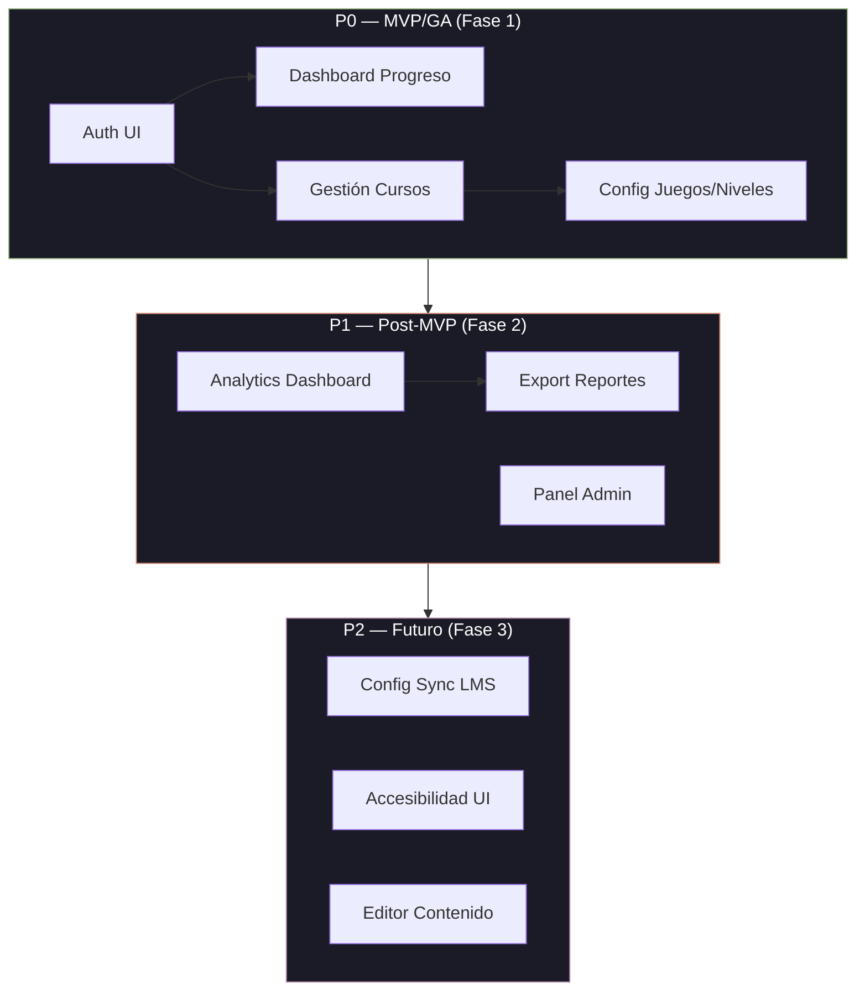
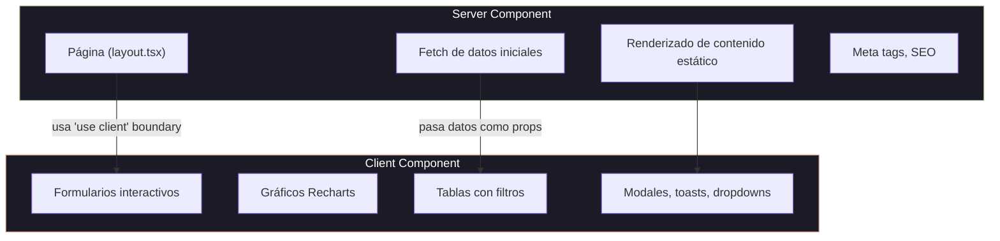
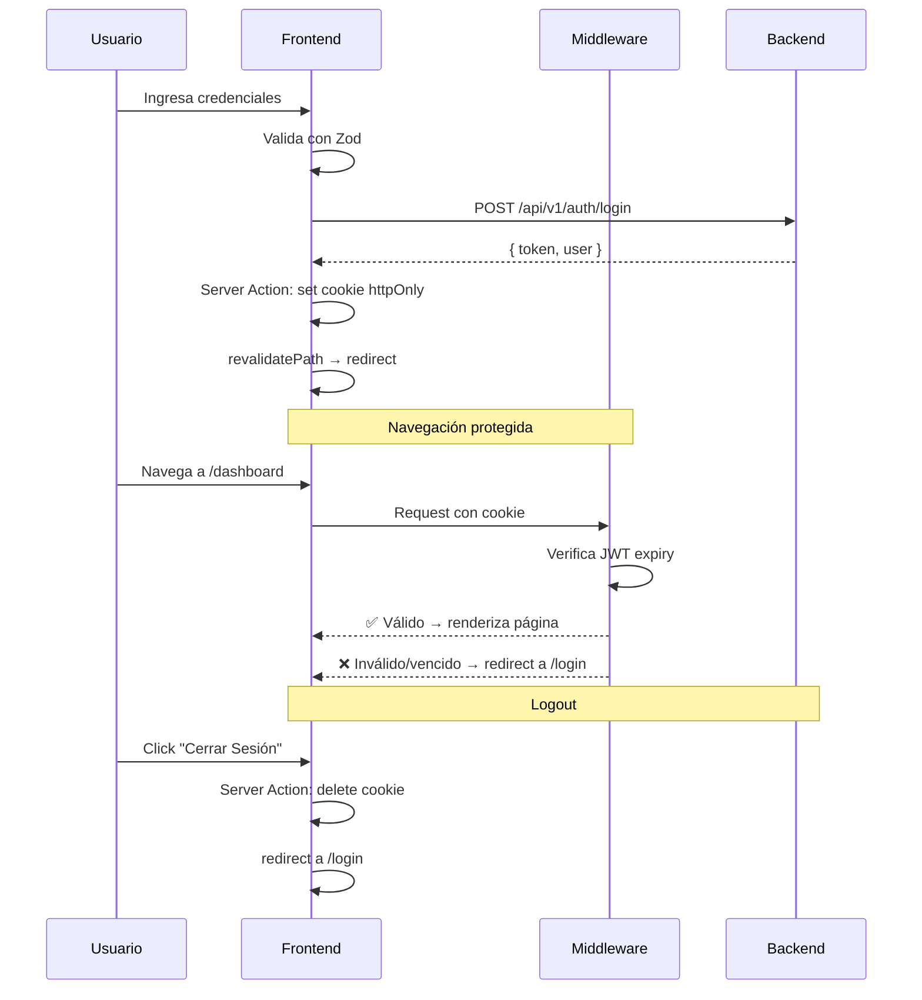
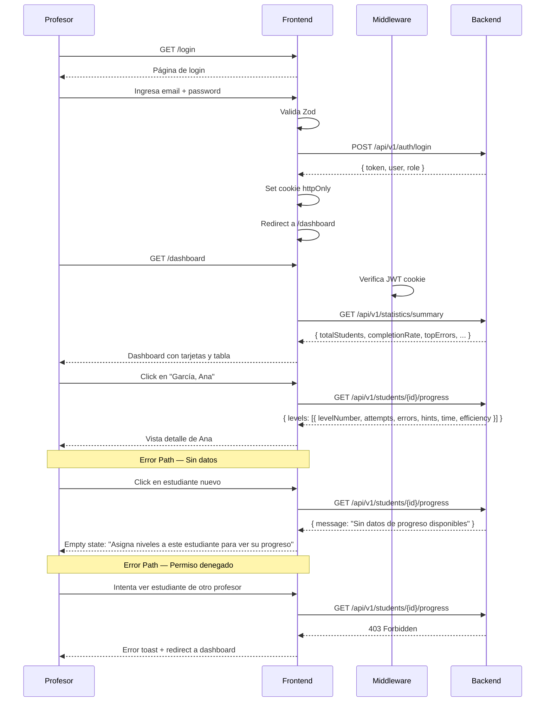
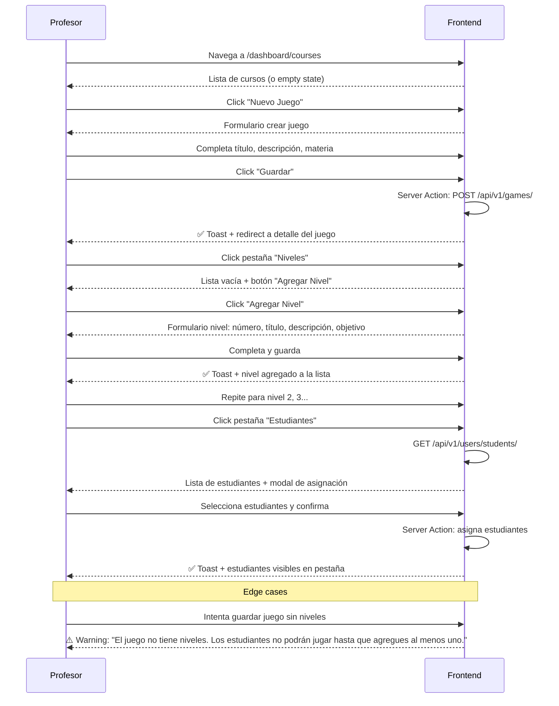
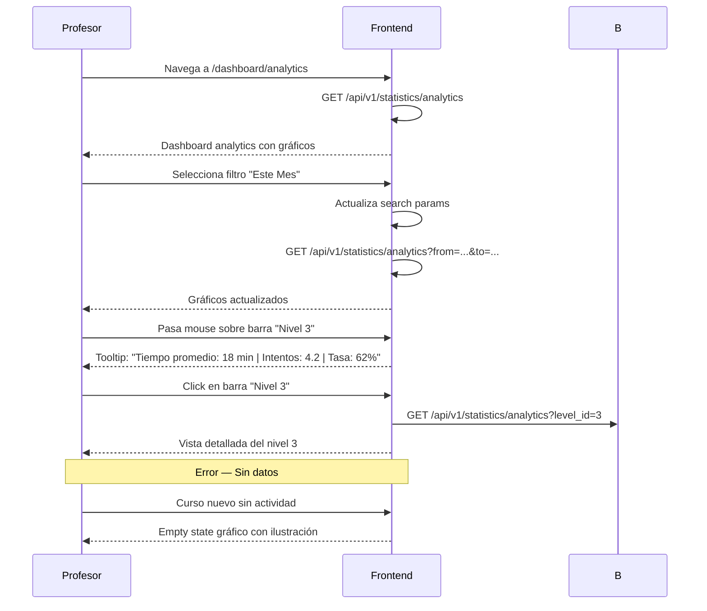
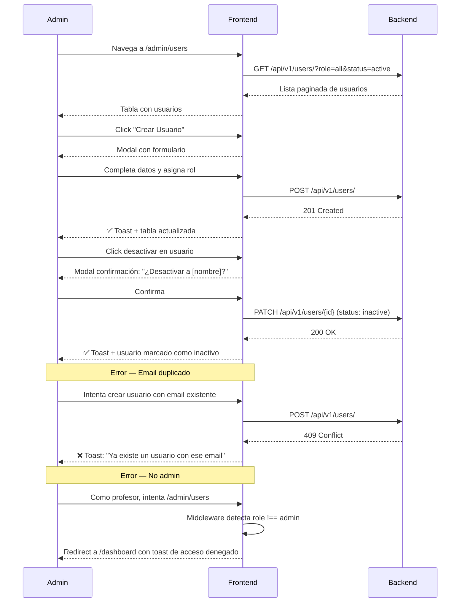
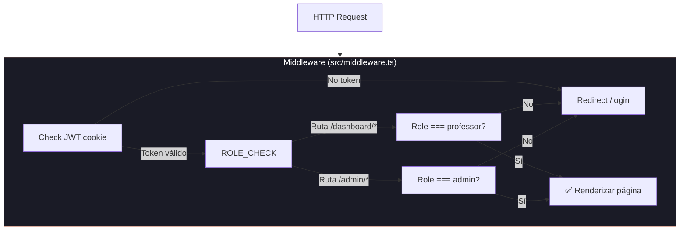

# PRD: Hello World Frontend — Dashboard Administrativo

> **Sub-componente del ecosistema Hello World Platform. Dashboard web para profesores y administradores que permite gestión de cursos, seguimiento de estudiantes, analítica avanzada y configuración del sistema.**

**Versión:** 0.1.0-draft
**Componente:** Frontend (Next.js 15.5, React 19, TypeScript 5)
**Derivado de:** PRD Principal v0.1.0-draft (`/PRD.md`)
**Fecha:** 2026-05-19
**Estado:** Draft

---

## Índice

1. [Visión y Misión del Frontend](#1-visión-y-misión-del-frontend)
2. [Catálogo de Funcionalidades](#2-catálogo-de-funcionalidades)
3. [Arquitectura del Frontend](#3-arquitectura-del-frontend)
4. [Flujos de Usuario](#4-flujos-de-usuario)
5. [Principios de Diseño UI/UX](#5-principios-de-diseño-uiux)
6. [Rutas y Navegación](#6-rutas-y-navegación)
7. [Restricciones Técnicas y No-Objetivos](#7-restricciones-técnicas-y-no-objetivos)
8. [Métricas de Éxito](#8-métricas-de-éxito)

---

## 1. Visión y Misión del Frontend

### 1.1 Declaración de Visión

> **El dashboard de Hello World convierte a cada profesor en un arquitecto del aprendizaje: con herramientas para diseñar experiencias educativas, visibilidad en tiempo real del progreso de cada estudiante, y datos para tomar decisiones pedagógicas informadas.**

El frontend no es un simple panel de control — es el centro de comando desde donde los profesores orquestan el ecosistema Hello World. Mientras el juego (Godot) es donde los estudiantes aprenden, el dashboard es donde los profesores enseñan a escala.

### 1.2 Declaración de Misión

> **Construir y mantener una aplicación web moderna (Next.js 15 + React 19) que sirva como interfaz administrativa definitiva para profesores y administradores, permitiendo la creación de contenido educativo, monitoreo en tiempo real del progreso estudiantil, generación de analítica pedagógica, y configuración del sistema — todo con una experiencia de usuario intuitiva, responsive, y centrada en el idioma español.**

### 1.3 "Teacher Empowerment" — El Valor Central

El dashboard se fundamenta en un principio rector: **el profesor es el experto, la tecnología lo potencia, no lo reemplaza**. Esto se traduce en:

| Principio | Manifestación en el Frontend |
|-----------|------------------------------|
| **Control pedagógico** | El profesor decide qué estudiantes acceden a qué contenido, cuándo y con qué parámetros |
| **Visibilidad total** | Cada clic, error y acierto del estudiante es visible — no más "no sé cómo le está yendo" |
| **Creación sin código** | Crear juegos, niveles y configuraciones educativas sin escribir una línea de código |
| **Decisiones basadas en datos** | Analítica que responde preguntas concretas: "¿quién está atascado?", "¿qué nivel es demasiado difícil?" |
| **Automatización de lo repetitivo** | Exportación de reportes, sincronización con LMS, gestión de usuarios |

### 1.4 Personas Objetivo

#### Profesor (Primary Persona)

| Atributo | Detalle |
|----------|---------|
| **Rol** | Docente de computación/informática, coordinador tecnológico |
| **Habilidades técnicas** | Usuario avanzado de tecnología, NO desarrollador de software |
| **Frecuencia de uso** | Diaria durante períodos de clase, semanal en preparación |
| **Necesidad principal** | Crear contenido + monitorear estudiantes + exportar reportes |
| **Dolor principal** | "No sé si mis estudiantes están aprendiendo hasta el examen final" |
| **Objetivo** | Enseñar programación efectivamente con datos en tiempo real |

#### Administrador (Secondary Persona)

| Atributo | Detalle |
|----------|---------|
| **Rol** | Jefe de departamento, coordinador académico, director de tecnología |
| **Habilidades técnicas** | Moderadas — puede evaluar software y gestionar usuarios |
| **Frecuencia de uso** | Semanal (revisión general) o mensual (reportes) |
| **Necesidad principal** | Gestión de usuarios + visibilidad cross-classroom + reportes institucionales |
| **Dolor principal** | "No tengo visibilidad de lo que pasa en cada curso" |
| **Objetivo** | Asegurar estándares curriculares y justificar inversión tecnológica |

### 1.5 Dolores Específicos que el Dashboard Resuelve

| Dolor | Cómo lo Resuelve el Frontend | Feature Relacionada |
|-------|------------------------------|---------------------|
| "No sé qué estudiantes están atascados" | Dashboard en tiempo real con tasas de finalización, patrones de error, uso de pistas | Dashboard de Progreso (P0) |
| "Crear ejercicios me toma horas" | UI de creación de juegos/niveles con formularios guiados | Gestión de Cursos (P0) |
| "No tengo datos para informes" | Exportación CSV/PDF con métricas aggregate y por estudiante | Exportación de Reportes (P1) |
| "Los administradores no ven nada" | Panel admin con gestión de usuarios, logs de auditoría | Panel de Admin (P1) |
| "Múltiples herramientas inconexas" | Dashboard unificado: cursos, estudiantes, analítica, configuración | Toda la plataforma |
| "La interfaz no es intuitiva" | shadcn/ui + Blue-Noir theme + diseño responsive + español nativo | Principios de UI/UX (Sección 5) |

---

## 2. Catálogo de Funcionalidades

### 2.1 Mapa de Prioridades



### 2.2 P0 — MVP/GA Critical

#### F-01: Autenticación UI (Login/Registro)

| Atributo | Detalle |
|----------|---------|
| **Prioridad** | P0 — Sin autenticación no hay acceso al sistema |
| **Descripción** | Páginas de login y registro de profesores con manejo de sesión JWT vía cookies httpOnly |
| **Rol objetivo** | Profesor, Admin |
| **Dependencias** | Backend Auth API (`POST /api/v1/auth/login`, `POST /api/v1/auth/register`) |

**Historias de usuario:**
- Como profesor, quiero iniciar sesión con mi email y contraseña para acceder al dashboard
- Como profesor, quiero registrarme en la plataforma para crear mi cuenta docente
- Como administrador, quiero iniciar sesión para gestionar el sistema

**Criterios de aceptación:**
- [ ] Formulario de login con validación Zod (email válido, password ≥ 8 caracteres)
- [ ] Formulario de registro con confirmación de password
- [ ] Mensajes de error en español para credenciales inválidas
- [ ] Token JWT almacenado en cookie httpOnly (no accesible desde JS)
- [ ] Redirección post-login según rol (professor → `/dashboard`, admin → `/admin`)
- [ ] Cierre de sesión que invalida la cookie
- [ ] Protección de rutas: redirección a `/login` si no hay sesión válida
- [ ] Página de registro no accesible para usuarios ya autenticados
- [ ] Loader durante la petición, error toast si el backend no responde
- [ ] Tiempo de carga de página de login ≤ 1.5s (first paint)

**Mockup (textual):**
```
┌──────────────────────────────────────┐
│         Hello World Dashboard         │
│                                      │
│  ┌──────────────────────────────────┐│
│  │           INICIAR SESIÓN         ││
│  │                                  ││
│  │  Correo electrónico              ││
│  │  [____________________________]  ││
│  │                                  ││
│  │  Contraseña                      ││
│  │  [____________________________]  ││
│  │                                  ││
│  │  [┌──────────────────────┐]      ││
│  │  [│   Iniciar Sesión    │]      ││
│  │  [└──────────────────────┘]      ││
│  │                                  ││
│  │  ¿No tienes cuenta? Regístrate   ││
│  └──────────────────────────────────┘│
│                                      │
│  © Hello World Project — MIT License │
└──────────────────────────────────────┘
```

**Notas técnicas:**
- Server Component para la página (layout), Client Component para el formulario interactivo
- Server Action `loginAction` con validación Zod
- Middleware de Next.js para protección de rutas
- Cookie configurada desde Server Action usando `cookies()` de Next.js
- Valores default: email `profesor@ejemplo.com`, placeholder `nombre@institucion.edu`

---

#### F-02: Dashboard de Progreso Estudiantil

| Atributo | Detalle |
|----------|---------|
| **Prioridad** | P0 — El profesor debe ver el progreso desde el día uno |
| **Descripción** | Dashboard principal con métricas en tiempo real: tasas de finalización, tiempo invertido, patrones de error, uso de pistas. Drill-down a detalle individual por estudiante |
| **Rol objetivo** | Profesor |
| **Dependencias** | Backend Statistics API (`GET /api/v1/statistics/summary`, `GET /api/v1/students/{id}/progress`) |

**Historias de usuario:**
- Como profesor, quiero ver un resumen del progreso de toda mi clase para identificar rápidamente quién necesita ayuda
- Como profesor, quiero hacer clic en un estudiante para ver su progreso detallado: niveles completados, intentos, errores, tiempo
- Como profesor, quiero ver qué niveles tienen más errores para saber dónde ajustar mi enseñanza

**Criterios de aceptación:**
- [ ] Vista aggregate: total estudiantes, tasa de finalización promedio, niveles más difíciles (por conteo de errores)
- [ ] Vista por estudiante: nombre, email, nivel actual, tasa de finalización individual, último acceso
- [ ] Drill-down a detalle: por nivel → intentos, errores, pistas usadas, tiempo, efficiency rating
- [ ] Tarjetas resumen con indicadores visuales (verde = bien, amarillo = atención, rojo = atascado)
- [ ] Lista de estudiantes filtrable por nombre, ordenable por progreso
- [ ] Estado vacío: "Aún no hay estudiantes asignados a este curso" con CTA para asignar
- [ ] Estado de carga: skeleton screens para cada tarjeta
- [ ] Estado de error: "Error al cargar datos" con botón de reintento
- [ ] Tiempo de carga aggregate ≤ 3s para 100+ estudiantes
- [ ] Tiempo de carga drill-down ≤ 2s por estudiante

**Mockup (textual):**
```
┌──────────────────────────────────────────────────────────┐
│  📊 Dashboard  │  Mis Cursos  │  Estudiantes  │  🧑‍🏫  │
├──────────────────────────────────────────────────────────┤
│                                                          │
│  Resumen del Curso: Programación 101                     │
│                                                          │
│  ┌──────┐  ┌──────┐  ┌──────┐  ┌──────┐                │
│  │  24  │  │  83% │  │ 4.2  │  │  12  │                │
│  │Estuds│  │ Compl│  │ Intent│  │Atasc │                │
│  └──────┘  └──────┘  └──────┘  └──────┘                │
│                                                          │
│  Niveles con más errores:                                │
│  ████████████████░░ Nivel 3 — Bucle While   45% error   │
│  ████████████░░░░░░ Nivel 5 — Condicional  32% error   │
│  ██████░░░░░░░░░░░░ Nivel 2 — Secuencia     18% error  │
│                                                          │
│  Estudiantes ────────────────────── Buscar... [____]     │
│  ┌─────────────────────────────────────────────────────┐ │
│  │ 👤 García, Ana        │ 85% │ Nvl 4 │ ⚠️ 3 errores  │ │
│  │ 👤 López, Carlos      │ 45% │ Nvl 2 │ 🔴 Atascado   │ │
│  │ 👤 Martínez, Sofía    │ 92% │ Nvl 5 │ ✅ Fluido     │ │
│  └─────────────────────────────────────────────────────┘ │
└──────────────────────────────────────────────────────────┘
```

**Notas técnicas:**
- Server Component para layout, Client Components para gráficos interactivos
- Fetch de datos aggregate en Server Component (`async function DashboardPage`)
- Recharts para visualizaciones (barras de error, líneas de progreso)
- Cache de datos con `fetch` cache de Next.js (revalidate cada 60s)
- Paginación del lado del servidor para listas largas de estudiantes

---

#### F-03: Gestión de Cursos (Creación/Edición)

| Atributo | Detalle |
|----------|---------|
| **Prioridad** | P0 — Los profesores deben poder crear cursos desde el inicio |
| **Descripción** | Interfaz completa para crear, editar y organizar cursos. Asociar juegos y niveles, asignar estudiantes, configurar parámetros de pacing |
| **Rol objetivo** | Profesor |
| **Dependencias** | Backend Game/Level API (`POST /api/v1/games/`, `GET /api/v1/games/`, `POST /api/v1/games/{id}/levels`) |

**Historias de usuario:**
- Como profesor, quiero crear un nuevo juego con título, descripción y materia para estructurar mi curso
- Como profesor, quiero agregar niveles a cada juego con número, título, descripción y objetivo
- Como profesor, quiero asignar estudiantes a un juego para controlar quién accede al contenido
- Como profesor, quiero editar un juego existente para ajustar la descripción o el pacing

**Criterios de aceptación:**
- [ ] Lista de juegos existentes con título, materia, fecha, cantidad de estudiantes y niveles
- [ ] Formulario de creación: título (requerido), descripción, materia, nivel de dificultad
- [ ] Formulario de edición de niveles: número, título, descripción, objetivo, conceptos asociados
- [ ] Asignación de estudiantes: modal de búsqueda y selección múltiple
- [ ] Validación Zod: título único por profesor, número de nivel único por juego
- [ ] Feedback toast en cada operación (creado, actualizado, error)
- [ ] Estado vacío: "No tienes juegos creados aún" con botón "Crear primer juego"
- [ ] Confirmación antes de eliminar (soft delete)
- [ ] Advertencia si se asigna un juego sin niveles a estudiantes
- [ ] Tiempo de guardado ≤ 1s

**Mockup (textual):**
```
┌──────────────────────────────────────────────────────────┐
│  📚 Mis Cursos                                           │
├──────────────────────────────────────────────────────────┤
│  [+ Nuevo Juego]                                         │
│                                                          │
│  ┌─────────────────────────────────────────────────────┐ │
│  │ 🎮 Aventura en la Cafetería     │  Mat: Programación│ │
│  │   📅 Creado: 15/05/2026        │  👥 12 estudiantes │ │
│  │   📊 5 niveles · 3 conceptos   │  [Editar] [🗑]    │ │
│  ├─────────────────────────────────────────────────────┤ │
│  │ 🎮 Lógica de Tienda             │  Mat: Algoritmos  │ │
│  │   📅 Creado: 10/05/2026        │  👥 8 estudiantes  │ │
│  │   📊 3 niveles · 2 conceptos   │  [Editar] [🗑]    │ │
│  └─────────────────────────────────────────────────────┘ │
└──────────────────────────────────────────────────────────┘
```

**Notas técnicas:**
- Server Actions para todas las mutaciones (`createGame`, `updateGame`, `deleteGame`, `assignStudents`)
- `revalidatePath('/dashboard')` después de cada mutación
- Formularios con `useActionState` de React 19 para manejar estados de envío
- Validación Zod compartida entre Server Action y formulario cliente
- Drag & drop (@dnd-kit) para reordenar niveles (P1, opcional)

---

#### F-04: Configuración de Juegos y Niveles

| Atributo | Detalle |
|----------|---------|
| **Prioridad** | P0 — La creación de contenido requiere UI de configuración |
| **Descripción** | Configurar metadatos del juego (título, descripción, materia), crear niveles con número, título y objetivos, gestionar segmentos |
| **Rol objetivo** | Profesor |
| **Dependencias** | F-03 (Gestión de Cursos) |

**Historias de usuario:**
- Como profesor, quiero configurar los metadatos de un juego (título, descripción, materia, dificultad) para organizar mi contenido
- Como profesor, quiero crear niveles dentro de un juego con número, título, descripción del problema y objetivo
- Como profesor, quiero configurar segmentos dentro de cada nivel para definir hitos de progreso

**Criterios de aceptación:**
- [ ] Vista de detalle de juego con pestañas: "Información", "Niveles", "Estudiantes", "Configuración"
- [ ] Panel de niveles: lista ordenada con drag para reordenar
- [ ] Formulario de nivel: número, título, descripción, objetivo, conceptos (tags), dificultad
- [ ] Configuración de segmentos: nombre, descripción, orden
- [ ] Vista previa del nivel (texto): muestra el problema, los conceptos y los bloques disponibles
- [ ] Estados loading/error/vacío consistentes con el resto del sistema

**Mockup (textual):**
```
┌──────────────────────────────────────────────────────────┐
│  🎮 Aventura en la Cafetería  │  [Volver a Mis Juegos]  │
├──────────────────────────────────────────────────────────┤
│  [Información] [Niveles] [Estudiantes] [Config]          │
├──────────────────────────────────────────────────────────┤
│                                                          │
│  Niveles ──────────────────────────── [+ Agregar Nivel]  │
│                                                          │
│  ┌──┐ ┌────────────────────────────────────────────────┐ │
│  │≡ │ │ Nivel 1: Atendiendo Clientes                   │ │
│  │  │ │ 🎯 Usar un bucle while para servir a todos     │ │
│  │  │ │ 📚 Conceptos: while, secuencia                 │ │
│  │  │ │ [Editar] [Duplicar] [🗑]                      │ │
│  ├──┤ ├────────────────────────────────────────────────┤ │
│  │≡ │ │ Nivel 2: Clientes VIP                          │ │
│  │  │ │ 🎯 Combinar while + condicional                │ │
│  │  │ │ 📚 Conceptos: while, if, condición            │ │
│  │  │ │ [Editar] [Duplicar] [🗑]                      │ │
│  └──┘ └────────────────────────────────────────────────┘ │
└──────────────────────────────────────────────────────────┘
```

**Notas técnicas:**
- Server Component para la página principal, Client Components para formularios interactivos
- Server Actions: `createLevel`, `updateLevel`, `deleteLevel`, `reorderLevels`
- Drag & drop con `@dnd-kit` para reordenamiento
- Segmentos como lista anidada expandible

---

### 2.3 P1 — Post-MVP (Fase 2)

#### F-05: Analytics Dashboard (Gráficos Recharts)

| Atributo | Detalle |
|----------|---------|
| **Prioridad** | P1 — La analítica aggregate mejora pero no bloquea la enseñanza |
| **Descripción** | Dashboard de analítica con gráficos Recharts: tiempo promedio de finalización, distribución de errores, tendencias de engagement. Filtros por rango de fechas, grupo de estudiantes y nivel |
| **Rol objetivo** | Profesor, Admin |
| **Dependencias** | Backend Statistics API, F-02 (Dashboard de Progreso) |

**Historias de usuario:**
- Como profesor, quiero ver gráficos de tiempo promedio por nivel para identificar cuáles son demasiado largos
- Como profesor, quiero ver la distribución de tipos de error para ajustar mi enseñanza
- Como profesor, quiero filtrar por rango de fechas para ver el progreso semanal/mensual
- Como administrador, quiero ver tendencias de engagement cross-classroom

**Criterios de aceptación:**
- [ ] Gráfico de barras: tiempo promedio por nivel
- [ ] Gráfico de distribución: tipos de error más comunes (usar pila incorrecta, no usar while, condición incorrecta)
- [ ] Gráfico de líneas: tendencia de finalización en el tiempo
- [ ] Filtros combinados: fecha, nivel, grupo de estudiantes
- [ ] Exportación de gráficos como imagen (PNG)
- [ ] Tooltips informativos en cada punto de datos
- [ ] Estados vacío: "No hay suficientes datos para mostrar analytics. Los datos aparecerán cuando los estudiantes comiencen a jugar."
- [ ] Performance: gráficos renderizados con `useMemo` no necesario (React Compiler), lazy loading de Recharts

**Mockup (textual):**
```
┌──────────────────────────────────────────────────────────┐
│  📈 Analytics  │  [Filtros: 📅 Este Mes ▼] [Nivel ▼]   │
├──────────────────────────────────────────────────────────┤
│                                                          │
│  Tiempo Promedio por Nivel (minutos)                     │
│  ┌─────────────────────────────────────────────────┐    │
│  │  ██                                              │    │
│  │  ██ ██                                           │    │
│  │  ██ ██ ██                                        │    │
│  │  ██ ██ ██ ██                                     │    │
│  │  ██ ██ ██ ██ ██                                  │    │
│  │  N1  N2  N3  N4  N5                              │    │
│  └─────────────────────────────────────────────────┘    │
│                                                          │
│  Distribución de Errores ─────── Engagement ──────────  │
│  ┌──────────────────┐  ┌──────────────────┐              │
│  │     While  45%   │  │    ┌───┐         │              │
│  │     If     30%   │  │  ┌─┘   └─┐       │              │
│  │     Orden  25%   │  │  └───────┘       │              │
│  └──────────────────┘  └──────────────────┘              │
└──────────────────────────────────────────────────────────┘
```

**Notas técnicas:**
- Lazy loading de Recharts (`dynamic(() => import('recharts'), { ssr: false })`)
- Server Component provee datos, Client Component renderiza gráficos
- Filtros como search params en la URL para compartir vistas
- Cache de consultas aggregate (revalidate: 300s)

---

#### F-06: Exportación de Reportes (CSV/PDF)

| Atributo | Detalle |
|----------|---------|
| **Prioridad** | P1 — La exportación manual es un workaround aceptable en MVP |
| **Descripción** | Exportar progreso de estudiantes y analytics del curso a CSV/PDF. Reportes individuales y agrupados |
| **Rol objetivo** | Profesor |
| **Dependencias** | Backend Statistics API (`GET /api/v1/statistics/export`) |

**Historias de usuario:**
- Como profesor, quiero exportar el progreso de todos mis estudiantes a CSV para llevarlo a reuniones de padres
- Como profesor, quiero generar un reporte PDF de un estudiante específico para su expediente

**Criterios de aceptación:**
- [ ] Descarga CSV con datos de todos los estudiantes: nombre, email, niveles completados, tasa, tiempo total, errores
- [ ] Descarga CSV por nivel: número, título, tasa de finalización, tiempo promedio, errores totales
- [ ] Reporte PDF individual: nombre, resumen, detalle por nivel, gráfico de progreso
- [ ] Selector de formato (CSV/PDF) antes de descargar
- [ ] Indicador de progreso durante la generación (especialmente PDF para 1K+ estudiantes)
- [ ] Nombres de archivo con fecha: `progreso_programacion101_2026-05-19.csv`
- [ ] Manejo de error: "No hay datos para exportar" si el curso está vacío

**Notas técnicas:**
- Generación del lado del servidor (Server Action que invoca al backend)
- PDF generado por librería server-side (ej. `@react-pdf/renderer` o Puppeteer)
- CSV generado por el backend, el frontend solo descarga el blob
- Límite de 10K estudiantes por exportación (con advertencia)

---

#### F-07: Panel de Administración

| Atributo | Detalle |
|----------|---------|
| **Prioridad** | P1 — La gestión de usuarios puede hacerse via API en MVP |
| **Descripción** | Interfaz de administración: listar, crear y desactivar usuarios, asignar roles, ver logs de auditoría |
| **Rol objetivo** | Admin |
| **Dependencias** | Backend Users API (`GET /api/v1/users/`, `POST /api/v1/users/`, `PATCH /api/v1/users/{id}`) |

**Historias de usuario:**
- Como administrador, quiero ver todos los usuarios registrados para gestionar el acceso a la plataforma
- Como administrador, quiero crear cuentas de profesor para incorporar nuevos docentes
- Como administrador, quiero desactivar usuarios que ya no pertenecen a la institución
- Como administrador, quiero ver los logs de actividad para auditoría

**Criterios de aceptación:**
- [ ] Tabla de usuarios con columnas: nombre, email, rol, estado (activo/inactivo), fecha de registro, último acceso
- [ ] Filtros: por rol (admin/profesor/estudiante), por estado, búsqueda por nombre/email
- [ ] Crear usuario: formulario con nombre, email, rol, contraseña (o generación automática)
- [ ] Modal de confirmación para desactivar usuario
- [ ] Vista de logs de auditoría: acción, usuario, fecha, detalles
- [ ] Protección: solo admin puede acceder a `/admin/*`
- [ ] Estado vacío: "No hay registros de auditoría" (para logs vacíos)

**Mockup (textual):**
```
┌──────────────────────────────────────────────────────────┐
│  ⚙️ Admin  │  Usuarios  │  Auditoría  │  Config        │
├──────────────────────────────────────────────────────────┤
│  Usuarios ────────── [+ Crear Usuario]  🔍 Buscar [___] │
│                                                          │
│  Rol: [Todos ▼]  Estado: [Activos ▼]                    │
│                                                          │
│  ┌─────────────────────────────────────────────────────┐ │
│  │ Nombre          │ Email             │ Rol    │ Estado│ │
│  ├─────────────────────────────────────────────────────┤ │
│  │ Admin Sistema   │ admin@inst.edu   │ Admin  │ ✅    │ │
│  │ García María    │ mgarcia@inst.edu │ Prof.  │ ✅    │ │
│  │ López Carlos    │ clopez@inst.edu  │ Est.   │ ✅    │ │
│  │ Pérez Ana       │ aperez@inst.edu  │ Prof.  │ ❌    │ │
│  └─────────────────────────────────────────────────────┘ │
└──────────────────────────────────────────────────────────┘
```

**Notas técnicas:**
- Server Component con Server Actions para todas las mutaciones
- Protección de ruta via middleware + verificación de rol en Server Action
- Tabla virtualizada para 1K+ usuarios (react-virtual)
- Logs de auditoría con carga incremental (paginación server-side)

---

### 2.4 P2 — Futuro (Fase 3)

#### F-08: UI de Configuración de Sincronización LMS

| Atributo | Detalle |
|----------|---------|
| **Prioridad** | P2 — La integración LMS puede ser API-only en el lanzamiento |
| **Descripción** | Configurar credenciales Moodle/Canvas, disparar sincronización manual, ver historial de sync |
| **Rol objetivo** | Profesor |
| **Dependencias** | Backend LMS Integration API |

**Historia de usuario:** Como profesor, quiero conectar mi curso de Moodle para que las calificaciones se sincronicen automáticamente.

**Criterios de aceptación:**
- [ ] Formulario de conexión: seleccionar LMS (Moodle/Canvas), ingresar URL, token/credenciales
- [ ] Botón "Probar conexión" que verifica las credenciales antes de guardar
- [ ] Botón "Sincronizar ahora" que dispara sync manual
- [ ] Historial de sincronización: fecha, estado (éxito/error), registros procesados, detalles de error

---

#### F-09: UI de Configuración de Accesibilidad

| Atributo | Detalle |
|----------|---------|
| **Prioridad** | P2 — WCAG compliance comienza con componentes, no necesita página de settings |
| **Descripción** | Controles de tamaño de fuente, temas de contraste, optimización para lector de pantalla |
| **Rol objetivo** | Todos |

**Historia de usuario:** Como profesor con baja visión, quiero aumentar el tamaño de fuente del dashboard para poder leer las métricas cómodamente.

**Criterios de aceptación:**
- [ ] Control deslizante de tamaño de fuente (small/default/large/x-large)
- [ ] Tema de alto contraste (black-on-white)
- [ ] Preferencias persistidas en localStorage y cookie
- [ ] Compatibilidad con prefers-reduced-motion

---

#### F-10: Editor de Contenido con Vista Previa

| Atributo | Detalle |
|----------|---------|
| **Prioridad** | P2 — Mejora la experiencia de creación de contenido |
| **Descripción** | Editor WYSIWYG-like para crear descripciones de nivel, objetivos y texto tutorial con vista previa en tiempo real |
| **Rol objetivo** | Profesor |
| **Dependencias** | F-04 (Configuración de Niveles) |

**Historia de usuario:** Como profesor, quiero escribir la descripción de un nivel y ver cómo se verá en el juego antes de guardarlo.

**Criterios de aceptación:**
- [ ] Editor rich text con formato básico (negrita, cursiva, listas)
- [ ] Panel de vista previa en tiempo real
- [ ] Inserción de bloques de código de ejemplo
- [ ] Selector de conceptos (tags) para etiquetar el nivel

---

### 2.5 Matriz de Trazabilidad con el PRD Principal

| Feature Frontend | Sección PRD Principal | Prioridad Global | Fase |
|------------------|----------------------|------------------|------|
| Auth UI | 5.2 — Autenticación UI | P0 | Fase 1 |
| Dashboard Progreso | 5.2 — Dashboard Student Progress | P0 | Fase 1 |
| Gestión Cursos | 5.2 — Course Management UI | P0 | Fase 1 |
| Config Juegos/Niveles | 5.2 — Game & Level Configuration | P0 | Fase 1 |
| Analytics Dashboard | 5.2 — Analytics Dashboard | P1 | Fase 2 |
| Export Reportes | 5.2 — Report Export | P1 | Fase 2 |
| Panel Admin | 5.2 — Admin Panel | P1 | Fase 2 |
| Config Sync LMS | 5.2 — LMS Sync Configuration UI | P2 | Fase 3 |
| Accesibilidad UI | 5.2 — Accessibility Settings UI | P2 | Fase 3 |
| Editor Contenido | 5.2 — Content Editor with Live Preview | P2 | Fase 3 |

---

## 3. Arquitectura del Frontend

### 3.1 Estructura de App Router

```
src/app/
├── (auth)/                          # Grupo de rutas de autenticación
│   ├── login/
│   │   └── page.tsx                 # Página de inicio de sesión
│   └── register/
│       └── page.tsx                 # Página de registro de profesor
├── (landing-page)/                  # Grupo de rutas públicas
│   └── page.tsx                     # Landing page
├── dashboard/                       # Dashboard protegido (profesor)
│   ├── page.tsx                     # Dashboard principal con resumen
│   ├── courses/
│   │   ├── page.tsx                 # Lista de cursos
│   │   ├── [id]/
│   │   │   ├── page.tsx             # Detalle de curso
│   │   │   ├── levels/
│   │   │   │   ├── page.tsx         # Lista de niveles del juego
│   │   │   │   └── [levelId]/
│   │   │   │       └── page.tsx     # Configuración de nivel
│   │   │   └── students/
│   │   │       └── page.tsx         # Estudiantes asignados al curso
│   │   └── new/
│   │       └── page.tsx             # Crear nuevo curso
│   ├── students/
│   │   ├── page.tsx                 # Lista de todos los estudiantes
│   │   └── [id]/
│   │       └── page.tsx             # Detalle de progreso del estudiante
│   ├── analytics/
│   │   └── page.tsx                 # Dashboard de analytics (P1)
│   ├── reports/
│   │   └── page.tsx                 # Exportación de reportes (P1)
│   └── settings/
│       └── page.tsx                 # Configuración del profesor (P1)
├── admin/                           # Panel protegido (admin)
│   ├── page.tsx                     # Admin overview
│   ├── users/
│   │   ├── page.tsx                 # Gestión de usuarios (P1)
│   │   └── new/
│   │       └── page.tsx             # Crear usuario (P1)
│   ├── audit/
│   │   └── page.tsx                 # Logs de auditoría (P1)
│   └── settings/
│       └── page.tsx                 # Configuración del sistema (P2)
├── actions/                         # Server Actions centralizadas
│   ├── auth.ts                      # login, register, logout
│   ├── games.ts                     # CRUD de juegos
│   ├── levels.ts                    # CRUD de niveles
│   └── users.ts                     # Gestión de usuarios
├── layout.tsx                       # Root layout
├── error.tsx                        # Error boundary global
└── not-found.tsx                    # Página 404
```

### 3.2 Límite Server Components vs Client Components



**Reglas del límite:**

| Qué va en Server Component | Qué va en Client Component |
|---------------------------|----------------------------|
| Páginas completas (page.tsx) | Formularios con `useActionState` |
| Layouts (layout.tsx) | Componentes con `useState`/`useEffect` |
| Fetch de datos iniciales | Gráficos (Recharts) |
| Meta tags, SEO | Componentes de shadcn/ui interactivos |
| Texto estático (español) | Drag & drop, modales, toasts |
| Server Actions | Filtros dinámicos en tabla |

### 3.3 Patrón de Server Actions

```
┌──────────────┐         ┌──────────────────┐         ┌──────────────┐
│  Formulario  │ ──────> │  Server Action   │ ──────> │   Backend    │
│  (Cliente)   │         │  (src/actions/)  │         │   (FastAPI)  │
│              │         │                  │         │              │
│  useAction-  │         │  Zod validation  │         │  POST /api/  │
│  State       │ <────── │  revalidatePath  │ <────── │  Response    │
└──────────────┘         └──────────────────┘         └──────────────┘
```

**Patrón estándar:**

```typescript
'use server'

import { z } from 'zod'
import { api } from '@/services/api'
import { revalidatePath } from 'next/cache'

const CreateGameSchema = z.object({
  title: z.string().min(1, 'El título es requerido').max(255),
  description: z.string().max(1000).optional(),
  subject: z.string().optional(),
})

interface CreateGameResult {
  success: boolean
  message: string
  data?: Game
  errors?: Record<string, string[]>
}

export async function createGame(formData: FormData): Promise<CreateGameResult> {
  const parsed = CreateGameSchema.safeParse({
    title: formData.get('title'),
    description: formData.get('description'),
    subject: formData.get('subject'),
  })

  if (!parsed.success) {
    return { success: false, message: 'Datos inválidos', errors: parsed.error.flatten().fieldErrors }
  }

  try {
    const game = await api.games.create(parsed.data)
    revalidatePath('/dashboard/courses')
    return { success: true, message: 'Juego creado exitosamente', data: game }
  } catch (error) {
    return { success: false, message: 'Error al crear el juego' }
  }
}
```

### 3.4 Estado Global con Zustand 5

Zustand se usa exclusivamente para estado **cliente** que no persiste en el servidor:

| Store | Propósito | Persistencia |
|-------|-----------|-------------|
| `useAuthStore` | Estado de autenticación del lado cliente | sessionStorage |
| `useUIStore` | Sidebar abierto/cerrado, tema, preferencias | localStorage |
| `useFilterStore` | Filtros activos en vistas de lista | URL search params (primario) |
| `useNotificationStore` | Cola de notificaciones toast | No persiste |

**Regla:** No duplicar datos del servidor en Zustand. Los datos se obtienen via Server Components y se pasan como props.

### 3.5 Patrón de Integración con API Client

```
┌─────────────────────┐     ┌──────────────────────┐     ┌──────────────┐
│  Server Component   │────>│  services/api.ts      │────>│  @workspace/ │
│  (fetch directo)    │     │  (singleton client)   │     │  api-client-ts│
├─────────────────────┤     ├──────────────────────┤     ├──────────────┤
│  - Dashboard page   │     │  - Autenticación JWT  │     │  - Generated │
│  - Course list      │     │  - Error handling     │     │  from OpenAPI│
│  - Student list     │     │  - Request/response   │     │  - Typed      │
└─────────────────────┘     └──────────────────────┘     └──────────────┘

┌─────────────────────┐     ┌──────────────────────┐
│  Server Action      │────>│  services/api.ts      │
│  (mutaciones)       │     │  (mismo singleton)    │
└─────────────────────┘     └──────────────────────┘
```

```typescript
// src/services/api.ts
import { ApiClient } from '@workspace/api-client-ts'

export const api = new ApiClient({
  baseUrl: process.env.NEXT_PUBLIC_API_URL!,
  headers: {
    'Content-Type': 'application/json',
  },
})
```

### 3.6 Flujo de Autenticación (JWT + Cookies)



### 3.7 Jerarquía de Componentes

```
shadcn/ui (base)
├── Button, Input, Select, Card, Table, Tabs, Dialog, Toast, Badge
│
├── Feature Components (domain-specific)
│   ├── auth/
│   │   ├── LoginForm              # Formulario de login (client)
│   │   └── RegisterForm           # Formulario de registro (client)
│   ├── dashboard/
│   │   ├── ProgressSummaryCard    # Tarjeta de resumen (server)
│   │   └── StudentProgressTable   # Tabla de estudiantes (client)
│   ├── courses/
│   │   ├── CourseList             # Lista de cursos (server)
│   │   ├── CourseForm             # Formulario creación/edición (client)
│   │   ├── LevelList              # Lista de niveles (client, drag)
│   │   └── LevelForm              # Formulario de nivel (client)
│   ├── charts/
│   │   ├── CompletionChart        # Gráfico de finalización (client)
│   │   ├── ErrorDistribution      # Distribución de errores (client)
│   │   └── EngagementTrend        # Tendencia de engagement (client)
│   ├── students/
│   │   ├── StudentDetail          # Detalle de estudiante (server)
│   │   └── StudentProgressChart   # Progreso individual (client)
│   ├── admin/
│   │   ├── UserTable              # Tabla de usuarios (client)
│   │   ├── UserForm               # Formulario de usuario (client)
│   │   └── AuditLogTable          # Logs de auditoría (server)
│   ├── export/
│   │   ├── ExportButton           # Botón exportar (client)
│   │   └── ExportFormatSelector   # Selector formato (client)
│   └── shared/
│       ├── PageHeader             # Encabezado de página
│       ├── EmptyState             # Estado vacío genérico
│       ├── ErrorState             # Estado de error genérico
│       ├── LoadingSkeleton        # Skeleton loader
│       ├── ConfirmDialog          # Diálogo de confirmación
│       └── DataTable              # Tabla de datos genérica
│
└── Pages (composición)
    ├── LoginPage
    ├── RegisterPage
    ├── DashboardPage
    ├── CourseDetailPage
    └── ...
```

---

## 4. Flujos de Usuario

### 4.1 Flujo: Login → Dashboard → Drill-Down a Estudiante



**Pantallas involucradas:** `/login` → `/dashboard` → `/dashboard/students/{id}`

**Estados:**
- ✅ **Happy path:** Login → Dashboard con datos → Drill-down con datos
- 🕐 **Loading:** Skeleton screens en cada transición
- 😶 **Empty:** "Aún no hay estudiantes asignados" / "Sin datos de progreso"
- ❌ **Error:** Toast "Credenciales inválidas" / Página de error con reintento
- 🔒 **Auth error:** "No tienes permiso para ver este estudiante"

---

### 4.2 Flujo: Creación de Curso (Crear Juego → Agregar Niveles → Asignar Estudiantes)



**Pantallas involucradas:** `/dashboard/courses` → `/dashboard/courses/new` → `/dashboard/courses/{id}?tab=niveles` → `/dashboard/courses/{id}?tab=estudiantes`

**Estados:**
- ✅ **Happy path:** Creación completa con niveles y estudiantes
- 😶 **Empty (cursos):** "No tienes juegos creados aún. Crea tu primer juego."
- 😶 **Empty (niveles):** "Este juego no tiene niveles. Agrega al menos uno."
- ❌ **Error:** Toast "Error al crear el juego. Intenta de nuevo."
- ⚠️ **Warning:** "Juego sin niveles asignado a estudiantes"

---

### 4.3 Flujo: Exploración de Analytics



**Pantallas involucradas:** `/dashboard/analytics`

**Estados:**
- ✅ **Happy path:** Gráficos con datos, tooltips, drill-down
- 🕐 **Loading:** Skeleton de gráficos con shimmer
- 😶 **Empty:** "No hay suficientes datos para mostrar analytics. Los datos aparecerán cuando los estudiantes comiencen a jugar."
- ❌ **Error:** Toast "Error al cargar analytics" + botón reintentar

---

### 4.4 Flujo: Gestión de Usuarios (Admin)



**Pantallas involucradas:** `/admin/users` → `/admin/users/new`

**Estados:**
- ✅ **Happy path:** CRUD completo de usuarios
- 😶 **Empty:** "No hay usuarios registrados" (solo en sistema nuevo)
- ❌ **Error:** Toast con mensaje específico del backend
- 🔒 **Auth error:** Redirect con "No tienes permisos para acceder a esta sección"

---

### 4.5 Estados de Error y Vacío — Resumen Visual

| Componente | Empty State | Loading State | Error State |
|-----------|-------------|---------------|-------------|
| **Dashboard** | "Aún no hay estudiantes asignados" + CTA | Skeleton de 4 tarjetas | "Error al cargar dashboard" + Reintentar |
| **Lista Cursos** | "No tienes juegos creados aún" + Botón crear | Skeleton de filas | "Error al cargar cursos" + Reintentar |
| **Detalle Estudiante** | "Este estudiante no ha completado niveles" | Skeleton de perfil | "Error al cargar progreso" + Reintentar |
| **Analytics** | "Datos insuficientes para mostrar gráficos" | Skeleton de gráficos | "Error al cargar analytics" + Reintentar |
| **Admin Users** | "No hay usuarios registrados" | Skeleton de tabla | "Error al cargar usuarios" + Reintentar |
| **Export Reportes** | "No hay datos para exportar" | Spinner + "Generando reporte..." | "Error al generar reporte" + Reintentar |

---

## 5. Principios de Diseño UI/UX

### 5.1 Tema Blue-Noir

| Aspecto | Especificación |
|---------|----------------|
| **Paleta primaria** | Azul profundo (#1a1b26 fondo, #2563eb accent) |
| **Paleta secundaria** | Grises neutros (#374151, #6B7280, #9CA3AF) |
| **Acentos** | Verde éxito (#10B981), Rojo error (#EF4444), Amarillo warning (#F59E0B) |
| **Tipografía** | Sistema sans-serif (Inter vía next/font) |
| **Border radius** | 8px (componentes), 12px (tarjetas), 4px (inputs) |
| **Sombras** | Sombra sutil en tarjetas (shadow-sm), elevación en modales (shadow-lg) |
| **Transiciones** | 150ms ease-in-out para hover/focus |

### 5.2 UI Primero en Español

- **Todo el texto de UI** debe estar en español: labels, placeholders, toasts, mensajes de error, empty states
- **Formato de fechas:** `dd/mm/aaaa` (ej. `15/05/2026`)
- **Formato de números:** Separador de miles con punto (ej. `1.234`), decimales con coma (ej. `4,5`)
- **Mensajes de error:** Claros y accionables, no técnicos
  - ✅ "Credenciales inválidas. Verifica tu email y contraseña."
  - ❌ "Error 401: Unauthorized"
- **Moneda:** No aplica (plataforma open-source gratuita)

### 5.3 Diseño Responsive

| Breakpoint | Target | Comportamiento |
|-----------|--------|----------------|
| **< 640px** | Mobile | Navegación colapsada (hamburger), tablas → cards, gráficos apilados |
| **640–1024px** | Tablet | Sidebar colapsable, layout de 2 columnas, tablas con scroll horizontal |
| **> 1024px** | Desktop | Sidebar fijo, layout completo de 3 columnas, tablas completas |

**Mobile-first:** Todos los componentes diseñados primero para mobile, luego mejorados para desktop.

### 5.4 Accesibilidad (WCAG 2.1 Level AA)

| Principio | Implementación |
|-----------|----------------|
| **Perceivable** | Alt text en iconos, contraste 4.5:1 mínimo (texto sobre fondo) |
| **Operable** | Navegación completa por teclado (Tab, Enter, Escape), focus visible (ring azul 2px) |
| **Understandable** | Etiquetas en todos los inputs, mensajes de error claros, navegación consistente |
| **Robust** | HTML semántico (`<nav>`, `<main>`, `<button>`), ARIA landmarks |

**Casos específicos:**
- Los indicadores de color (verde/rojo/amarillo) SIEMPRE acompañados de icono + texto
- Los gráficos Recharts tienen `aria-label` y datos en texto alternativo
- Los formularios muestran error específico por campo (no solo un toast global)
- Los modales atrapan el foco y se cierran con Escape

### 5.5 Patrones de Estado Consistentes

Cada componente de datos debe implementar 4 estados:

```typescript
interface DataComponentProps<T> {
  data: T[] | null
  isLoading: boolean
  error: string | null
}

// Render pattern
if (error) return <ErrorState message={error} onRetry={refetch} />
if (isLoading) return <LoadingSkeleton />
if (!data || data.length === 0) return <EmptyState message="..." action={...} />
return <DataView data={data} />
```

---

## 6. Rutas y Navegación

### 6.1 Mapa Completo de Rutas

| Ruta | Descripción | Rol | Server Component | Layout |
|------|-------------|-----|------------------|--------|
| `/` | Landing page pública | Todos | ✅ | LandingLayout |
| `/login` | Inicio de sesión | No auth | ❌ (formulario) | AuthLayout |
| `/register` | Registro de profesor | No auth | ❌ (formulario) | AuthLayout |
| `/dashboard` | Dashboard principal con resumen | Profesor | ✅ | DashboardLayout |
| `/dashboard/courses` | Lista de cursos/juegos | Profesor | ✅ | DashboardLayout |
| `/dashboard/courses/new` | Crear nuevo juego | Profesor | ❌ (formulario) | DashboardLayout |
| `/dashboard/courses/[id]` | Detalle de juego (tabs) | Profesor | ✅ | DashboardLayout |
| `/dashboard/courses/[id]/levels` | Niveles del juego | Profesor | ✅ | DashboardLayout |
| `/dashboard/courses/[id]/levels/[levelId]` | Configuración de nivel | Profesor | ❌ (formulario) | DashboardLayout |
| `/dashboard/courses/[id]/students` | Estudiantes asignados | Profesor | ✅ | DashboardLayout |
| `/dashboard/students` | Todos los estudiantes | Profesor | ✅ | DashboardLayout |
| `/dashboard/students/[id]` | Progreso detallado del estudiante | Profesor | ✅ | DashboardLayout |
| `/dashboard/analytics` | Dashboard de analytics (P1) | Profesor | ✅ | DashboardLayout |
| `/dashboard/reports` | Exportación de reportes (P1) | Profesor | ❌ (cliente) | DashboardLayout |
| `/dashboard/settings` | Configuración del profesor (P1) | Profesor | ❌ (formulario) | DashboardLayout |
| `/admin` | Panel admin — overview | Admin | ✅ | AdminLayout |
| `/admin/users` | Gestión de usuarios (P1) | Admin | ✅ | AdminLayout |
| `/admin/users/new` | Crear usuario (P1) | Admin | ❌ (formulario) | AdminLayout |
| `/admin/audit` | Logs de auditoría (P1) | Admin | ✅ | AdminLayout |
| `/admin/settings` | Configuración del sistema (P2) | Admin | ❌ (formulario) | AdminLayout |

### 6.2 Protección de Rutas por Rol



**Implementación del middleware:**

```typescript
// src/middleware.ts
import { NextResponse } from 'next/server'
import type { NextRequest } from 'next/server'

const protectedRoutes = ['/dashboard', '/admin']
const adminRoutes = ['/admin']
const authRoutes = ['/login', '/register']

export function middleware(request: NextRequest) {
  const token = request.cookies.get('session')?.value
  const { pathname } = request.nextUrl

  // Extraer rol del JWT (sin verificar firma — eso lo hace el backend)
  const role = extractRoleFromToken(token)

  // Rutas de auth → redirect a dashboard si ya tiene sesión
  if (authRoutes.includes(pathname) && token) {
    return NextResponse.redirect(new URL('/dashboard', request.url))
  }

  // Proteger rutas protegidas
  if (protectedRoutes.some(r => pathname.startsWith(r))) {
    if (!token) {
      return NextResponse.redirect(new URL('/login', request.url))
    }

    // Admin routes solo para admin
    if (adminRoutes.some(r => pathname.startsWith(r)) && role !== 'admin') {
      return NextResponse.redirect(new URL('/dashboard', request.url))
    }
  }

  return NextResponse.next()
}
```

### 6.3 Layout Hierarchy

```
RootLayout (html, body, fonts)
├── AuthLayout            # (/login, /register)
│   ├── LoginPage
│   └── RegisterPage
├── LandingLayout         # (/)
│   └── LandingPage
├── DashboardLayout       # (/dashboard/*) — sidebar + header + main
│   ├── Sidebar (client)  # Navegación colapsable con iconos
│   ├── Header (server)   # Breadcrumb, user menu, notificaciones
│   └── Main Content      # Page content
└── AdminLayout           # (/admin/*) — sidebar + header + main
```

---

## 7. Restricciones Técnicas y No-Objetivos

### 7.1 Restricciones Técnicas

| Restricción | Explicación | Impacto |
|-------------|-------------|---------|
| **Server Components por defecto** | Minimizar JS del lado cliente para performance | Forms interactivos requieren `"use client"` boundary explícito |
| **Server Actions para mutaciones** | Toda escritura de datos pasa por Server Action | No hay fetch directo desde cliente para POST/PUT/DELETE |
| **API Client auto-generado** | Usar `@workspace/api-client-ts` (generado de OpenAPI) | Cambios en backend requieren regenerar cliente |
| **Sin useMemo/useCallback** | React Compiler optimiza automáticamente | No esforzarse en memoización manual |
| **Zod 4 para validación** | Toda entrada de usuario validada con Zod | Esquemas compartidos entre Server Action y formulario |
| **Zustand 5 solo para estado UI** | No duplicar datos del servidor en stores | Datos de API fluyen via Server Components |
| **Tailwind CSS 4 + cn()** | No usar `var()` en className | Usar `cn()` utility para clases condicionales |
| **Recharts lazy loaded** | Gráficos cargados con `dynamic(() => import(...), { ssr: false })` | No disponible en SSR |
| **JWT vía httpOnly cookies** | Token no accesible desde JavaScript | Logout = delete cookie |
| **Spanish-first UI** | Todo el texto de interfaz en español | Sin i18n library en MVP (hardcode español) |

### 7.2 No-Objetivos (Lo que el Frontend NO es)

| No-Objetivo | Explicación | Dónde Vive |
|-------------|-------------|------------|
| **No es un juego** | El frontend NO tiene motor de juego, bloques visuales ni ejecución de código. Eso es el componente Godot. | `apps/game/` |
| **No es un LMS** | El frontend NO reemplaza a Moodle/Canvas. Es complementario: gestiona contenido Hello World y se sincroniza con el LMS institucional. | LMS externo |
| **No es tiempo real (inicialmente)** | Sin WebSockets en MVP. Las actualizaciones de progreso se obtienen vía polling (refetch periódico) o recarga de página. | P2 — WebSocket |
| **No es un reemplazo de API** | No hay lógica de negocio duplicada. El frontend es una capa de presentación que consume la API del backend. | `apps/backend/` |
| **No es multi-idioma en MVP** | Solo español. i18n (next-intl) se evalúa para P1 cuando se agregue inglés. | P1 — Post-MVP |
| **No es offline-first** | A diferencia del juego (Godot con SQLite local), el dashboard requiere conexión a internet para funcionar. | Arquitectura web |
| **No es collaborative editing** | Sin edición colaborativa en tiempo real de cursos/niveles. Un profesor edita a la vez. | P2 — Futuro |
| **No tiene App Mobile nativa** | El dashboard es web responsive. No hay planes para app nativa iOS/Android. | Web exclusively |

### 7.3 Performance Targets (Frontend-Specific)

| Métrica | Target (p95) | Condiciones |
|---------|-------------|-------------|
| **Page load inicial (login/dashboard)** | ≤ 2s | First paint después de auth redirect |
| **Page load subsecuente** | ≤ 1s | Con App Router cache, misma sesión |
| **Dashboard aggregate view** | ≤ 3s | Renderiza summary para 100+ estudiantes |
| **Student detail drill-down** | ≤ 2s | Estudiante individual con historial completo |
| **Report export (CSV)** | ≤ 5s | 1K estudiantes |
| **Report export (PDF)** | ≤ 30s | 1K estudiantes |
| **API response (cliente percibido)** | ≤ 500ms | Sin contar latencia de red al backend |
| **Bundle size (JS inicial)** | ≤ 150KB | Gzip comprimido |

---

## 8. Métricas de Éxito (Frontend-Specific)

### 8.1 Engagement del Profesor

| KPI | Definición | Target | Fuente de Datos |
|-----|------------|--------|-----------------|
| **Login Frequency** | Sesiones semanales por profesor activo | ≥ 3 logins/semana (activo), ≥ 1 (preparación) | Backend auth events |
| **Actions per Session** | Acciones por sesión (crear, editar, ver detalle) | ≥ 5 acciones/sesión | Frontend analytics (P1) |
| **Time on Dashboard** | Tiempo promedio por sesión | ≥ 10 min/sesión | Frontend analytics (P1) |
| **Feature Adoption** | % de profesores que usan cada feature (dashboard, cursos, analytics) | ≥ 70% usa dashboard semanalmente | Backend usage logs |

### 8.2 Visibilidad Estudiantil

| KPI | Definición | Target | Fuente de Datos |
|-----|------------|--------|-----------------|
| **Students Monitored** | % de profesores que ven detalle de al menos 1 estudiante/semana | ≥ 60% | Backend API call logs |
| **Drill-down Rate** | % de sesiones donde el profesor hace clic en un estudiante específico | ≥ 40% de sesiones | Frontend analytics (P1) |
| **Intervention Actions** | Acciones tomadas después de ver datos (ej. re-asignar nivel) | ≥ 1 acción/intervención | Backend mutation logs |

### 8.3 Eficiencia en Creación de Contenido

| KPI | Definición | Target | Fuente de Datos |
|-----|------------|--------|-----------------|
| **Time to Create Game** | Tiempo desde "nuevo juego" hasta primer nivel guardado | ≤ 5 min | Frontend analytics (P1) |
| **Time to Add Level** | Tiempo promedio para crear un nivel | ≤ 3 min | Frontend analytics (P1) |
| **Content Creation Rate** | Niveles creados por profesor activo por mes | ≥ 2 niveles/mes | Backend levels table |
| **Abandonment Rate** | % de juegos creados pero sin niveles | ≤ 10% | Backend games + levels tables |

### 8.4 Performance del Dashboard

| KPI | Definición | Target | Fuente de Datos |
|-----|------------|--------|-----------------|
| **Page Load Time (p95)** | Tiempo de carga percibido por el usuario | ≤ 3s para vistas aggregate | RUM (Real User Monitoring) — P1 |
| **API Response Time (p95)** | Tiempo de respuesta del backend percibido desde frontend | ≤ 500ms | Frontend fetch timing |
| **Error Rate** | % de peticiones que fallan | ≤ 1% | Frontend error tracking |
| **Bundle Size** | Tamaño del JS bundle inicial | ≤ 150KB gzip | Lighthouse CI |

### 8.5 Tabla Resumen de KPIs

| # | KPI | Tipo | Target | Cadencia |
|---|-----|------|--------|----------|
| 1 | Login Frequency | Engagement | ≥ 3/semana | Mensual |
| 2 | Actions per Session | Engagement | ≥ 5 | Mensual |
| 3 | Students Monitored | Visibilidad | ≥ 60% | Mensual |
| 4 | Drill-down Rate | Visibilidad | ≥ 40% | Mensual |
| 5 | Time to Create Game | Eficiencia | ≤ 5 min | Trimestral |
| 6 | Content Creation Rate | Eficiencia | ≥ 2/mes | Mensual |
| 7 | Page Load Time (p95) | Performance | ≤ 3s | Semanal |
| 8 | Error Rate | Performance | ≤ 1% | Semanal |

---

*Este documento es un artefacto vivo del componente Frontend del ecosistema Hello World Platform. Debe mantenerse actualizado con los cambios en la implementación y las decisiones de producto. Todo cambio sustancial debe ser revisado por el equipo de producto.*

*Última actualización: 2026-05-19*
