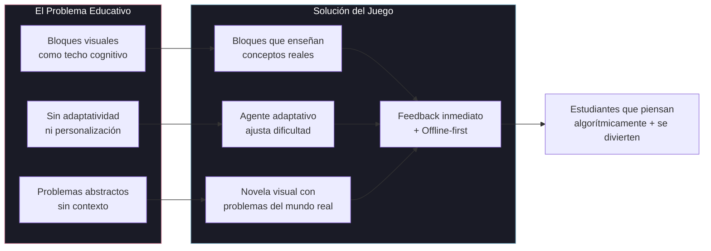
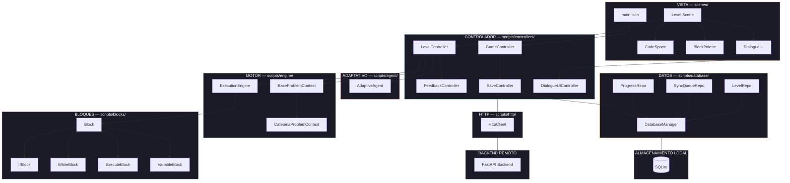
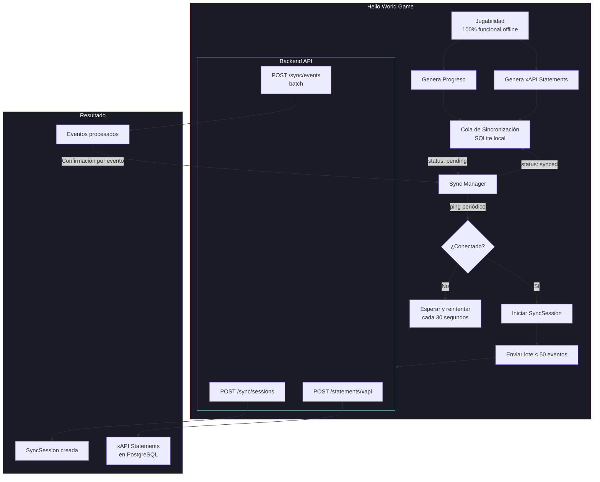
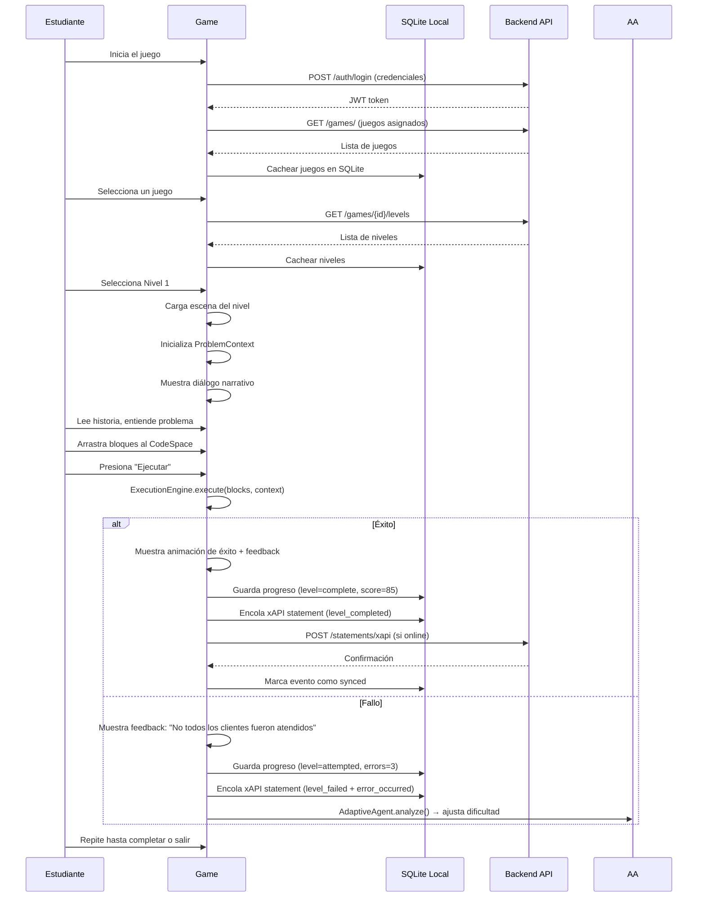
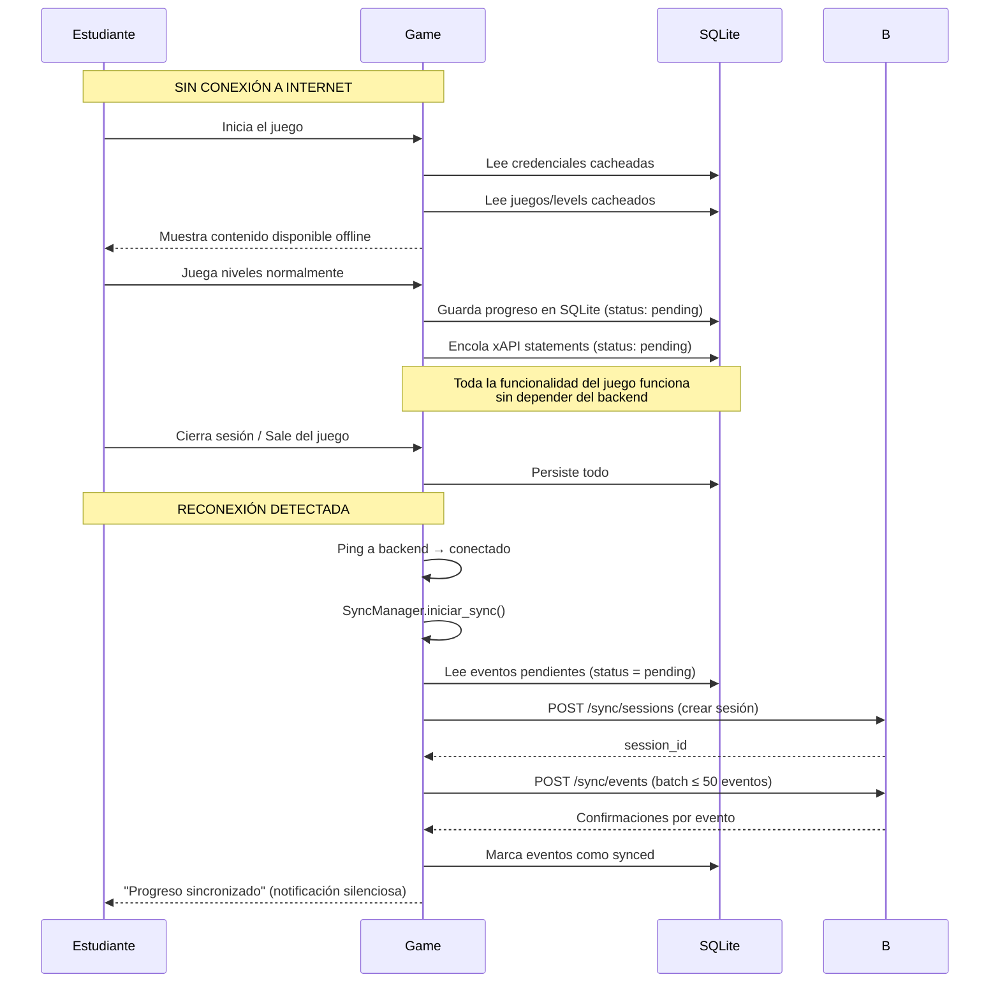

# PRD: Hello World Game — Componente de Juego Educativo

> **Sub-PRD del componente de juego derivado del PRD principal de la plataforma. Documenta la visión, arquitectura, funcionalidades y métricas específicas del juego educativo desarrollado en Godot 4.4.**

**Versión**: 0.1.0-draft
**Componente**: `apps/game/`
**Motor**: Godot 4.4 · GDScript 2.0
**Autor**: Hello World Project Team
**Fecha**: 2026-05-19
**Estado**: Draft

---

## Índice

1. [Visión y Misión del Juego](#1-visión-y-misión-del-juego)
2. [Declaración del Problema](#2-declaración-del-problema)
3. [Catálogo de Funcionalidades](#3-catálogo-de-funcionalidades)
4. [Arquitectura General](#4-arquitectura-general)
5. [Flujos de Usuario](#5-flujos-de-usuario)
6. [Filosofía Educativa Aplicada](#6-filosofía-educativa-aplicada)
7. [Restricciones Técnicas y No-Objetivos](#7-restricciones-técnicas-y-no-objetivos)
8. [Métricas de Éxito](#8-métricas-de-éxito)

---

## 1. Visión y Misión del Juego

### 1.1 Visión del Componente

> **Cada estudiante, sin importar su experiencia previa, descubre el poder del pensamiento algorítmico resolviendo problemas del mundo real a través de un juego narrativo intuitivo. El juego es la puerta de entrada — no un juguete, sino un verdadero entorno de aprendizaje.**

El juego es el componente central de la plataforma Hello World. Mientras que el backend proporciona la infraestructura y el frontend la visibilidad para profesores, **el juego es donde ocurre el aprendizaje**. Su diseño está guiado por tres pilares educativos:

| Pilar | Aplicación en el Juego |
|-------|----------------------|
| **Construccionismo (Papert)** | Los estudiantes construyen programas visuales para resolver problemas auténticos. Los bloques son "objetos para pensar" — representaciones tangibles de conceptos abstractos como condicionales, bucles y variables. |
| **Aprendizaje por Maestría (Bloom)** | El agente adaptativo ajusta la dificultad dinámicamente para que cada estudiante progrese a su ritmo. El estándar de dominio es el mismo para todos; el camino y el tiempo varían. |
| **Aprender Haciendo (Dewey)** | No hay lecciones teóricas. Cada nivel presenta un problema, el estudiante construye una solución, la ejecuta, recibe feedback inmediato, itera y aprende. |

### 1.2 Diferenciación desde la Perspectiva del Juego

| Plataforma | Enfoque | Lo que Hello World Game hace DIFERENTE |
|------------|---------|----------------------------------------|
| **Scratch** | Lienzo creativo abierto, sin progresión estructurada | Niveles con objetivos claros, progresión adaptativa, narrativa inmersiva |
| **Code.org** | Actividades cortas tipo Hour of Code, poca profundidad por concepto | Mundo persistente con arco narrativo, práctica profunda por concepto, agente adaptativo |
| **Tynker** | Curso comercial con suscripción, sin adaptatividad dinámica | Código abierto, bloques en español, adaptatividad en tiempo real, sincronización offline |
| **Blockly Games** | Puzzles genéricos sin contexto narrativo | Novela visual con personajes, historia ramificada, problemas contextualizados |

**La tesis central del juego**: Los bloques visuales son una **rampa**, no un techo. El juego no enseña a arrastrar bloques — enseña pensamiento algorítmico. Cuando un estudiante domina los bloques, ha dominado los conceptos. No hay "graduación a texto" porque los conceptos son los mismos.

### 1.3 Arquetipos de Estudiante

#### Estudiante K-12 (11-17 años)

| Atributo | Descripción |
|----------|-------------|
| **Contexto de uso** | Aula con profesor, sesiones de 45-60 minutos, 1-2 veces por semana |
| **Relación con la tecnología** | Nativos digitales, sin experiencia en programación |
| **Motor motivacional** | Narrativa, personajes, progresión visual, recompensas |
| **Zona de desafío** | 5-15 minutos por nivel con ayuda moderada |
| **Riesgo principal** | Frustración temprana → abandono. El agente adaptativo debe detectar señales de frustración (múltiples fallos, uso excesivo de pistas, tiempo excesivo) y reducir dificultad antes de que el estudiante se desconecte. |

#### Estudiante Universitario (18-25 años)

| Atributo | Descripción |
|----------|-------------|
| **Contexto de uso** | Laboratorio con profesor + estudio autodirigido |
| **Relación con la tecnología** | Variable: desde cero hasta exposición básica a Python/HTML |
| **Motor motivacional** | Dominio conceptual, preparación profesional, nota |
| **Zona de desafío** | 10-25 minutos por nivel con menos intervención |
| **Riesgo principal** | Aburrimiento si el nivel es trivial. El agente adaptativo debe detectar señales de bajo desafío (éxito rápido, cero errores) y aumentar dificultad. |

### 1.4 Principios de Diseño del Juego

1. **Bloques en español obligatorio**: `si`, `mientras`, `ejecutar`, `variable`, `iniciar`, `fin` — los keywords del lenguaje visual son en español. Esto no es negociable y responde al mercado objetivo (Latinoamérica).
2. **Feedback inmediato**: Cada ejecución produce un resultado visible. El estudiante ve su programa en acción y entiende qué hace cada instrucción.
3. **Narrativa como andamiaje**: La historia no es decoración — es el contexto que da significado al problema. "Ayuda a servir clientes en la cafetería" es más motivante que "ordena esta lista".
4. **Falla segura**: Nunca hay un "game over" irreversible. El estudiante siempre puede reintentar, modificar su programa y volver a ejecutar.
5. **Offline-first**: El juego funciona completo sin internet. La sincronización es asíncrona y transparente para el usuario.

---

## 2. Declaración del Problema

### 2.1 La Brecha Educativa desde la Perspectiva del Juego

Las herramientas existentes de programación visual comparten una falla fundamental: **tratan los bloques como un fin, no como un medio**.

- **Scratch** atrapa a los estudiantes en un techo de bloques: pueden hacer animaciones impresionantes pero no entienden qué es un bucle. Cuando intentan aprender Python, empiezan desde cero porque Scratch no enseñó conceptos — enseñó a mover bloques.
- **Code.org** prioriza la amplitud sobre la profundidad: los estudiantes pasan de un concepto a otro sin la práctica suficiente para lograr dominio.
- **Tynker** cobra una suscripción cara y no permite que las escuelas adapten el contenido a su currícula.

**Hello World Game resuelve esto siendo**: un juego que enseña conceptos reales (condicionales, bucles, variables) a través de bloques visuales **en español**, con dificultad adaptativa, y que funciona sin internet.

### 2.2 Puntos de Dolor Específicos del Estudiante

| Dolor | Causa Raíz | Cómo lo Aborda el Juego |
|-------|------------|-------------------------|
| **Frustración por falta de ayuda contextual** | Los puzzles no explican POR QUÉ falló la solución | El motor de ejecución produce mensajes de error específicos del dominio: "No todos los clientes fueron atendidos. Revisa tu condición del bucle." |
| **Aburrimiento por falta de desafío** | Todos reciben los mismos problemas independientemente de su habilidad | El agente adaptativo ajusta: estudiantes avanzados reciben variantes más complejas; estudiantes con dificultades reciben más andamiaje |
| **Desconexión por problemas abstractos** | "Ordena esta lista de números" no motiva a un adolescente | Cada nivel es un problema del mundo real: atender una cafetería, organizar una biblioteca, optimizar una ruta de entrega |
| **Ansiedad por el error** | El error se siente como fracaso permanente | El juego trata cada error como una oportunidad de aprendizaje: feedback inmediato, sin penalización permanente, siempre se puede reintentar |
| **Dependencia del profesor para resolver dudas** | El estudiante se queda atascado y debe esperar ayuda | El sistema de pistas progresivas (0-3 pistas por nivel) permite al estudiante obtener ayuda sin depender del profesor |
| **Síncope por transición a código textual** | Pasar de bloques a Python/JavaScript es un salto enorme | Los conceptos son los mismos — el juego NO necesita una "transición a texto" porque enseña conceptos, no sintaxis. El estudiante que domina `mientras` en bloques, entiende `while`. |

### 2.3 Por Qué un Juego y No Otra Interfaz

El formato de juego no es arbitrario. La investigación en aprendizaje basado en juegos (GBL) muestra que:

- **Motivación intrínseca**: Los juegos generan motivación interna para superar desafíos, a diferencia de las calificaciones externas.
- **Fracaso seguro**: En un juego, fallar es parte del proceso. No hay costo social por equivocarse. Esto fomenta la experimentación.
- **Andamiaje narrativo**: La historia proporciona contexto y significado. El estudiante no resuelve un puzzle abstracto — ayuda a un personaje.
- **Retroalimentación inmediata**: Cada acción produce una consecuencia visible. El ciclo acción → resultado → reflexión → iteración está integrado en la jugabilidad.



---

## 3. Catálogo de Funcionalidades

> Este catálogo detalla TODAS las funcionalidades del componente de juego, mapeadas del PRD principal (Sección 5.1). Cada funcionalidad incluye: descripción, prioridad, historia de usuario, criterios de aceptación, notas técnicas y dependencias.

### 3.1 P0 — MVP/GA Crítico

#### F-01: Motor de Programación Visual

| Atributo | Detalle |
|----------|---------|
| **ID** | F-01 |
| **Nombre** | Motor de Programación Visual (Visual Programming Engine) |
| **Prioridad** | **P0** — Sin esto, el juego no puede enseñar programación. Es la funcionalidad central. |
| **Descripción** | Editor de bloques tipo drag-and-drop con los tipos de bloque fundamentales: `Inicio`, `Fin`, `Si` (condicional), `Mientras` (bucle), `Ejecutar` (acción de dominio), y `Variable` (asignación/lectura). Los bloques se conectan secuencialmente formando un programa. |
| **Historia de usuario** | Como estudiante, quiero arrastrar bloques desde una paleta y conectarlos en un área de trabajo (CodeSpace) para construir un programa que resuelva un problema. |
| **Criterios de aceptación** | |
| | CA-01.1: El estudiante puede arrastrar bloques desde la paleta al CodeSpace |
| | CA-01.2: Los bloques se conectan automáticamente al soltarlos cerca de otro bloque (snap-to-connect) |
| | CA-01.3: El estudiante puede eliminar bloques del CodeSpace (drag fuera o botón eliminar) |
| | CA-01.4: Los bloques soportan anidamiento: un `Si` puede contener bloques dentro de su cuerpo |
| | CA-01.5: Los bloques `Ejecutar` muestran acciones específicas del dominio (e.g., "Tomar pan", "Atender cliente") |
| | CA-01.6: El CodeSpace muestra 5 segmentos (slots) de programa numerados |
| | CA-01.7: Todos los keywords están en español: `Inicio`, `Fin`, `Si`, `Mientras`, `Ejecutar`, `Variable` |
| **Notas técnicas** | Implementado en `scripts/blocks/` como clases que extienden `Block` base. El CodeSpace es un nodo `Container` que acepta bloques como hijos. Usar señales (`block_connected`, `block_removed`, `program_changed`) para comunicación con el controlador del nivel. |
| **Dependencias** | Ninguna (autocontenido en Godot) |

#### F-02: Sistema de Contexto de Problemas (Problem Context)

| Atributo | Detalle |
|----------|---------|
| **ID** | F-02 |
| **Nombre** | Sistema de Contexto de Problemas Extensible |
| **Prioridad** | **P0** — Cada nivel necesita un problema específico con estado, reglas y condiciones de éxito. |
| **Descripción** | Sistema que define el estado inicial del problema, las reglas del dominio, y las condiciones de éxito para cada nivel. Implementa el patrón `BaseProblemContext` como clase abstracta que cada nivel extiende (e.g., `CafeteriaProblemContext`, `LibraryProblemContext`). |
| **Historia de usuario** | Como estudiante, quiero que el nivel tenga un problema concreto (e.g., atender clientes en una cafetería) con reglas claras y un objetivo medible, para saber exactamente qué debo lograr con mi programa. |
| **Criterios de aceptación** | |
| | CA-02.1: Cada nivel tiene un contexto de problema con estado inicial (inputs, propiedades de dominio) |
| | CA-02.2: El contexto expone condiciones de éxito evaluables por el motor de ejecución |
| | CA-02.3: El contexto almacena el estado mutado después de la ejecución (outputs) |
| | CA-02.4: Nuevos niveles pueden crear contextos extendiendo `BaseProblemContext` sin modificar el motor |
| | CA-02.5: El contexto puede ser serializado a JSON para persistencia local |
| **Notas técnicas** | `BaseProblemContext` es una clase con `class_name`. Cada contexto de dominio sobrescribe `is_solution_correct()`. Ver `docs/engine.md` para diseño detallado. |
| **Dependencias** | F-01 (Motor de Programación Visual) |

#### F-03: Motor de Ejecución (Execution Engine)

| Atributo | Detalle |
|----------|---------|
| **ID** | F-03 |
| **Nombre** | Motor de Ejecución |
| **Prioridad** | **P0** — Los programas del estudiante deben ejecutarse y validarse. |
| **Descripción** | Intérprete que recibe un arreglo de bloques (el programa del estudiante) y un contexto de problema, ejecuta cada bloque secuencialmente respetando estructuras de control (`Si`, `Mientras`), actualiza el estado del contexto, y retorna el resultado (éxito/fallo + traza de ejecución). |
| **Historia de usuario** | Como estudiante, quiero presionar "Ejecutar" y ver cómo mi programa resuelve (o no) el problema, para entender qué funciona y qué necesita cambiar. |
| **Criterios de aceptación** | |
| | CA-03.1: El motor ejecuta bloques en orden secuencial respetando `Inicio` → ... → `Fin` |
| | CA-03.2: El bloque `Si` evalúa una condición booleana y ejecuta el cuerpo solo si es verdadera |
| | CA-03.3: El bloque `Mientras` ejecuta el cuerpo repetidamente mientras la condición sea verdadera |
| | CA-03.4: Soporta anidamiento: `Si` dentro de `Mientras`, `Mientras` dentro de `Si`, etc. |
| | CA-03.5: El motor previene bucles infinitos con un límite de iteraciones (configurable, default 1000) |
| | CA-03.6: El motor produce una traza de ejecución (qué bloques se ejecutaron, en qué orden) |
| | CA-03.7: Después de ejecutar, el motor llama `is_solution_correct()` en el contexto y retorna éxito/fallo |
| | CA-03.8: Errores de ejecución (división por cero, variable no definida) producen mensajes de error amigables |
| **Notas técnicas** | Máquina de estados implementada en `scripts/engine/ExecutionEngine.gd`. Usa una pila de llamadas para manejar estructuras de control anidadas. Ver `docs/engine.md`. |
| **Dependencias** | F-01 (Motor Visual), F-02 (Contexto de Problemas) |

#### F-04: Almacenamiento Local Offline (SQLite)

| Atributo | Detalle |
|----------|---------|
| **ID** | F-04 |
| **Nombre** | Almacenamiento Local Offline |
| **Prioridad** | **P0** — El juego debe funcionar sin internet como modo primario de operación. |
| **Descripción** | Base de datos SQLite local que almacena: progreso del estudiante (niveles completados, puntuaciones), cola de sincronización (eventos pendientes de enviar al backend), estado de sesión, y configuración local. Toda la funcionalidad del juego opera sobre SQLite; el backend es secundario y se usa para sincronización. |
| **Historia de usuario** | Como estudiante, quiero jugar sin conexión a internet y que mi progreso se guarde automáticamente, para poder jugar en el aula o en casa sin depender de la conectividad. |
| **Criterios de aceptación** | |
| | CA-04.1: El progreso se guarda en SQLite inmediatamente después de completar cada nivel |
| | CA-04.2: La cola de sincronización almacena eventos xAPI y de progreso con estado "pending" |
| | CA-04.3: El juego carga el progreso desde SQLite al iniciar sesión |
| | CA-04.4: Todas las operaciones de base de datos usan el patrón repositorio |
| | CA-04.5: La base de datos local tiene un tamaño máximo configurable (default 50MB) con rotación de eventos viejos |
| | CA-04.6: Las consultas SQLite se ejecutan en < 10ms (p95) para no afectar la jugabilidad |
| **Notas técnicas** | Usar plugin `godot-sqlite`. Implementar repositorios en `scripts/database/repositories/` con interfaz limpia. Ver `apps/backend/docs/database-design.md` SyncSession/SyncEvent para esquemas compatibles. |
| **Dependencias** | Ninguna (autocontenido en Godot) |

#### F-05: Sistema de Diálogos y Narrativa

| Atributo | Detalle |
|----------|---------|
| **ID** | F-05 |
| **Nombre** | Sistema de Diálogos y Narrativa |
| **Prioridad** | **P0** — La narrativa es un diferenciador clave del juego frente a herramientas no-narrativas. |
| **Descripción** | Integración con el plugin Dialogue Manager para crear novelas visuales interactivas. Los diálogos introducen problemas, desarrollan personajes, proporcionan tutoriales, y ofrecen branching (decisiones del estudiante afectan el diálogo). Los archivos `.dialogue` definen nodos de conversación con condiciones, variables y saltos. |
| **Historia de usuario** | Como estudiante, quiero que el problema se presente a través de una historia con personajes, para sentirme inmerso y motivado a resolverlo. |
| **Criterios de aceptación** | |
| | CA-05.1: Los diálogos se muestran en una interfaz tipo novela visual (retrato de personaje + texto + opciones) |
| | CA-05.2: El estudiante puede avanzar el diálogo haciendo clic o presionando espacio |
| | CA-05.3: Algunos diálogos ofrecen opciones ramificadas que afectan el flujo de la conversación |
| | CA-05.4: Los diálogos pueden hacer referencia al estado del juego (e.g., "¡Lograste atender a todos los clientes!") |
| | CA-05.5: Los diálogos de tutorial guían al estudiante en el uso del editor de bloques |
| | CA-05.6: Todos los textos de diálogo están en español |
| **Notas técnicas** | Usar plugin Dialogue Manager (`.dialogue` files en `dialogue/`). Los nodos de diálogo se conectan al `EventBus` para comunicar decisiones al controlador del nivel. |
| **Dependencias** | Ninguna (usa plugin Dialogue Manager) |

#### F-06: Emisión de Eventos xAPI

| Atributo | Detalle |
|----------|---------|
| **ID** | F-06 |
| **Nombre** | Emisión de Eventos xAPI |
| **Prioridad** | **P0** — Sin eventos xAPI no hay tracking de progreso para el profesor. |
| **Descripción** | Genera statements xAPI 1.0 para cada interacción significativa del estudiante: `level_attempted`, `level_completed`, `level_failed`, `hint_used`, `error_occurred`. Los statements se encolan localmente (SQLite) cuando el juego está offline y se envían por lote cuando hay conectividad. |
| **Historia de usuario** | Como profesor, quiero recibir datos detallados de la interacción de mis estudiantes con el juego, para identificar quién necesita ayuda y qué conceptos son más difíciles. |
| **Criterios de aceptación** | |
| | CA-06.1: Se genera `level_attempted` cuando el estudiante inicia un nivel |
| | CA-06.2: Se genera `level_completed` cuando el estudiante resuelve un nivel exitosamente |
| | CA-06.3: Se genera `level_failed` cuando el estudiante falla un nivel |
| | CA-06.4: Se genera `hint_used` cuando el estudiante solicita una pista |
| | CA-06.5: Se genera `error_occurred` cuando el motor de ejecución encuentra un error |
| | CA-06.6: El statement sigue el formato xAPI 1.0: Actor (student UUID), Verb (IRI), Object (level IRI), Result (success, duration, extensions) |
| | CA-06.7: Los statements se encolan localmente con estado "pending" cuando no hay conexión |
| | CA-06.8: El payload incluye `efficiency_rating`, `attempt_count`, `error_count`, `hints_used` en `result.extensions` |
| **Notas técnicas** | Implementar generación de statements en `scripts/controllers/xapi_controller.gd` o similar. Usar el patrón repositorio para la cola local. Ver PRD principal Sección 8.1 para formato completo. |
| **Dependencias** | F-04 (SQLite local), Backend Sync API (`POST /api/v1/statements/xapi`) |

### 3.2 P1 — Post-MVP (12 meses)

#### F-07: Agente Adaptativo

| Atributo | Detalle |
|----------|---------|
| **ID** | F-07 |
| **Nombre** | Agente Adaptativo (Adaptive Agent) |
| **Prioridad** | **P1** — Diferenciador clave pero el Nivel 1 puede lanzarse con dificultad estática. |
| **Descripción** | Motor basado en reglas que analiza el rendimiento del estudiante (puntuación, errores, tiempo, uso de pistas) y ajusta dinámicamente parámetros del nivel: dificultad, frecuencia de pistas, disponibilidad de bloques, y velocidad del problema. Usa suavizado exponencial para métricas históricas y reglas JSON para decisiones. |
| **Historia de usuario** | Como estudiante, quiero que el juego se adapte a mi nivel de habilidad, para no aburrirme si es muy fácil ni frustrarme si es muy difícil. |
| **Criterios de aceptación** | |
| | CA-07.1: El agente recolecta métricas por nivel: score, errores, tiempo, hint_usage |
| | CA-07.2: Mantiene promedio histórico con suavizado exponencial (`new_avg = 0.3 * last + 0.7 * prev_avg`) |
| | CA-07.3: Aumenta dificultad cuando `avg_score > 0.85` y `errors < 2` |
| | CA-07.4: Reduce dificultad cuando `avg_score < 0.55` o `errors > 5` |
| | CA-07.5: Mantiene dificultad cuando el rendimiento está entre 0.55 y 0.85 (zona de flujo) |
| | CA-07.6: Las decisiones se emiten como señal al `LevelModifier` que ajusta el nivel antes de la siguiente ejecución |
| | CA-07.7: Las reglas de decisión son configurables desde archivo JSON (no hardcodeadas) |
| | CA-07.8: Las métricas se persisten en SQLite entre sesiones |
| **Notas técnicas** | Implementado en `scripts/agent/AdaptiveAgent.gd`. Fase 1: basado en reglas. Fase 2-3: Q-Learning/SARSA planeado. Ver `docs/adaptive_agent.md` para diseño completo. |
| **Dependencias** | F-03 (Motor de Ejecución), F-04 (SQLite local) |

#### F-08: Modo Sandbox

| Atributo | Detalle |
|----------|---------|
| **ID** | F-08 |
| **Nombre** | Modo Sandbox |
| **Prioridad** | **P1** — Apoya el aprendizaje construccionista pero no es requerido para MVP. |
| **Descripción** | Entorno abierto donde los estudiantes pueden combinar bloques libremente SIN un problema específico que resolver. Incluye: un contexto de problema genérico (e.g., "manipula estos números"), visualización en tiempo real del estado, y la capacidad de compartir creaciones. |
| **Historia de usuario** | Como estudiante, quiero experimentar con bloques sin un objetivo fijo, para explorar qué hace cada bloque y crear mis propios programas. |
| **Criterios de aceptación** | |
| | CA-08.1: El sandbox carga todos los bloques disponibles (sin restricciones de nivel) |
| | CA-08.2: El estudiante puede ejecutar su programa y ver el resultado en tiempo real |
| | CA-08.3: No hay condiciones de éxito/fallo — solo exploración |
| | CA-08.4: El sandbox puede guardar y cargar programas creados por el estudiante |
| | CA-08.5: Los programas del sandbox se sincronizan con el backend (P2: compartir con compañeros) |
| **Notas técnicas** | Reutiliza F-01 (Motor Visual) y F-03 (Motor de Ejecución) con un contexto genérico. No requiere F-02 (Contexto específico). |
| **Dependencias** | F-01 (Motor Visual), F-03 (Motor de Ejecución) |

#### F-09: Soporte Multi-Capítulo

| Atributo | Detalle |
|----------|---------|
| **ID** | F-09 |
| **Nombre** | Soporte Multi-Capítulo |
| **Prioridad** | **P1** — Un solo capítulo es aceptable para MVP; múltiples capítulos son post-lanzamiento. |
| **Descripción** | Sistema de progresión que organiza niveles en capítulos, cada capítulo con su propio arco narrativo, conjunto de conceptos a enseñar, y dificultad base. El estudiante desbloquea capítulos secuencialmente. Los capítulos pueden tener niveles obligatorios y opcionales. |
| **Historia de usuario** | Como estudiante, quiero progresar a través de capítulos con una historia continua, para mantener el interés y ver cómo evolucionan los personajes y desafíos. |
| **Criterios de aceptación** | |
| | CA-09.1: El juego organiza niveles en capítulos con metadatos (título, descripción, orden) |
| | CA-09.2: Los capítulos se desbloquean secuencialmente (completar capítulo n desbloquea n+1) |
| | CA-09.3: Cada capítulo tiene su propio arco narrativo (archivos `.dialogue` por capítulo) |
| | CA-09.4: La configuración de capítulos se obtiene del backend y se cachea localmente |
| | CA-09.5: El profesor puede asignar capítulos específicos a sus estudiantes |
| **Notas técnicas** | Datos de capítulos almacenados en SQLite local y sincronizados con backend. La escena `ChapterSelect` reemplaza o complementa `LevelSelect`. |
| **Dependencias** | F-02 (Contexto de Problemas), F-05 (Diálogos) |

### 3.3 P2 — Futuro

#### F-10: Personalización de Librería de Bloques

| Atributo | Detalle |
|----------|---------|
| **ID** | F-10 |
| **Nombre** | Personalización de Librería de Bloques |
| **Prioridad** | **P2** — Permite a profesores crear bloques personalizados para problemas de dominio específico. |
| **Descripción** | Los profesores definen nuevos tipos de bloques (sintaxis visual + semántica de ejecución) a través del dashboard, que el juego descarga al cargar. Cada bloque personalizado tiene: nombre, ícono, acción asociada, y validación de parámetros. |
| **Historia de usuario** | Como profesor, quiero crear bloques personalizados para problemas específicos de mi materia, para que mis estudiantes practiquen conceptos de programación en contextos relevantes para mi curso. |
| **Criterios de aceptación** | |
| | CA-10.1: El dashboard permite definir bloques con nombre, ícono, acción y parámetros |
| | CA-10.2: El juego sincroniza la librería de bloques al iniciar (o al recibir notificación) |
| | CA-10.3: Los bloques personalizados aparecen en la paleta junto a los bloques estándar |
| | CA-10.4: El motor de ejecución puede procesar bloques personalizados (mapeo nombre → función) |
| **Notas técnicas** | Requiere cambios en `scripts/blocks/` para soportar carga dinámica de tipos de bloque. |
| **Dependencias** | F-01 (Motor Visual), Backend Game/Level API |

#### F-11: Modo Desafío entre Pares

| Atributo | Detalle |
|----------|---------|
| **ID** | F-11 |
| **Nombre** | Modo Desafío entre Pares |
| **Prioridad** | **P2** — Funcionalidad social, baja prioridad vs mecánicas de aprendizaje. |
| **Descripción** | Los estudiantes pueden compartir sus soluciones con compañeros, intentar resolver puzzles creados por otros estudiantes, y participar en competencias amistosas (menos bloques, menos tiempo). |
| **Historia de usuario** | Como estudiante, quiero compartir mi solución con un compañero y ver cómo resolvió él el mismo problema, para aprender nuevas estrategias. |
| **Criterios de aceptación** | |
| | CA-11.1: El estudiante puede publicar su solución (anónima o con nombre) |
| | CA-11.2: Otros estudiantes pueden ver y ejecutar la solución publicada |
| | CA-11.3: El sistema soporta "desafíos": resolver un nivel con restricciones (menos bloques, menos tiempo) |
| | CA-11.4: Las soluciones compartidas se sincronizan a través del backend |
| **Notas técnicas** | Construye sobre F-08 (Sandbox). Backend necesita endpoint para almacenar y servir soluciones compartidas. |
| **Dependencias** | F-08 (Sandbox), Backend Sync API |

### 3.4 Matriz de Trazabilidad

| ID | Funcionalidad | Prioridad | Depende de | Dependencias Externas |
|----|--------------|-----------|------------|----------------------|
| F-01 | Motor de Programación Visual | P0 | — | — |
| F-02 | Sistema de Contexto de Problemas | P0 | F-01 | — |
| F-03 | Motor de Ejecución | P0 | F-01, F-02 | — |
| F-04 | Almacenamiento Local SQLite | P0 | — | Plugin godot-sqlite |
| F-05 | Sistema de Diálogos y Narrativa | P0 | — | Plugin Dialogue Manager |
| F-06 | Emisión de Eventos xAPI | P0 | F-04 | Backend `/statements/xapi` |
| F-07 | Agente Adaptativo | P1 | F-03, F-04 | — |
| F-08 | Modo Sandbox | P1 | F-01, F-03 | — |
| F-09 | Soporte Multi-Capítulo | P1 | F-02, F-05 | Backend Game/Level API |
| F-10 | Personalización de Bloques | P2 | F-01 | Backend Game/Level API |
| F-11 | Modo Desafío entre Pares | P2 | F-08 | Backend Sync API |

---

## 4. Arquitectura General

### 4.1 Patrón MVC

El juego sigue estrictamente el patrón **Modelo-Vista-Controlador**:

```
apps/game/
├── scenes/              → VISTA (View) — Escenas Godot .tscn + scripts de UI mínimos
│   ├── levels/          →   Escenas de nivel (LevelOne.tscn, LevelTwo.tscn)
│   ├── ui/              →   Componentes de interfaz (menús, HUD, diálogos)
│   ├── components/      →   Componentes reutilizables (BlockSlot, BlockPalette)
│   └── main.tscn        →   Escena raíz
│
├── scripts/
│   ├── controllers/     → CONTROLADOR (Controller) — Lógica del juego
│   │   ├── game_controller.gd      → Controlador principal (autoload)
│   │   ├── level_controller.gd     → Controlador de nivel (por nivel)
│   │   ├── feedback_controller.gd  → Sistema de feedback
│   │   ├── save_controller.gd      → Persistencia y sync
│   │   └── dialogue_ui_controller.gd → UI de diálogos
│   │
│   ├── engine/          → MOTOR DE EJECUCIÓN
│   │   ├── execution_engine.gd     → Intérprete de bloques
│   │   └── base_problem_context.gd → Contexto base de problema
│   │
│   ├── blocks/          → SISTEMA DE BLOQUES
│   │   ├── block.gd               → Clase base Block
│   │   ├── if_block.gd            → Bloque Si
│   │   ├── while_block.gd         → Bloque Mientras
│   │   ├── execute_block.gd       → Bloque Ejecutar
│   │   └── variable_block.gd      → Bloque Variable
│   │
│   ├── agent/           → AGENTE ADAPTATIVO
│   │   └── adaptive_agent.gd      → Motor de ajuste de dificultad
│   │
│   └── database/        → MODELO (Model) — Acceso a datos
│       ├── database_manager.gd    → Gestor de conexión SQLite
│       └── repositories/          → Repositorios (patrón)
│           ├── progress_repository.gd
│           ├── sync_queue_repository.gd
│           └── level_repository.gd
│
├── models/              → Recursos Godot (recursos de datos)
│
└── dialogue/            → Archivos .dialogue (narrativa)
```

**Regla fundamental**: Los scripts en `scenes/` solo contienen lógica de presentación (actualizar UI, manejar input visual). Toda la lógica de negocio vive en `scripts/controllers/`. Los datos viven en `scripts/database/` a través del patrón repositorio.

### 4.2 Diagrama de Capas



### 4.3 Flujo de Ejecución de Bloques

```mermaid
sequenceDiagram
    participant E as Estudiante
    participant CS as CodeSpace (UI)
    participant LC as LevelController
    participant EE as ExecutionEngine
    participant PC as ProblemContext
    participant AA as AdaptiveAgent
    participant DB as SQLite

    E->>CS: Arrastra bloques al CodeSpace
    CS->>LC: signal(program_changed, blocks[])
    
    E->>CS: Presiona "Ejecutar"
    CS->>LC: signal(execute_requested)
    
    LC->>LC: Obtiene bloques del CodeSpace
    LC->>EE: execute(blocks, context)
    
    loop Por cada bloque
        EE->>EE: Lee bloque actual (program counter)
        EE->>PC: get_variable(name) / set_variable(name, value)
        
        alt Bloque = Si (IfBlock)
            EE->>PC: get_variable(condition_name)
            PC-->>EE: value
            EE->>EE: Evalúa condición
            EE->>EE: Si true → ejecuta cuerpo; si false → salta al Fin correspondiente
        else Bloque = Mientras (WhileBlock)
            EE->>PC: get_variable(condition_name)
            PC-->>EE: value
            EE->>EE: Evalúa condición
            EE->>EE: Si true → ejecuta cuerpo y repite; si false → sale
        else Bloque = Ejecutar (ExecuteBlock)
            EE->>PC: execute_action(action_name, params)
            PC->>PC: Muta estado del problema
            PC-->>EE: result
        else Bloque = Variable (VariableBlock)
            EE->>PC: set_variable(var_name, value)
        end
    end

    EE->>PC: is_solution_correct()
    PC-->>EE: success (bool) + mensaje
    
    EE-->>LC: ExecutionResult { success, trace, message }
    
    LC->>AA: analyze_performance(result)
    AA->>AA: actualiza métricas, evalúa reglas
    AA-->>LC: action (increase/decrease/keep difficulty)
    
    LC->>DB: save_progress(level_id, result, metrics)
    
    LC->>CS: show_feedback(result)
    
    alt Success
        CS-->>E: "¡Nivel completado! + animación de éxito"
    else Failure
        CS-->>E: "Tu programa no resolvió el problema. Intenta de nuevo."
    end
```

### 4.4 Arquitectura Offline-First



**Estrategia de sincronización**:

1. **Detección de conectividad**: El juego hace ping al backend (`GET /api/v1/health`) cada 30 segundos. Timeout: 5 segundos.
2. **Cola local**: Todos los eventos (progreso, xAPI) se escriben primero en SQLite con `status = 'pending'`.
3. **Batch sync**: Cuando hay conexión, el Sync Manager inicia una `SyncSession`, envía hasta 50 eventos por lote ordenados cronológicamente.
4. **Confirmación**: El backend confirma cada evento individualmente. El juego marca como `synced` solo los confirmados.
5. **Reintento**: Eventos fallidos se reintentan hasta 5 veces, luego pasan a estado `dead_letter`.
6. **Resolución de conflictos**: Last-write-wins por timestamp. Si dos eventos conflictan (mismo nivel, mismo estudiante), gana el timestamp más reciente.

### 4.5 Arquitectura del Motor de Programación Visual

#### Tipos de Bloques

| Bloque | Clase GDScript | Sintaxis Visual | Comportamiento |
|--------|---------------|-----------------|----------------|
| `Inicio` | `StartBlock` | Encabezado verde | Marca el inicio del programa. Sin comportamiento de ejecución. |
| `Fin` | `EndBlock` | Pie rojo | Marca el final de un bloque de código. Retorna el control al bloque padre. |
| `Si` | `IfBlock` | Rombo naranja con condición | Evalúa `get_variable(condition_name)`. Si true, ejecuta cuerpo; si false, salta al `Fin` correspondiente. |
| `Mientras` | `WhileBlock` | Círculo azul con condición | Evalúa `get_variable(condition_name)`. Si true, ejecuta cuerpo y repite; si false, sale. |
| `Ejecutar` | `ExecuteBlock` | Rectángulo verde con acción | Llama `execute_action(action_name, params)` en el contexto del problema. |
| `Variable` | `VariableBlock` | Paralelogramo amarillo | Ejecuta `set_variable(var_name, value)` o `get_variable(var_name)` según configuración. |

#### Modelo de Conexión

Cada bloque tiene:

```gdscript
class_name Block
extends Node

# Puertos de conexión
var previous_block: Block          # Bloque anterior en la secuencia
var next_block: Block              # Siguiente bloque (para bloques secuenciales)
var parent_block: Block            # Bloque contenedor (para bloques anidados dentro de Si/While)
var child_blocks: Array[Block]     # Bloques dentro del cuerpo (para Si/While)

# Metadatos
var block_type: String             # "start", "end", "if", "while", "execute", "variable"
var block_name: String             # Nombre mostrado en español
var block_icon: Texture2D          # Ícono del bloque

# Ejecución
func execute(context: BaseProblemContext) -> ExecutionResult
```

#### Estructura del CodeSpace

El CodeSpace es un contenedor visual con N segmentos numerados (slots). Cada slot acepta un bloque. Los bloques se encadenan: el `next_block` del slot 1 apunta al bloque en slot 2, etc.

```
┌─────────────────────────────────────────┐
│  CodeSpace                               │
│  ┌─────────────────────────────────────┐ │
│  │ Slot 1: [Inicio]                    │ │
│  │         ↓                           │ │
│  │ Slot 2: [Mientras cola_no_vacia]    │ │
│  │              ├─ Cuerpo:             │ │
│  │              │  Slot 2.1: [Si       │ │
│  │              │       es_vip]        │ │
│  │              │       ├─ True:       │ │
│  │              │       │ [Ejecutar    │ │
│  │              │       │  atender_vip]│ │
│  │              │       └─ False:      │ │
│  │              │         [Ejecutar    │ │
│  │              │          atender_nor]│ │
│  │              └─ Fin del Si          │ │
│  │         ↓                           │ │
│  │ Slot 3: [Fin]                       │ │
│  └─────────────────────────────────────┘ │
└─────────────────────────────────────────┘
```

### 4.6 Diseño del Agente Adaptativo

#### Métricas Recolectadas

| Métrica | Tipo | Fuente | Cálculo |
|---------|------|--------|---------|
| `score` | float 0-1 | Motor de Ejecución | Porcentaje de objetivos cumplidos en el nivel |
| `errors` | int | Motor de Ejecución | Conteo de errores en la ejecución actual |
| `time_seconds` | int | Timer del nivel | Tiempo desde que se cargó el nivel hasta que se presionó Ejecutar |
| `hints_used` | int | Sistema de Pistas | Número de pistas solicitadas en el nivel actual |
| `avg_score` | float 0-1 | Agente (histórico) | Suavizado exponencial: `0.3 * last_score + 0.7 * prev_avg` |
| `avg_errors` | float | Agente (histórico) | Suavizado exponencial de errores |
| `avg_time` | float | Agente (histórico) | Suavizado exponencial del tiempo |
| `adaptation_count` | int | Agente (persistente) | Número total de ajustes aplicados al estudiante |

#### Reglas de Decisión (Fase 1)

```json
{
  "rules": [
    {
      "condition": "avg_score > 0.85 and errors < 2",
      "action": "increase_difficulty",
      "params": {
        "reduce_hints_by": 1,
        "increase_speed_by": 1.2,
        "add_constraints": ["fewer_execute_blocks"]
      }
    },
    {
      "condition": "avg_score < 0.55 or errors > 5 or hints_used > 3",
      "action": "decrease_difficulty",
      "params": {
        "increase_hints_by": 1,
        "reduce_speed_by": 0.8,
        "show_extra_scaffolding": true
      }
    },
    {
      "condition": "true",
      "action": "keep",
      "params": {}
    }
  ]
}
```

**Zona de flujo**: `avg_score` entre 0.55 y 0.85. El objetivo del agente es mantener al estudiante en este rango.

#### Ciclo de Decisión

```
[Fin de nivel] → [Recolectar métricas] → [Actualizar promedios históricos]
    → [Evaluar reglas] → [Emitir señal action_decided(action)]
    → [LevelModifier ajusta parámetros del siguiente intento/nivel]
```

---

## 5. Flujos de Usuario

### 5.1 Flujo de Juego (Online)



### 5.2 Flujo de Juego (Offline)



### 5.3 Flujo de Sincronización

```
Game (Godot)                     Backend API                     PostgreSQL
    |                               |                               |
    |--- POST /sync/sessions ------>|                               |
    |    { instance_id,             |                               |
    |      student_id }             |                               |
    |<-- { session_id,              |                               |
    |      start_time } ------------|                               |
    |                               |                               |
    |--- POST /sync/events -------->|                               |
    |    (batch, hasta 50 eventos)  |                               |
    |    [                          |                               |
    |      { event_type:            |                               |
    |        "level_complete",      |                               |
    |        payload: {             |                               |
    |          level_id, score,     |                               |
    |          errors, hints,       |                               |
    |          timestamp },         |                               |
    |      { event_type:            |                               |
    |        "xapi_statement",      |                               |
    |        payload: { ... } }     |                               |
    |    ]                          |                               |
    |                               |                               |
    |                               |--- INSERT sync_events ------->|
    |                               |<-- OK ------------------------|
    |                               |                               |
    |                               |--- INSERT progress_records -->|
    |                               |<-- OK ------------------------|
    |                               |                               |
    |<-- [                         |                               |
    |      { id: "evt-1",          |                               |
    |        status: "accepted" },  |                               |
    |      { id: "evt-2",          |                               |
    |        status: "accepted" }  |                               |
    |    ] -------------------------|                               |
    |                               |                               |
    |--- PUT /sync/sessions/{id} -->|                               |
    |    { status: "completed" }    |                               |
    |<-- { end_time, duration } ----|                               |
    |                               |                               |
    |--- POST /statements/xapi ---->|                               |
    |    (en paralelo o después)    |                               |
    |                               |--- INSERT xapi_statements -->|
    |                               |<-- OK ------------------------|
    |<-- { accepted: true } --------|                               |
```

---

## 6. Filosofía Educativa Aplicada

### 6.1 Construccionismo → Modo Sandbox

El construccionismo de Papert sostiene que los estudiantes aprenden mejor cuando **construyen artefactos que son significativos para ellos**. En el juego:

- **Niveles guiados**: El estudiante construye programas para resolver problemas narrativos. Cada programa es un artefacto que tiene significado en el contexto de la historia.
- **Modo Sandbox (P1)**: El estudiante puede construir programas sin restricciones, explorando qué hace cada bloque, combinándolos creativamente, y viendo resultados inmediatos. Esto es construcción pura — no hay objetivo externo, solo la satisfacción de crear algo que funciona.
- **Aprendizaje por descubrimiento**: No se explica qué hace un bloque antes de usarlo. El estudiante descubre su comportamiento al verlo ejecutar: "Ah, `Mientras` repite las instrucciones hasta que la condición cambia."

**Implementación en el juego**: El estudiante no lee un manual de "cómo funciona un bucle". Arrastra un bloque `Mientras`, lo conecta a una condición, ejecuta el programa, y VE el resultado. El concepto se internaliza a través de la acción, no de la instrucción.

### 6.2 Aprendizaje por Maestría → Agente Adaptativo

El modelo de Bloom postula que **el 90%+ de los estudiantes pueden alcanzar altos niveles de logro si se les da el tiempo y el apoyo adecuados**. En el juego:

- **El estándar no se negocia**: Todos los estudiantes deben dominar los mismos conceptos (condicionales, bucles, variables). Lo que varía es el camino y el apoyo.
- **El agente adaptativo es la implementación operativa de Bloom**: Ajusta dificultad, frecuencia de pistas, y andamiaje basado en el rendimiento individual.
- **El estudiante con dificultades recibe más**: Más pistas, problemas más simples, tiempo extendido, bloques pre-colocados.
- **El estudiante avanzado recibe menos**: Menos pistas, problemas más complejos, restricciones adicionales (menos bloques permitidos, menos tiempo).

**Indicador clave**: El número de intentos hasta lograr maestría (efficiency ≥ 90%) debe estar en el rango 3-8 para todos los estudiantes, independientemente de su nivel inicial. Si un estudiante necesita 15 intentos, el agente no está haciendo su trabajo.

### 6.3 Aprender Haciendo → Feedback Inmediato

Dewey postula que **el conocimiento se construye a través de la experiencia**. En el juego:

- **Ciclo acción → feedback → reflexión → iteración**: Cada ejecución del programa produce un resultado visible inmediato. El estudiante ve qué hizo su programa, qué funcionó y qué no.
- **No hay lecciones**: El juego no tiene un modo "teoría". Todo se aprende resolviendo problemas.
- **El error es parte del proceso**: El juego nunca penaliza el error. Cada fallo es solo información: "tu programa no resolvió el problema. Aquí está lo que pasó. ¿Puedes arreglarlo?"
- **Feedback contextual**: Los mensajes de error son específicos del dominio: "No todos los clientes fueron atendidos. Revisa tu condición del bucle `Mientras`."

### 6.4 Mapa Filosofía → Funcionalidad

| Filosofía | Principio | Funcionalidad del Juego | Métrica de Éxito |
|-----------|-----------|------------------------|------------------|
| **Construccionismo** | Aprender construyendo | Editor de bloques visual, Sandbox Mode | Programas creados por estudiante |
| **Aprendizaje por Maestría** | Mismo estándar, diferente camino | Agente Adaptativo, pistas progresivas | Intentos hasta maestría (3-8) |
| **Aprender Haciendo** | Feedback inmediato | Motor de Ejecución, feedback contextual | Iteraciones por nivel |
| **Andamiaje (Vygotsky)** | Zona de Desarrollo Próximo | Dificultad adaptativa, tutoriales narrativos | Hint usage rate (20-50%) |
| **Motivación Intrínseca** | Autonomía + competencia + relación | Narrativa, logros, progresión visible | Retención a 3 meses (≥60%) |

---

## 7. Restricciones Técnicas y No-Objetivos

### 7.1 Restricciones Técnicas

| Restricción | Detalle | Impacto |
|-------------|---------|---------|
| **Offline-first** | El juego debe ser 100% funcional sin conexión a internet. El backend es un componente secundario para sincronización y persistencia remota. | Toda la lógica del juego debe operar sobre SQLite local. No se puede asumir disponibilidad del backend. |
| **Hardware de gama baja** | El juego debe funcionar en laptops educativas comunes en Latinoamérica (Intel Celeron/N4000, 4GB RAM, GPU integrada, HDD). Godot 4.4 es ligero, pero requiere optimización. | Límite de 512MB RAM en pico, texturas comprimidas, atlas de sprites, LOD, OcclusionCulling. |
| **Español primero** | Toda la UI, diálogos, bloques y mensajes de feedback están en español. Inglés es secundario. | Los keywords de bloques son en español. Los archivos de localización de Godot tendrán español como locale default. |
| **Plugin Godot externo** | El juego depende de plugins de la comunidad: godot-sqlite, Dialogue Manager, GUT. | Estos plugins deben ser versionados en `addons/`. Las breaking changes de los plugins pueden afectar el desarrollo. |
| **Sin WebSockets en MVP** | La comunicación con el backend es HTTP REST solamente. No hay conexiones persistentes ni tiempo real. | La sincronización es batch pull/push. No hay actualizaciones en vivo del dashboard durante el juego. |
| **GDScript 2.0** | El juego usa GDScript 2.0 con type hints obligatorios. | Todo el código debe tener type hints. No se permite GDScript sin tipos. |
| **Sin hot-reload** | Godot no tiene hot-reload de scripts en producción. | El juego debe manejar actualizaciones de contenido a través del backend (pull de niveles), no modificando scripts in situ. |

### 7.2 No-Objetivos (Fuera de Alcance)

| No-Objetivo | Razón | Alternativa / Nota |
|-------------|-------|-------------------|
| **No es un juego multijugador** | La colaboración en tiempo real añade complejidad de red, sincronización de estado, y moderación que no están en el alcance del MVP. | El Modo Desafío entre Pares (P2) es asíncrono — los estudiantes comparten soluciones, no juegan juntos en tiempo real. |
| **No es un editor de código general** | El juego no pretende ser un IDE. Los bloques son la única interfaz de programación. | No hay soporte para escribir código textual. La transición a código textual ocurre fuera del juego, en cursos posteriores. |
| **No tiene creador de niveles para estudiantes** | Los estudiantes juegan niveles creados por profesores o por el equipo de contenido. Los estudiantes no crean niveles en MVP. | El Modo Sandbox (P1) permite experimentación libre, pero no creación de niveles formales. |
| **No tiene sistema de logros/gamification complejo** | El MVP se enfoca en la motivación intrínseca (narrativa, progresión, maestría). | Sistema básico de progresión visual (estrellas por nivel). Logros avanzados (insignias, tablas de líderes) son P2. |
| **No tiene analíticas locales avanzadas** | Las analíticas detalladas viven en el backend y el dashboard. El juego solo recolecta y envía datos. | El juego NO tiene un dashboard de progreso. Eso es responsabilidad del frontend. |
| **No soporta múltiples idiomas en MVP** | Español es el único idioma soportado en el lanzamiento. | La infraestructura de i18n de Godot está configurada pero no se traducirá a otros idiomas hasta P1. |
| **No es un reemplazo de Scratch** | Scratch es un excelente entorno creativo. Hello World no compite en ese espacio — se enfoca en educación estructurada con tracking de progreso. | Scratch es complementario. Hello World es para el aula; Scratch es para exploración libre. |

### 7.3 Dependencias de Plataforma

| Recurso | Dependencia | Versión Mínima | Notas |
|---------|-------------|----------------|-------|
| **Motor** | Godot Engine | 4.4 estable | Requiere export templates para builds de producción |
| **Base de datos** | godot-sqlite (plugin) | Compatible con Godot 4.4 | Plugin de la asset library |
| **Diálogos** | Dialogue Manager (plugin) | Compatible con Godot 4.4 | Plugin de la asset library |
| **Testing** | GUT (plugin) | Compatible con Godot 4.4 | Plugin de la asset library |
| **HTTP** | Godot HTTPRequest node | Nativo de Godot 4.4 | No requiere plugin externo |
| **JSON** | Godot JSON / JSONRPC | Nativo de Godot 4.4 | Para serialización de datos |
| **Sistema Operativo** | Windows 10+, Linux, macOS | — | Cualquier SO que soporte Godot 4.4 |

---

## 8. Métricas de Éxito

### 8.1 Métricas de Engagement del Estudiante

#### GE-1: Tiempo Promedio por Sesión

| Atributo | Detalle |
|----------|---------|
| **Definición** | Tiempo promedio que un estudiante pasa en el juego por sesión de juego |
| **Fuente de datos** | xAPI `session_started` / `session_ended` (diferencia de timestamp) |
| **Cálculo** | `AVG(session_end - session_start)` por estudiante, por día |
| **Target** | ≥ 20 minutos por sesión (K-12), ≥ 30 minutos (Universidad) |
| **Por qué importa** | < 10 minutos indica que el estudiante no está comprometido con el juego |

#### GE-2: Niveles Completados por Semana

| Atributo | Detalle |
|----------|---------|
| **Definición** | Cantidad de niveles que un estudiante completa exitosamente por semana |
| **Fuente de datos** | xAPI `level_completed` agrupado por semana |
| **Cálculo** | `COUNT(level_completed)` por estudiante, por semana |
| **Target** | 3-5 niveles/semana (K-12), 5-8 niveles/semana (Universidad) |
| **Por qué importa** | < 1 nivel/semana indica que el estudiante no está progresando; > 10 puede indicar niveles demasiado fáciles |

#### GE-3: Tasa de Retención de Sesión

| Atributo | Detalle |
|----------|---------|
| **Definición** | Porcentaje de estudiantes que regresan al juego después de su primera sesión |
| **Fuente de datos** | Backend auth events + xAPI session events |
| **Cálculo** | `# estudiantes con ≥ 2 sesiones en 7 días / # estudiantes con ≥ 1 sesión` |
| **Target** | ≥ 70% retención día 7, ≥ 50% retención día 30 |
| **Por qué importa** | La retención temprana es el predictor más fuerte de éxito a largo plazo |

### 8.2 Métricas de Efectividad del Aprendizaje

#### GA-1: Reducción de Errores por Nivel

| Atributo | Detalle |
|----------|---------|
| **Definición** | Reducción promedio de errores entre el primer y último intento de un nivel, y entre niveles consecutivos |
| **Fuente de datos** | xAPI `error_occurred` con timestamp, agrupado por estudiante y nivel |
| **Cálculo** | `AVG(errors en intento 1) - AVG(errors en intento final)` para el mismo nivel. También: reducción de errores entre nivel N y nivel N+1 |
| **Target** | ≥ 40% de reducción de errores dentro del mismo nivel. ≥ 20% de reducción entre niveles consecutivos |
| **Por qué importa** | Si los errores no se reducen, el estudiante no está aprendiendo del feedback. El agente adaptativo debe intervenir. |

#### GA-2: Independencia de Pistas

| Atributo | Detalle |
|----------|---------|
| **Definición** | Porcentaje de niveles completados sin usar pistas, o con uso decreciente de pistas a lo largo del tiempo |
| **Fuente de datos** | xAPI `hint_used` + `level_completed` |
| **Cálculo** | `# niveles completados sin hints / # total niveles completados × 100`. También: tendencia de hint_usage a través del tiempo |
| **Target** | ≥ 50% de niveles completados sin pistas después del nivel 3. Tendencia decreciente de hint_usage por nivel |
| **Por qué importa** | Un estudiante que depende de pistas constantemente no está desarrollando habilidades de resolución independiente |

#### GA-3: Eficiencia de Solución

| Atributo | Detalle |
|----------|---------|
| **Definición** | Promedio de bloques usados vs. bloques óptimos para resolver un nivel |
| **Fuente de datos** | Motor de Ejecución (traza de bloques ejecutados) |
| **Cálculo** | `bloques_usados / bloques_optimos` — ratio de eficiencia. 1.0 = solución óptima |
| **Target** | Ratio promedio ≤ 1.5 (usar 50% más bloques que la solución óptima es aceptable) |
| **Por qué importa** | Soluciones extremadamente largas (> 3x la óptima) indican que el estudiante no ha entendido el concepto y está brute-forceando |

#### GA-4: Progresión de Conceptos

| Atributo | Detalle |
|----------|---------|
| **Definición** | Porcentaje de estudiantes que demuestran maestría (efficiency ≥ 90%) en cada concepto antes de avanzar |
| **Fuente de datos** | xAPI `level_mastered` (P1), nivel completado con efficiency_rating ≥ 90 |
| **Cálculo** | `# estudiantes que dominaron concepto X / # estudiantes que llegaron al concepto X` |
| **Target** | ≥ 80% de estudiantes dominan cada concepto antes de pasar al siguiente |
| **Por qué importa** | Si < 60% dominan un concepto, el nivel o la enseñanza de ese concepto necesita rediseño |

### 8.3 Métricas Técnicas

#### GT-1: Tasa de Éxito de Sincronización

| Atributo | Detalle |
|----------|---------|
| **Definición** | Porcentaje de eventos de sincronización que se completan exitosamente en el primer intento |
| **Fuente de datos** | Cola de sincronización local (SQLite) — eventos marcados como synced vs. total |
| **Cálculo** | `# eventos synced en primer intento / # total eventos enviados × 100` |
| **Target** | ≥ 95% en redes estables. ≥ 80% en redes intermitentes (considerando reintentos) |
| **Por qué importa** | Sincronización fallida significa pérdida de datos de progreso del estudiante |

#### GT-2: Confiabilidad Offline

| Atributo | Detalle |
|----------|---------|
| **Definición** | Porcentaje de sesiones de juego offline que completan sin errores de base de datos o pérdida de datos |
| **Fuente de datos** | Logs locales del juego (errores de SQLite, corrupción de datos) |
| **Cálculo** | `# sesiones offline exitosas / # total sesiones offline × 100` |
| **Target** | ≥ 99% (menos de 1 sesión con error por cada 100) |
| **Por qué importa** | El juego es offline-first. Si falla offline, no cumple su propósito principal |

#### GT-3: Tiempo de Carga de Nivel

| Atributo | Detalle |
|----------|---------|
| **Definición** | Tiempo desde que el estudiante selecciona un nivel hasta que la escena está completamente cargada y operativa |
| **Fuente de datos** | Timer interno del juego |
| **Cálculo** | `AVG(level_load_end - level_load_start)` a través de todas las cargas |
| **Target** | ≤ 3 segundos (p95) en hardware de gama baja |
| **Por qué importa** | Tiempos de carga largos rompen la inmersión y frustran al estudiante |

#### GT-4: Rendimiento del Motor de Ejecución

| Atributo | Detalle |
|----------|---------|
| **Definición** | Tiempo de ejecución del motor para programas de complejidad típica (10-30 bloques) |
| **Fuente de datos** | Timer interno del ExecutionEngine |
| **Cálculo** | `AVG(tiempo de execute())` para programas de tamaño típico |
| **Target** | ≤ 100ms para programas de hasta 50 bloques y 1000 iteraciones de bucle |
| **Por qué importa** | El engine debe sentirse instantáneo. > 500ms rompe la sensación de feedback inmediato |

### 8.4 Resumen de Métricas

| ID | Métrica | Tipo | Fuente | Target | Cadencia |
|----|---------|------|--------|--------|----------|
| GE-1 | Tiempo promedio por sesión | Engagement | xAPI sessions | ≥ 20 min (K-12) / ≥ 30 min (Uni) | Semanal |
| GE-2 | Niveles completados por semana | Engagement | xAPI statements | 3-5 (K-12) / 5-8 (Uni) | Semanal |
| GE-3 | Retención de sesión (D7, D30) | Engagement | Backend auth | ≥ 70% D7, ≥ 50% D30 | Mensual |
| GA-1 | Reducción de errores | Aprendizaje | xAPI error_occurred | ≥ 40% intra-nivel, ≥ 20% entre niveles | Por nivel |
| GA-2 | Independencia de pistas | Aprendizaje | xAPI hint_used | ≥ 50% sin pistas tras nivel 3 | Semanal |
| GA-3 | Eficiencia de solución | Aprendizaje | Engine trace | Ratio ≤ 1.5 | Por nivel |
| GA-4 | Progresión de conceptos | Aprendizaje | xAPI statements | ≥ 80% dominan cada concepto | Por concepto |
| GT-1 | Tasa de éxito de sync | Técnica | SQLite sync_queue | ≥ 95% (estable), ≥ 80% (intermitente) | Diaria |
| GT-2 | Confiabilidad offline | Técnica | Logs locales | ≥ 99% | Diaria |
| GT-3 | Tiempo de carga de nivel | Técnica | Timer interno | ≤ 3s (p95) | Por release |
| GT-4 | Rendimiento del motor | Técnica | Timer engine | ≤ 100ms (p95) | Por release |

---

## Apéndice A: Referencias Cruzadas

| Sección PRD Principal | Sección PRD Juego | Relación |
|----------------------|-------------------|----------|
| 1 — Problem Statement | 2 — Declaración del Problema | El juego es la implementación concreta de la solución al gap educativo |
| 2 — Vision & Mission | 1 — Visión y Misión | El juego es el componente que materializa la visión para los estudiantes |
| 3 — Target Users (Student) | 1.3 — Arquetipos de Estudiante | Personas de estudiantes traducidas a perfiles de jugador |
| 3 — Target Users (Professor) | — | El profesor no interactúa directamente con el juego (lo hace via Frontend) |
| 5.1 — Game Features | 3 — Catálogo de Funcionalidades | Mapeo directo: cada feature P0/P1/P2 del PRD principal se expande aquí |
| 5.4 — Cross-Component Map | 4.4 — Arquitectura Offline-First | Diagrama de interacción juego ↔ backend |
| 6.2 — Gameplay Flow | 5.1 — Flujo de Juego | El flujo del PRD principal se detalla con interacciones específicas del juego |
| 7.1 — Component Architecture | 4.1 — Patrón MVC | La arquitectura del juego es un subsistema dentro de la arquitectura global |
| 7.4 — Offline Sync | 4.4 — Sincronización | El protocolo de sincronización se implementa en el Sync Manager del juego |
| 8.1 — xAPI Integration | F-06 — Emisión xAPI | El juego es el generador principal de statements xAPI |
| 9.1 — Performance (Game) | 8.3 — Métricas Técnicas | Targets de performance específicos del juego |
| 9.3 — i18n → Spanish | 7.1 — Español primero | El juego implementa español como idioma default |
| 10 — Success Metrics (Game) | 8 — Métricas de Éxito | Métricas específicas del juego derivadas de las KPIs generales |
| 11.3 — Phase 1 | 3.1 — P0 Features | F-01 a F-06 son el alcance del MVP / Phase 1 |

## Apéndice B: Glosario

| Término | Definición |
|---------|------------|
| **CodeSpace** | Área de trabajo visual donde el estudiante arrastra y conecta bloques para construir un programa |
| **Bloque** | Unidad visual que representa una instrucción de programación (Inicio, Si, Mientras, Ejecutar, Variable, Fin) |
| **Contexto de Problema** | Objeto que encapsula el estado de un nivel: inputs, outputs, reglas de dominio, condición de éxito |
| **Motor de Ejecución** | Intérprete que ejecuta el programa de bloques contra el contexto de problema |
| **Traza de Ejecución** | Registro de qué bloques se ejecutaron y en qué orden, usado para feedback y debugging |
| **Segmento** | Sub-nivel dentro de un nivel. Cada segmento introduce un concepto progresivamente |
| **Zona de Flujo** | Rango de dificultad óptimo (avg_score 0.55-0.85) donde el estudiante está desafiado pero no frustrado |
| **Agente Adaptativo** | Sistema basado en reglas que ajusta la dificultad del juego según el rendimiento del estudiante |
| **Suavizado Exponencial** | Técnica de promedio ponderado donde los datos más recientes tienen más peso: `new = α × last + (1-α) × prev` |
| **xAPI Statement** | Mensaje estándar de experiencia de aprendizaje (formato Actor-Verbo-Object) que describe una interacción |
| **SyncSession** | Sesión de sincronización que agrupa eventos enviados del juego al backend |
| **Offline-First** | Arquitectura donde el juego funciona completamente sin conexión y sincroniza cuando hay conectividad |

---

*Este documento es un sub-PRD del componente `apps/game/` y debe leerse en conjunto con el PRD principal de la plataforma en `/PRD.md`. Las decisiones de diseño aquí documentadas están sujetas a revisión del equipo de producto y pueden actualizarse mediante ADRs (Architecture Decision Records) en `docs/adr/`.*
